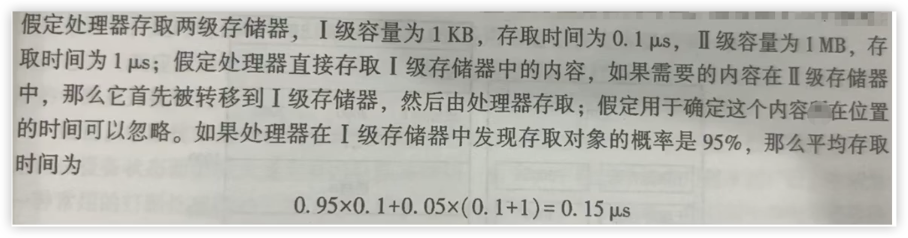
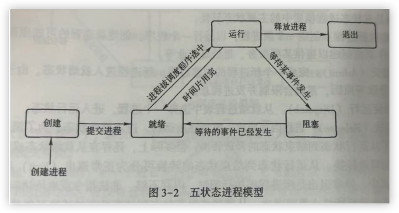

# 操作系统

## 第一章 操作系统概论

### 1.**计算机系统**

可以按照用户的要求接收和存储信息，自动进行数据处理并输出结果的信息系统

计算机系统包括硬件（子）系统和软件（子）系统

​	硬件系统是计算机系统赖以工作的`实体`

​	软件系统保证计算机系统按`用户指定的要求协调工作`

计算机系统的`资源`包括两大类：硬件资源和软件资源

在计算机系统中，集中了资源管理功能和控制程序的执行功能的一种软件称为操作系统

### 2.操作系统的特征

1. **并发性**：并发性是指在计算机系统中同时存在若干正在运行的程序，从宏观上来看，这些程序在同时向前推进

   见到宏观选并发

   体现在两个方面：

   1. 用户程序与用户程序之间并发执行
   1. 用户程序与操作系统之间并发执行

   并行性与并发性的区别

   并行性：同一时刻发生，微观意义（比如ABC三人同时六点起床）

   并发性：同一时间间隔内发生，宏观意义（ABC三人都在六点到六点十五起床）

1. **共享性**：操作系统程序与多个用户程序共用系统中的各种资源

   这种共享性是在操作系统控制下实现的

   资源的共享性主要针对计算机系统中的以下几个重要资源：中央处理器、内存储器、外存储器、外部设备 所有硬件资源

   在计算机系统中，对资源的共享一般有两种形式互斥共享和同时共享

   互斥共享：打印机、磁带机、扫描仪等，在某个时间段内只能由某一个用户程序使用（对于互斥共享的资源称为临界资源）

   同时共享：在线文档、硬盘，在某个时间段内可以由多个用户程序使用

1. **虚拟性**：是一种管理技术，将物理上的一个实体变为逻辑上的多个对应物，或将物理上的多个实体变为逻辑上的一个对应物。为用户提供易于使用，方便高效的操作环境

   例如分时系统将一体虚拟机分为多机，使得未来用户资源共享更加方便

   具体表现为：

   1. **虚拟内存**：当需要处理的任务比内存大时，先加载一部分到内存，处理完成后再换入下一部分。这样，程序会“以为”内存足够大，实现了对更大内存的模拟。
   1. **虚拟外设**：当计算机连接多个外部设备时，让多个外设工作时间差处在可接收的范围内，近似于同时工作，

1. **异步性**：在操作系统中，允许程序并发执行，但资源有限，进程的执行不是一贯到底的，而是走走停停，以不可预知的速度向前推进，进程的执行顺序和执行时间不确定

   例如：下载一个大文件和运行一个游戏比速度

### 3.研究操作系统的观点

**进程**的观点：进程可以看作运行中的程序是动态的，分为两大类用户进程、系统进程

**资源管理**的观点：一个是硬件资源，一个是软件资源。操作系统负责登记谁在使用什么资源，系统中有哪些空闲资源，当前响应了对谁的资源要求，以及回收了哪些资源。操作系统需要提供一些机制去协调程序间的竞争与同步，通过机制对资源进行合理使用，加以保护，以及采用虚拟技术来扩充资源

**虚机器**的观点：

​	**虚机器**：直接使用硬件称为`裸机`，通过操作系统控制`裸机`为`裸机`扩充了强大的功能后称为`虚机器`

​	将操作系统的功能分为若干层次，每个层次完成特定的功能，从而构成一个虚机器，并为上一层次提供支持

**服务提供者**的观点：把操作系统看作是服务提供者，这个服务提供者提供了一组功能强大，方便易用的广义的指令称为`系统调用`

### 4.操作系统的功能

1. **进程管理**：

   实质：对`中央处理器（CPU）`进行管理

   进程管理的主要内容：

   1. **进程控制**：

      `进程`是操作系统进行资源分配的`单位`

      主要处理进程的创建、状态转换、进程撤销以及相关进程资源的分配与回收等事物

   1. **进程同步**：

      主要处理进程之间的关系，包括进行的同步和互斥

      **互斥**：多个进程对临界资源的访问采用互斥的形式

      **同步**：在相互协作共同完成任务的进程之间，用同步机制协调他们之间的执行顺序

      最简单实现互斥的方法是给资源加锁，并提供操纵锁变量的`原语`，包括开锁和关锁的原语。原语是指具有某种功能，运行时具有`原子性`的一小段程序，原子性保证这一段程序要不全部被执行，要不全部不起作用，即这一操作不能被进一步分割或打断。

   1. **进程间通信**：主要处理进程之间相互协作信息交换问题

      一个比较典型的例子是通过网络在线流媒体播放。流媒体获取线程（线程是现代操作系统中处理时间分配的基本单位，它代表一个指令的执行流及执行上下文，一个进程可以包含多个线程）负责将媒体数据从远端的服务站点下载到本地的数据缓存中；流媒体的播放线程负责对缓存中的数据作流媒体数据分离（视频流和音频流）和解码，还原成图像帧和音频数据；然后渲染线程将前面的数据送往显示设备和声音设备。整个播放过程中，为了保证播放的流畅，这三个线程的执行是有一定关系的，原始数据的获取速度要比解码速度快，解码又要和渲染输出的速度匹配。这种执行速度的协调以及数据在不同线程之间的传递就需要进程间通信和进程同步机制来共同保证。

   1. **调度**：按照一定的算法从就绪队列中挑选一个进程执行

      `调度`又称为`处理器调度`，通常包括`线程调度`、`进程调度`、`作业调度`。

      `进程/线程`调度的任务就是按照一定的算法把处理器资源分配给就绪队列中的一个`进程/线程`，并准备好特定的`执行上下文`让其执行起来。`作业调度`的基本任务则是从`作业后备队列`中按照一定的算法挑出若干个作业，并按照`作业说明书`为它们分配一定的资源，把它们装入内存中并为每个作业建立相应的`进程`

      控制通信步（同步）调（调度）

1. **存储管理**：

   存储管理的任务是管理计算机内存的资源

   概括地说，存储管理有三个方面的任务

   1. **内存的分配与回收**

      操作系统要为每个进程分配内存空间，在分配的过程中还要尽可能提高内存资源的使用效率。对于已经退出运行的进程所占的内存空间，操作系统还要将它们加以回收，重新使用。人们在使用计算机时会经常发现，原本很大的内存在使用一段时间之后，似乎丢失了一部分空间，经过仔细检查，会看到内存空间使用图中有一大堆空间碎片，这种现象就是内存的分配与回收算法中的缺陷造成的。可见，内存的分配与回收对计算机系统有效运行的影响是很大的。

   1. **存储保护**

      由于内存是供多个程序共享的，因此，从理论上来讲，每个程序都应该在分配给自己的内存区中运行。但是必须要考虑某个程序发生越界的情况。因为程序自身可能存在一些错误或隐患，造成程序突然越界运行，不仅自身发生问题，而且影响或破坏其他程序的运行。如果发生故障的程序越界到操作系统运行的内存空间，那么受到的危害将更加严重，整个计算机系统有可能崩溃。其次，如果某个程序具有恶意，比如病毒程序或外界的入侵程序，那么就更有必要防止它们危害其他用户和整个计算机系统了

      在现代计算机系统中，由硬件提供存储保护机制，操作系统则利用这一机制实现进程的保护

   1. **内存扩充**

      在虚拟存储技术中，操作系统通常将空间划分为 4kB 大小的页面，并且以页面为单位进行存储空间的调度。进程所需的总页面数对应空间可以超出实际物理空间。但是操作系统只是把正在使用的页面保持在内存中或将即将使用的页面调入内存中，而将不用的页面置换到外存中，用户感受不到实际内存对使用空间的限制，仿佛有一个虚拟的大容量内存存在。

      系统要实现这一机制，必须提供请求页面调入和页面置换的功能

1. **文件管理**：

   在计算机系统中的信息资源（如程序和数据）是以文件的形式存储在外存储器（如磁盘、磁带）上的，需要时再把他们装入内存

   有三方面任务

   1. **文件存储空间的管理**

      文件系统为每一个文件分配一定的外存空间，并提高外存空间的利用率和访问效率，文件系统提供专门的数据结构记录文件系统的空间使用情况，为了提高利用率，存储空间通常采用离散分配方式，以 512B 或几 KB 的块为单位进行分配

   1. **目录管理**

      为每一个文件建立目录项，并对众多的目录项加以有效组织，方便用户按名存取

   1. **文件系统的安全性**

      包括读写权限以及存取控制，防止未经允许的用户读取文件，防止越权访问，防止以不正确的方式访问

1. **设备管理**：

   由操作系统的设备管理功能负责外部设备的分配、启动和故障处理，用户不必详细了解设备及接口的技术细节，就可以方便地通过操作系统提供的设备管理手段，对设备进行操作

1. **用户接口**：

   提供面向用户使用的交互接口

   1. 命令接口（cmd、shell、图形交互界面）
   1. 应用程序接口（API）

用户存储进程设备文件

### 5.不同时期的操作系统

**历史时期**：

1. 第一代电子管时代（1946 年～1957 年）
1. 第二代晶体管时代（1958 年～1964 年）
1. 第三代集成电路时代（1965 年～1970 年）
1. 第四代大规模/超大规模集成电路时代（1971 年至今）

**不同时期的操作系统**：

1. **手工操作**、**独占方式**

   对应电子管时代使用人工方式将需要计算的内容输入到计算机中

1. **监控程序（早期批处理）**

   由于手工操作的速度与计算机的计算速度不匹配，因此，人们设计了监控程序（管理程序），实现作业的自动转换，操作员将作业成批的输入到计算机中，由监控程序识别一个作业，进行处理后再取下一个作业，这种处理方式被称为`批处理`，由于是串行执行作业，因此被称为`单道批处理`

1. **多道批处理**

   所谓多道是指允许多个程序同时存在内存中，由 CPU 以切换方式为之服务

   `不适合`交互式作业

1. **分时系统**

   指多个用户通过终端设备于计算机交互作用来运行自己的作业，并且共享一个计算机系统而互不干扰，就好像自己有一台计算机

   `适合`交互式作业

1. **UNIX**通用操作系统

   是用 C 语言编写的，因此它是可移植的

1. **个人计算机操作系统**

   如 DOS、Windows、苹果、Linux

1. **现在操作系统的量大发展方向**

   **宏观应用**：大型操作系统，分布式操作系统和机群操作系统

   **微观应用**：微型操作系统，嵌入式操作系统

### 6.操作系统的分类

1. **批处理操作系统**

   **基本工作方式**：用户将作业交给系统操作员，系统操作员在收到作业后，并不立即将作业输入到计算机，而是在收到一定数量的用户作业后，组成一批作业，再把这批作业输入到计算机中；这批作业可以再系统中形成一个连续的、自动转接的作业流；系统操作员然后就启动操作系统，系统自动、依次执行每个作业。最后由操作员将执行完毕的作业结果交给用户

   特点是成批处理

   目标是系统资源利用率高，作业吞吐率高

   **优点**：作业流程自动化较高，资源利用率较高，作业吞吐量大

   **缺点**：用户不能直接于计算机交互，不适合调试程序

   **关键技术**：用多道程序运行、假脱机（SPOOLing）技术等

   **假脱机基本思想**：用磁盘设备作为主机的直接输入输出设备，主机直接从磁盘上选取作业运行，作业的执行结果也存在磁盘上；相应的，通道则负责将用户作业从卡片机上动态写入硬盘，而这一操作与主机并行

   **多道程序运行基本思想**：在内存中同时保持多个作业，主机可以交替的方式同时处理多个作业

1. **分时操作系统**

   采用时间片轮转方式处理服务请求，并通过交互方式在终端上向用户展示结果

   为了弥补批处理方式不能向用户提供交互式快速服务的不足而发展起来

   具有多路性、交互性、独占性和及时性的特点

   **多路性**：多个用户同时使用一台计算机

   **交互性**：用户向系统发出请求，系统进行响应，用户可以直接干预操作的每一步

   **独占性**：用户感知不到计算机正在被其他人使用

   **及时性**：系统对用户的请求给予快速响应

   在通用操作系统中，对于分时与批处理的处理原则：分时优先，批处理在后

   在通用操作系统中，一般把系统的分时和批处理运行状态称为前台和后台。把处理终端用户的、交互式的、比较小的、需要及时处理的作业，即分时作业，称为`前台作业`；而把那些需要运行时间较长、要调用其他外部设备的、比较大的、无须终端用户干预的，且不需要立即处理的作业，即可以批量处理的作业称为`后台作业`。换句话说，在系统的`前台`响应需要频繁交互的作业，如大量终端的处理要求；而`后台`则处理对时效性要求不强的作业

1. **实时操作系统**

   1. 硬实时系统（火箭和导弹控制、飞行控制系统、核反应堆控制等）`高度可靠性`在规定的时间内实时响应外部事件的请求，同时完成对该事件的处理
   1. 软实时系系统（视频处理、飞机订票） 对事件的响应和处理时间有一定的时间范围要求，不满足相关要求会影响系统的服务质量，但通常不会引发灾难性后果

   能力：

   1. **实时时钟管理**：针对实时任务能够进行实时处理

      根据时间要求可以分为`定时任务`与`延时任务`

      ​	**定时任务**：依据用户的定时启动，并按照严格的时间间隔重复运行

      ​	**延时任务**：非周期的运行，允许被延后执行，但是往往有一个严格的时间界限

      根据功能可以分为`主动式任务`与`从动式任务`

      ​	**主动式任务**：依据时间间隔主动运行，多用于实时监控

      ​	**从动式任务**：依赖外部事件的发生，当外部事件出现时（例如中断），这种实时任务应可能快地进行处理，并尽量保证不丢失事件

   1. **过载防护**：有大量的任务需要系统处理，但是任务的数量已经超出了当前系统的处理能力，系统需要有一定的防护能力对意外情况进行处理（通过延后或抛弃次要任务保证主要任务的执行成功）

   1. **高可靠性**

1. **个人计算机操作系统**

   是一种单用户的操作系统

   主要特点是：

   1. 计算机在某一时间内为单个用户服务
   1. 采用图形界面人机交互的工作方式，界面友好
   1. 使用方便，用户无须具备专门知识，也能熟练地操纵系统

1. **网络操作系统**

   基于计算机网络的、为计算机网络配置的操作系统，将计算机网络中的各个计算机有机的连接起来，实现相互通信以及资源共享

   1. **集中式模式**：运算处理在主计算机中发生，终端仅作为输入输出设备使用，通过连接两台以上的主机构成计算机网络
   1. **分布式模式**：每台计算机都有运算处理能力，多台计算机通过网络交互数据并共享资源和服务以及共享运算能力。

1. **分布式操作系统**

   机群（cluster）是分布式系统的一种

   将大量的计算机通过网络联结到一起，可以获得极高的运算能力及实现广泛的数据共享

   分布式操作系统是网络操作系统的更高级形式，它除了保持了网络操作系统的各种功能之外，还有如下特征：                                                                                                                                                                                                 

   1. 分布式操作系统是一个统一的操作系统，在系统中的所有主机使用的是同一个操作系统
   1. 实现资源的深度共享。在网络操作系统中，由于各个主机使用的操作系统不同，因此不能随意将一个计算任务从一台主机迁移到另一台主机，在分布式系统中，通过统一的操作系统调度，在某台主机上执行的任务可以迁移到另一台主机上执行
   1. **透明性**：在网络操作系统中，用户能够清晰的感觉本地主机与非本地主机的区别，但是在分布式操作系统中用户感觉不到本地主机与非本地主机的区别
   1. **自治性**：在分布式系统中的各个主机都处于平等地位，一个主机失效不会影响整个分布式系统

   **优点**：

   1. 以较低的成本获得较高的运算性能
   1. 可靠性

1. **嵌入式操作系统**

   是一种`实时操作系统`，嵌入式操作系统在工业控制、交通管理、信息家电等

   **特点**：

   1. 系统内核小
   1. 专业性强
   1. 系统精简
   1. 高实时性
   1. 多任务的操作系统

### 7.操作系统设计

1. **设计难点**                                                                                                                                                                                                                                                                                                                                                                                   

   1. **设计复杂程度高**：程序长、接口信息多、动态性强、并行性强
   1. **正确性难以保证**：操作系统包含的功能成分多，外部接口设备复杂，导致操作系统源代码的正确性难以保证
   1. **研制周期长**：需求分析、制作软件规格说明书、进行软件设计、编写程序、调试、测试、整理开发文档

1. **设计过程**

   1. **功能设计**：根据系统的设计目标和使用要求确定所设计的操作系统应该具备哪些功能

   1. **算法设计**：某些算法能促进操作系统更快的响应

   1. **结构设计**：按照系统的功能和特性要求选择合适的结构，将系统逐层分解，使系统简单适应性强

      能结算

1. **设计目标**

   1. **可靠性**：正确性和健壮性

   1. **高效性**：提高系统运行的效率

   1. **易维护性**：易读性、易扩充性、易剪裁性、易修改性

   1. **可移植性**：将一个程序从一个计算机系统环境移动到另一个计算机系统环境中并可以正常运行

   1. **安全性**：是计算机系统安全性的基础

      靠高位可安全

1. **结构设计** 

   操作系统结构设计的重要性

   操作系统结构研究的目标

   1. **系统模块化**：一组数据结构以及定义在这组数据结构上的一组操作

      对模块的访问只能通过操作来完成，称为`信息隐蔽`

   1. **模块标准化**：

      1. 模块规格统一，按照标准化设计，模块构造一致，符合规范。
      1. 提炼操作系统核心，将关键组件固定为构建模块的基础单元，形成操作系统积木化设计

   1. **通信规范化**：模块之间的接口清晰划一，模块之间的通信方式统一

      系统标准通信

### 8.操作系统的体系结构

1. **整体式结构**：

   将整个操作系统拆分成若干模块，通过接口将这些模块连接在一起

   **优点**：结构紧密、接口简单直接、系统效率较高

   **缺点**：

   1. 模块间转接随便，各模块相互牵连，独立性差，系统结构不清晰
   1. 数据基本上作为全程量处理，相当复杂
   1. 可适应性比较差

1. **层次式结构**

   将操作系统的所有功能模块，按功能留图的调用次序，分别排列成若干层，各层之间的模块只能是单向依赖或单向调用关系。这样，不但操作系统的结构清晰，而且不会构成循环

   **优点**：

   1. 单向依赖或单向调用，结构清晰，不会构成循环
   1. 很容易对操作系统增加或替换掉一层而不影响其他层次
   1. 易于调试，易于修改、易于扩充、易于维护、易于保证正确性

1. **客户/服务器（微内核）结构**

   **特点**：

   1. 运行在核心态的内核：内核提供所有操作**系统基本**都具有的**操作**
   1. 运行在用户态的并以客户/服务器方式运行的进程层：**除内核部分外**，操作系统所有的其他部分都被分成若干个相对独立的进程，每一个进程实现一组服务，称为**服务进程**

   客户机进程发出消息，内核将消息传递给服务进程，服务进程执行相应的操作，将结果通过内核返回给客户机

   **优点**：

   1. **可靠**：每个服务进程都是相互独立且自包含的，因此某个服务进程出现问题也不会影响其他服务进程
   1. **灵活**：每个服务进程是自包含的，接口规范，修改一个服务进程代码不影响其他服务进程，便于增加新的服务功能
   1. **适用分布式处理的计算环境**：不同的服务进程可以运行在不同的处理器或计算机上，所以使操作系统自然拥有分布式的能力

   **缺点**：主要是对于效率的考虑，所有的用户进程只能通过微内核相互通信，微内核本身就成为系统的瓶颈

1. **外核结构**

   **内核**：仅仅为简单的申请操作以及释放和复用硬件资源

   **外核**：一些关键的硬件资源管理功能放在内核之外，通过一些特殊的机制让应用程序能够更直接地访问和控制这些硬件资源

   **比如**：传统的操作系统内核会对硬盘资源（像磁盘、内存）进行集中式管理。而外核结构就像是把这些管理权限部分地`下放`，让不同的应用程序或用户程序可以由更多的自主性

### 9.操作系统启动

1. **引导方式**：BIOS引导和UEFI引导

1. **启动机制**：BIOS自检、系统引导、启动内核、初始化系统 

1. **程序执行流程**：

   1. 用户通过操作系统启动程序

   1. 操作系统将程序从磁盘加载到内存中

   1. 操作系统为程序分配资源，如CPU时间，内存空间和输入输出设备

   1. 程序开始执行，由 CPU 按顺序执行指令

   1. 程序可能会与操作系统交互，请求服务，如读写文件或访问网络

   1. 程序执行完毕后，操作系统回收其占用的资源

      启动加载分配执行交互回收

### 习题

1. 计算机系统包括硬件系统和软件系统
1. 计算机赖以工作的实体是硬件系统
1. 在单处理机操作系统中，多个程序交替地在处理器上运行，从宏观上看，这些程序同时向前推进。这体现了操作系统的并发性
1. 对 OS 功能的概括中，正确的是：进程管理、存储管理、作业管理、用户接口和设备管理
1. 进程控制的主要任务是创建进程、撤销结束的进程以及控制进程运行时的各种状态转换
1. 进程间通信主要发生在哪些进程之间相互协作
1. 进程约束、进程控制、进程同步、进程调度那一项不属于进程管理的内容进程约束
1. 存储管理的任务是管理计算机内存的资源
1. 操作系统的发展过程中，按照由早到晚出现的顺序，以下排序正确的是手工操作、监控程序、多道批处理，分时/实时系统
1. 实时操作系统的主要目标是在严格的时间范围内，对外部请求做出反应。因此系统应该具有高度的可靠性
1. 用户提交作业后，再也无法干预其作业的运行的操作系统是批处理操作系统
1. 对可靠性要求极高，并且要求有强健壮性和坚固性的操作系统是实时操作系统
1. 将大量的计算机通过网络连结在一起，可以获得极高的运算能力及广泛的数据共享。这样一种系统称为分布式系统
1. 操作系统的设计过程一般可分为功能设计、算法设计和结构设计
1. 它是操作系统结构研究的目标之一，在该目标下，模块之间的接口清晰划一，模块的联系方式统一。基于上述的描述，操作系统结构研究的这种目标是通信规范化
1. 下列关于计算机微内核操作系统结构的描述中，错误的是
   1. 内核运行在核心态
   1. 具有良好的灵活性，便于操作系统增加新的功能
   1. 模块之间可以任意相互调用，结构紧密，接口简单
   1. 除内核之外，操作系统其他部分以进程方式运行在用户态
1. 将操作系统分成用于实现操作系统最基本功能的内核和提供各种服务的服务进程两个部分，这样的操作系统结构是微内核结构

## 第二章 操作系统运行环境与运行机制

### 1. 中央处理器CPU

CPU 一般由运算器、控制器、一系列的寄存器以及高速缓存构成

运算器实现指令中的算术和逻辑运算，是计算机计算的核心

控制器负责控制程序运行的流程，包括取指令、维护CPU状态、CPU 与内存的交互等

**寄存器**：一种暂时存储器件，用于在 CPU 处理指令期间暂存数据、地址以及指令信息	

1. `用户可见`的寄存器，包括：数据寄存器，地址寄存器以及条件码寄存器 数地条（速递条）
1. 控制和状态寄存器，常见：程序计数器（PC）、指令寄存器（IR）和程序状态字（PSW） 两程序一指令

高速缓存：cache

指令执行的基本过程

开始 $\rightarrow$ 取指令  $\rightarrow$  执行 $\rightarrow$  停止

### 2. 特权指令和非特权指令

**特权指令**：指令系统中那些只能由`操作系统`使用的指令，不允许一般用户使用，如果用户可以随意使用特权指令，会造成系统混乱

如：设置程序状态字、启动某设备、设置中断屏蔽、设置时钟指令、清内存指令和建立存储保护指令等

**非特权指令**：操作系统、普通用户都能使用的

**用户程序如何使用特权指令**：通过处理器的处理机制，将处理器状态切换到操作系统运行的特权状态，然后将处理权移交给操作系统中的一段特殊代码，通常将这个过程称为陷入

### 3. 处理器的状态

**内核态**：又叫`管态`、`特权态`、`系统态`、`核心态`。指`操作系统`管理程序运行的状态，具有`较高`的特权级别 

**用户态**：又叫`目态`、`普通态`。指`用户程序`运行时的状态，具有较低的特权级别

当处理器处于内核态时，可以运行全部指令，可以使用全部资源并具有改变状态的能力。当处理器处于用户态时，只有非特权指令可以执行。不同的处理器状态的区别就是赋予运行程序的特权级别不同，可以运行的指令集合也不同。特权级别越高，可以运行的指令集合越大，高特权级别可以运行的指令集合包含低特权级别的

**CPU状态的转换**

1. **用户态 $\rightarrow$ 内核态的转换** 

   其转换的唯一途径是中断。中断响应时交换中断向量，新的中断向量中的 `PSW` 的 CPU 状态位标志为内核态

1. **内核态 $\rightarrow$ 用户态的转换**

   可通过设置PSW指令（修改程序状态字），实现从操作系统向用户程序的转换

   系统启动时，CPU的初始状态是内核态

   操作系统退出执行时，让用户程序运行在用户态

1. **限制用户程序执行特权指令**

   用户程序不能使用特权指令，当用户程序占用 CPU 时，应让 CPU 在用户状态下工作。若此刻收到了一条特权指令，CPU 将拒绝执行该指令，并生成一个非法操作事件。中断机制识别到该事件后，转交给操作系统处理，生成一个通知：程序中有非法指令

### 4. 程序状态字

**程序状态字的作用是指示处理器状态**

处理器的状态字（`PSW`）通常包括以下状态码

1. CPU的工作状态码：指明当前处理器的工作状态是管态还是目态，用来说明当前在处理器上执行的是操作系统还是一般用户，从而决定其是否可以使用特权指令或用尤其他的特殊权利

1. 条件码：反应指令执行后的结果特征

1. 中断屏蔽码：指出是否允许中断

   C（塞）条中华

**标准条件位**：

1. **CF**：进位标志位
1. **ZF**：零标志位
1. **SF**：符号标志位
1. **OF**：溢出标志位

1. **TF**：陷阱标志位
1. **IF**：中断使能标志位
1. **VIF**：虚拟中断标志位
1. **VIP**：虚拟中断待决标志位
1. **IOPL**：IO 特权级别

`VIF` 和`VIP`用于支持对一类可屏蔽的硬件中断处理

### 5. 存储器类型

随机访问存储器（RAM）：存放随机存取的程序的数据

只读存储器（ROM）：只能读取数据，不能随意地用普通方法写数据

`PROM`是一种可编程的只读存储器，它可以被特殊的 PROM 写入器向其中写入数据

`EPROM` 可以用一种特殊的紫外线照射芯片，擦去其中的信息位，使其恢复原来的状态，然后使用特殊的 EPROM 写入器来写入数据

**RAM**（随机存取存储器）和 **ROM**（只读存储器）有以下区别:

- **读写特性**：RAM 可读可写，ROM 通常只能读不能写
- **数据易失性**：RAM 中的数据在断电后丢失，ROM 的数据断电后仍可以保存
- **用途**：RAM 用于存储正在运行的程序或数据，ROM 用于存储固化的程序和数据

存储的最小单位是：二进位（又叫：比特或 bit 或 b ）

存储器的最小编址单位是：字节（又叫 Byte 或 B）

内存空间的最小分配单位是：块（又叫物理页或 Page）

1B = 8b 1kb = 1024B 1MB = 1024KB 1GB = 1024KB 1TB = 1024GB

### 6. 存储器的层次结构

计算机存储系统的设计主要考虑三个问题

1. **容量**：容量是存储系统的基础
1. **速度**：存储系统的速度则要能匹配处理器的速度，在处理器工作时不应该因为等待指令和操作符而发生暂停
1. **成本**：存储器的成本和其他部件相比应该在一个合适的范围内

### 7. 存储访问局部性原理

提高存储系统效能的关键在于`程序的存储访问局部性原理`

存储器存取 N 级存储器：

I 级存储器，若命中则返回数据；若不命中，在方位 II 级存储器，命中则返回数据，若不命中，在访问 III 级存储器，命中则返回数据....

公式解读：一级存储器的命中概率 * 一级存储器的存取时间 + 二级存储器的命中概率 * （一级存储器的存取时间 + 二级存储器的存取时间）

### 8. 存储保护

**界地址寄存器**:

在 CPU 中设置一对界限寄存器来存放该用户作业在内存中的下限和上限地址，分别称为下限寄存器和上限寄存器。

也可以使用一个寄存器作为基址寄存器，另一个寄存器作为限长寄存器（指示存储区长度）来指出程序在内存中的存放区域。每当 CPU 要访问内存时，硬件会自动将被访问的内存地址与界限寄存器的内容进行比较，以判断是否越界。如果未越界，则按此地址访问内存，否则将产生的程序中断——越界中断或存储保护中断

**存储保护键**：

当一个用户作业被允许进入内存时，操作系统会为其分配一个唯一的，不与其他用户作业相同的存储保护键号；将分配给该作业的各存储块的存储保护键也设置成同样的键号，当操作系统挑选该作业到 CPU 上运行时，操作系统同时也会将该作业的存储保护键号放到 PSW 的存储保护键（“钥匙”）域中。这样每当 CPU 访问内存时，都将对内存块的存储保护键与 PSW 中的钥匙进行比较。如果相匹配，则允许访问。否则拒绝并报警                      

### 9. 中断机制

**中断的概念**：

所谓中断是指CPU对系统中或系统外发生的异步事件的响应

**异步事件**：无一定时序关系的随机发生的事件

**中断的来源**：当发生某个异步事件以后，处理器会中断当前事件的执行，而转去处理该异步事件（称为执行该事件的中断处理程序）。在该异步事件处理完之后，处理器在转回源程序的中断点继续执行

​	**举例**：某人正在看书，此时电话响了（异步事件），于是用书签记住正在看的那一页（中断点），再去接电话（响应异步事件并进行处理），接完电话后再从被打断的那一页继续看（返回原程序的中断点继续执行）

中断是所有要打断处理器的正常工作顺序，并要求其去处理某一事件的一种常用手段

引起中断的事件称为`中断事件`或`中断源`

中断源向处理器发出的请求称为`中断请求`

处理中断事件的程序称为`中断处理程序`

发生中断时正在执行的程序的暂停点称为`中断断点`

处理器暂停当前程序转而处理中断程序的过程称为`中断响应`

中断处理结束之后恢复原来程序的执行称为`中断返回`

**中断的作用**

1. 能充分发挥处理器的使用效率，I/O 设备可以通过中断与 CPU 进行通信，主动向 CPU 报告当前输入的输入情况，可以避免 CPU 不断的查询和等待
1. 提高系统的实时能力，对于有较高实时处理要求的设备可以通过中断方式使请求可以及时处理

**中断的分类**

1. **强迫中断**：正在运行的程序不期望发生的，随机性较强
   1. **程序性中断**：算数运算溢出、被零除、用户态程序执行非法指令、访问不被允许的存储位置、虚拟存储缺页
   1. **时钟中断**：处理器内部的计时器产生，允许操作系统以一定规律执行函数，如时间片到，硬件实时时钟到时
   1. **输入输出（I/O）中断**：I/O 控制器产生，用于通知一个 I/O 操作是完成还是出现错误
   1. **控制台中断**：程序员在控制台发出命令
   1. **硬件故障中断**：掉电等硬件故障
1. **自愿性中断**：程序有意安排的，由`访管指令`引起，目的是要求操作系统提供系统服务，发生时间以及位置具有确定

**同步中断和异步中断区别**

1. **异步中断**：一般由当对当前程序而言的外部事件激发的，属于外源性质

   比如：用户输入、硬件故障等

   1. 时钟中断
   1. I/O 中段
   1. 控制台中断
   1. 硬件故障中断

1. **同步中断（异常）**：由当前程序的编码和逻辑激发的，属于内因性质

   比如：非法指令

   1. 程序性中断
   1. 访管指令异常

### 10. 中断系统

中断系统是现代计算机系统的核心机制之一，他不是单纯的硬件或软件的概念，而是`硬件`和`软件`相互配合、相互渗透而使得计算机系统得以充分发挥能力的`计算模式`

**两大组成部分**：硬件中断装置和软件中断处理程序

**硬件中断装置**负责捕获中断源发出的中断请求，并以一定的方式响应中断源，然后将处理器的控制权移交给特定的`中断处理程序`

硬件中断装置提供了中断系统的`基本框架`，是中断系统的`机制部分`

中断处理程序是中断系统的`策略部分`，它利用中断机制来实现对处理能力的`扩展`和对多种处理需求的适应

中断处理程序则针对中断事件的性质而执行相应的一系列操作

**中断请求的接收**：

在计算机硬件的中断逻辑线路和中断寄存器实现的

`中断逻辑线路`用于接收中断信号，并把收到的中断信号寄存在线路的`硬件触发器`上

由于计算机中可能有很多中断源请求，它们可能同时发生，因此由中断逻辑线路按中断优先级加以判定，即究竟应该响应哪个中断请求

**中断响应**：

1. **扫描中断**：指令执行周期结束时，处理器检查中断寄存器，看是否有中断信号。
   - **无中断**：执行下一条指令。
   - **有中断**：接收中断信号的编号（中断向量）。
1. **保存状态**：保护现场， 将中断程序状态字 PSW 的值和程序计数器 PC 的值存入系统堆栈。
1. **切换内核态**：进入内核态，处理中断更安全。
1. **查询中断向量表**：分析中断向量，取得中断处理程序的入口地址。
1. **执行中断处理程序**：转移控制权，调用中断处理程序

扫信号，存状态，切内核，查表跳，控转移。

### 11. 典型中断的处理

1. **I/O中断**：由 I/O 设备的控制器或通道发出

   **分类**：I/O 操作正常结束以及I/O异常

1. **时钟中断**

   **维护软件时钟**：定时维护、更新软件时钟。

   **处理器调度**：时间片到时切换到下一个进程。

   **控制系统定时任务**：定时启动任务，如死锁监测、记账、审计

   **实时处理**：触发信号，监控硬件健康

   维护处理器要定时处理

1. **硬件故障中断**

   **硬件故障**：通常需要人工干预，例如复位或更换设备。

   **保存现场**：确保当前状态数据不丢失

   **警告通知**：提醒管理员并提供诊断信息

   硬件故障需干预，保存现场发警示

1. **程序性中断**：程序指令出错，指令越权、寻址越界引发的系统保护

   **分类**：

   1. 程序性中断只能由操作系统完成。例如程序尝试做不能做的操作
   1. 程序性中断可以由程序自己完成。例如系统调试中断，断点和单步跟踪等

1. **系统服务请求（自愿性中断）**

   系统服务请求一般由处理器提供的专用指令（又称访管指令）来激发

### 12. 中断优先级、中断屏蔽与中断嵌套

- **多级中断与中断优先级**

  现代的微处理器都提供有多级中断系统，在多级中断系统中，硬件决定了各个中断的优先级别

  **多级中断作用**：

  1. 对各类中断信号依据其紧急程度和重要性划分级别
  1. 解决如果有重要程度相当的多个中断信号同时到达的，如何选择首个被处理的中断信号问题，在同一中断级中的多个设备接口中同时都有中断请求时，一般有两种办法可以采用、
     1. **固定优先级**：给每个设备接口安装一个不同的、固定的优先级。比如以该设备在总线中的位置来定优先级，离 CPU 近的设备的优先级高于离 CPU 远的设备
     1. **轮转法**：用一个表格，依次轮转响应，这是一个比较公平，合理的方法

- **中断屏蔽**：是一种用于控制中断处理的机制，通过设置特定的中断屏蔽位位或寄存器来临时禁止某些中断信号的处理。它主要用于在关键任务执行过程中避免某些不重要或低优先级的中断打断，从而保证系统的稳定性与任务的完整性

  程序状态字（PWS）中的中断屏蔽位决定，这些屏蔽位标识了被屏蔽的中断类或者中断。一旦某个 I/O 中断被程序状态字中的中断屏蔽位加以屏蔽，那么即使有 I/O 中断信号，处理器也不予响应

  机器故障中断不可屏蔽。比如：内存奇偶校验错，以及掉电等使得机器无法继续操作一类得故障

- **中断嵌套**

  计算机系统中都有多个中断源，如果一个中断处理过程中又发生了新的中断那么将引起`多个中断处理问题`

  **多级中断处理的策略分两种**:

  1. **禁止其他中断**：处理中断时，暂时屏蔽其他中断，新中断信号需等当前处理完成后再响应。通过**禁止和放开中断指令**实现，但无法根据中断紧急程度优先处理，不能满足严格的时间要求

     处理中断禁他信，优先紧急难达成

     

  1. **中断嵌套**：允许优先级较高的中断打断优先级较低的中断处理过程

     由于中断嵌套中高优先级中断可以打断低优先级的中断，因此需要为低优先级中断保存现场，压入堆栈中

### 13. I/O 技术

- **I/O结构**

  一台计算机中有大量的外部设备，为了满足这些外部设备的控制要求，**提高处理器和外部设备的运行效率，每台外部设备中都配有各自的设备控制器**

- **通道**

  `独立于处理器`，专门负责数据 I/O 传输工作的处理单元，又称为` I/O 处理机`

  **通道作用**：

  ​	•	处理器与外设**并行工作**，双方可同时访问内存。

  ​	•	处理器与外设、外设之间**并行分工**，提升效率。

  **访问冲突处理**：

  ​	•	若同时申请访问内存，由内存控制线路协调，**保证同步有序执行**。

  **多程序并行**：

  ​	•	操作系统通过通道技术，**多程序并行运行**，每个程序占用不同系统资源。

  通道并行协调忙，多程共享资源强

  通道技术一般用于大型机系统和那些对 I/O 处理能力要求比较高的系统。低档次的微机中没有通道

- **直接存储器访问技术（DMA）**

  **DMA（直接存储器访问）的作用**：

  ​	•	**自动化数据传输**：DMA 控制器通过系统总线，自动管理内存与 I/O 设备间的大块数据传输。

  ​	•	**指令执行**：处理器只需发送包含目标地址、数据长度等信息的指令，然后可以继续处理其他任务。

  ​	•	**完成通知**：DMA 传输完成后，会通过中断通知处理器。

  **优点**：

  ​	•	**提高效率**：处理器仅在传输开始和结束时参与，大幅减少干预。

  ​	•	**简化操作**：无需程序逐字节操作。

  **限制**：

  ​	•	**总线竞争**：DMA 传输与处理器访问总线可能冲突，处理器需要短暂等待，总线访问速度略降。

  ​	•	**整体提升**：尽管如此，对于大块数据传输，DMA 依然非常高效。

  DMA 传块自动忙，传前传后处理想。冲突竞争短暂停，数据高效效能强。

- **缓冲技术**

  缓冲区是应用设备之间进行数据传输时，专门用来暂存这些数据的一个存储区域

  缓冲技术一般在以下情况使用：

  1. 处理器与内存之间
  1. 处理器与其他外部设备之间
  1. 设备与设备之间的通信上

  缓冲技术用来解决部件之间速度不匹配的问题

  缓冲区可以供多个用户使用以及反复使用

### 14. 时钟

**主要功能总结**

​	1.	**死循环检测**：多道程序运行环境中，时钟用于发现陷入死循环的程序，避免资源浪费。

​	2.	**分时系统**：通过时钟间隔实现时间片轮转机制，确保任务公平调度。

​	3.	**实时控制**：在实时系统中，按固定间隔输出信号用于实时设备控制。

​	4.	**定时唤醒**：用于按需唤醒特定时间点需要执行的任务。

​	5.	**时间记录**：记录用户设备使用时长或事件时间间隔。

​	6.	**绝对时间记录**：提供系统日期和时间信息（年、月、日、时、分、秒）。

**时钟分类**

**按实现方式：**

​	1.	**硬件时钟**：

​	•	基于晶体振荡器的固定频率脉冲。

​	•	通过时钟寄存器记录脉冲数。

​	2.	**软件时钟**：

​	•	使用内存模拟时钟寄存器。

​	•	程序通过增减内存值来模拟时间。

**按用途：**

​	1.	**绝对时钟**：

​	•	运行独立，不受外界影响，即使断电仍保持准确时间。

​	•	提供完整的时间信息。

​	2.	**相对时钟**：

​	•	记录从设定初值开始的时间间隔。

​	•	支持倒计时功能，触发中断后用于任务管理或时间控制。

这类时钟的功能和分类为操作系统中的时间管理提供了基础支持。

### 15. 系统调用

用户在程序中调用操作系统所提供的一些子功能。这是一种特殊的过程调用，这种调用通常是由特殊的机器指令实现的，并且将系统转入特权方式（管态）

系统调用程序被看成是一个低级的过程，只能由汇编语言直接访问

系统调用是操作系统提供给编程人员的唯一接口

编程人员利用系统调用，动态请求和释放系统资源，调用系统中已有的功能来完成与计算机硬件部分相关的工作以及控制程序的执行速度等

**系统调用与一般过程调用的区别**

1. **运行在不同的系统状态**

   系统调用运行在用户态，但是被调用程序运行在内核态，一般过程调用中的调用程序与被调用程序都是运行在相同的状态下

1. **状态的转换**

   一般过程调用不涉及状态转换，系统调用通过软中断机制由用户态转换为内核态，由操作系统分析后，转入相应的系统子程序

1. **返回问题**

   一般的过程调用在被调用过程执行完毕后，将返回调用过程继续执行。但是，在采用抢占调度方式的系统中，被调用过程执行完后，系统对所有要执行的进程进行优先级分析。如果调用进程仍然有最高优先级则返回到调用过程继续执行；否则让优先级最高的进程先执行

1. **嵌套调用**：

   与一般调用过程一样，系统调用也允许嵌套调用，在一个被调用过程执行期间，还可以利用系统调用命令去调用另一个系统。一般情况下，每个系统对嵌套调用的深度都会有限制

   运行 状态 回调

**操作系统按功能分为两大部分**

1. 是系统自身所需要的
1. 是作为服务提供给用户的

**通用操作系统系统调用分类**

1. **进程控制类系统调用**

   主要针对进程的控制，如创建和关闭进程、获得和设置进程

1. **文件操作类系统调用**

   创建、打开、关闭、读\写文件、目录管理、移动文件指针、改变文件属性

1. **进程通信类系统调用**

   用于进程之间的消息和信号传递

1. **设备管理类系统调用**

   用来请求和释放有关设备，以及启动设备操作

1. **信息维护类系统调用**

   用户可以用该类系统调用获得当前日期和时间、设置文件访问和修改时间、了解系统当前的用户数、操作系统版本号、空闲内存和磁盘空间大小

**用户程序和系统程序之间的参数传递，常用方法**

1. 由陷入指令自带参数
1. 通过有关通用寄存器来传递参数
1. 在内存中开辟专用堆栈来传递参数

### 练习

1. 在处理器的所有寄存器中，对用户不可见的是

   1. 指令寄存器
   1. 条件码寄存器
   1. 地址寄存器
   1. 数据寄存器

1. 计算机处理器中用于管理程序运行流程的是

   1. 控制器
   1. 高速缓存
   1. 运算器
   1. 寄存器

1. 以下属于非特权指令的是

   1. 启动 I/O 设备
   1. 设置中断屏蔽
   1. 执行数据算数计算
   1. 设置程序状态字

1. 在多用户或多任务的多道程序设计环境中，以下不是特权指令的是

   1. 启动设备
   1. 设置中断屏蔽
   1. 清内存
   1. 算数运算指令

1. 程序状态字的内容不包含

   1. CPU 的工作状态代码
   1. 条件码
   1. 中断屏蔽码
   1. 执行代码的用户 ID

1. 以下关于处理器工作状态的描述，正确的是

   1. 操作系统管理程序运行的状态称为目态
   1. 当处理器处于管态时，可以执行全部指令
   1. 系统启动时，处理器的初始状态为目态
   1. 当用户程序占用处理器时，应让处理器在管态下工作

1. 存储器的最小编址单位是字节，1024 个字节称为

   1. 1B
   1. 1KB
   1. 1MB
   1. 1GB

1. 可用作随机存取数据的存储器是

   1. RAM
   1. ROM
   1. PROM
   1. EPROM

1. 内存空间的最小分配单位是

   1. 二进制位
   1. 字节
   1. 字
   1. 块

1. 计算机系统采用层次化的存储体系，以下存储装置中容量最小的是

   1. 硬盘
   1. 内存
   1. 高速缓存
   1. 寄存器

1. 如果处理器的上限寄存器值为 3000，下限寄存器值为 4000，那么当处理器要访问内存地址 4100 时，会产生

   1. 硬件故障中断
   1. 存储保护中断
   1. 时钟中断
   1. I/O 中断

1. 以下可用于存储保护的技术是

   1. 缓冲技术
   1. DMA 技术
   1. 通道技术
   1. 界地址寄存器

1. 时钟中断处理程序的主要内容不包括

   1. 维护软件时钟
   1. 监控管理
   1. 处理器调度
   1. 实时处理

1. 下列哪一种中断一般由处理器提供的专用指令（又称访管指令）来激发

   1. 程序性中断
   1. I/O 中断
   1. 控制台中断
   1. 自愿性中断

1. 需要做的工作是保存现场，使用一定的手段警告管理员并提供一些辅助的诊断信息的是

   1. 硬件故障中断处理程序
   1. 时钟中断处理程序
   1. 程序性中断处理程序
   1. 自愿性中断处理程序

1. 中断系统接收中断源的中断请求的途径是计算机硬件的

   1. 中断源和中断逻辑线路
   1. 中断逻辑线路和中断寄存器
   1. 中断逻辑线路和中断位
   1. 中断位和中断寄存器

1. 中断处理结束时，处理器的状态

   1. 保持目态不变
   1. 从目态恢复为被中断时的管态
   1. 保持管态不变
   1. 从管态恢复为被中断时的目态

1. 在多级中断系统中，同时有多个中断请求，处理器将

   1. 向用户发出询问请求
   1. 接收中断优先级最高的中断
   1. 接收处理时间最短的中断
   1. 根据先来先服务的方式进行响应

1. 中断按照优先度分级，允许优先级较高的中断打断优先级较低的中断处理过程称为

   1. 中断断点
   1. 中断响应
   1. 中断嵌套
   1. 中断事件

1. 在多级中断系统中，决定了各个中断的优先级别的是

   1. 通道
   1. 软件
   1. 硬件
   1. 时间

1. 多级中断系统中，各中断优先级由硬件决定。但在某些情况下（如低优先级的事件正在执行），操作系统不能立即响应高优先级的中断，此时采用的技术是

   1. 软件设置中断优先级
   1. 中断挂起
   1. 中断嵌套
   1. 中断屏蔽

1. 以下关于处理器工作状态转换的说法中，不正确的是

   1. 处理器处于管态时可以执行一切机器指令，包括特权指令
   1. 处理器处于目态时不允许执行特权指令
   1. 系统启动时，处理器的初始状态为管态
   1. 用程序计数器（PC）来指示处理器状态

1. 处理器处理数据的速度与设备传输数据的速度不匹配时，可用于缓解两者之间速度矛盾的技术是

   1. 通道技术
   1. DMA 技术
   1. 缓冲技术
   1. I/O 控制技术

1. 下列关于通道的作用的描述中，不正确的是

   1. 可以实现中央处理器和各种外部设备并行工作
   1. 可以实现各种外部设备之间的并行工作
   1. 通道既能负责数据I/O传输，也能负责数据计算
   1. 采用通道后，处理器和外部设备能够访问存储器

1. 以下关于系统调用、库函数和应用程序的叙述中，正确的是

   1. 应用程序通过系统调用来获得操作系统内核提供的服务

   1. 应用程序可以通过库函数来获得操作系统内核提供的服务

   1. 库函数是操作系统提供给应用程序的接口

   1. 应用程序在目态执行系统调用

      应用程序在管态执行系统调用

1. 关于系统调用与函数调用的区别的叙述中，正确的是

   1. 函数调用的调用程序和被调用程序运行在不同状态

   1. 系统调用的调用程序运行在系统态

   1. 一般函数调用可直接由调用过程转向被调用过程

   1. 系统调用由可调用过程直接转向被调用过程

      系统程序的调用程序运行在目态

## 第三章 进程/线程模型

###   1.  进程

进程是具有一定独立功能的程序在某个数据集合上运行的活动，是操作系统进行资源分配和调度的单位

从操作系统的角度来看，可将进程分为用户进程和系统进程，系统进程的优先级高

#### 进程与程序的区别与联系

1. **进程和程序的联系**

   程序是进程的组成部分之一，一个进程的目标是执行它所对应的程序，如果没有程序进程就失去了意义。从静态角度来看，进程是由程序、数据和控制块（PCB）组成的

1. **进程与程序的区别**

   程序是静态的，进程是动态的。

   程序是永久存在的，进程是为了程序的一次执行而短暂存在的

   一个进程可以包含若干程序的执行，一个程序也可以产生多个进程。

   进程具有创建其它进程的功能。被创建的进程称为子进程，创建者称为父进程。

   **例如**：一个编译程序在执行时就要执行词法分析、语法分析、代码生成和优化等若干个程序。而一个编译程序有时需要同时生成几个编译进程，为几个用户服务。

#### 可再入程序

一个能被多个用户同时调用的程序，在执行中自身不可以改变

**通俗讲**：可再入程序必须和有关的数据区分离

#### 进程的特征

 1. **并发性**：

    多个进程可以同时运行，互不干扰。

 2. **动态性**：

    进程有生命周期，从创建到消亡，状态会不断变化。

 3. **独立性**：

    每个进程是独立的资源分配和运行单位。

 4. **交互性**：

    进程之间可以通过通信或共享资源进行交互。

 5. **异步性**：

    进程独立运行，进度不可预测。

 6. **结构性**：

    由程序、数据和控制信息（PCB）组成。

    并动态交互，异步独立结构

### 2. 进程状态及状态转换

#### 三状态进程模型

1. **运行状态**

   进程已获得 CPU 并已在 CPU 上执行。在单 CPU 系统，最多只有一个进程处于运行状态

1. **就绪状态**

   已满足运行条件，但因未获得 CPU 而等待分配。多个进程可同时处于就绪状态。

1. **阻塞状态**

   也称`等待状态`或`封锁状态`，因等待资源或事件而暂停运行（如等待文件输入或竞争资源失败）。等待条件消失后，转为就绪状态，可再次争取 CPU。

**状态转换**

1. **就绪 → 运行**：

   就绪进程因获得 CPU 开始运行，调度程序按算法分配 CPU，并启动进程运行。

1. **运行 → 就绪**：

   时间片耗尽，触发超时中断，保存进程现场，将其状态设为就绪，等待重新调度。

1. **运行 → 阻塞**：

   进程因等待资源（如文件输入）暂停运行，保存现场，标记阻塞原因，CPU 转给其他就绪进程。

1. **阻塞 → 就绪**：

   阻塞条件解除，进程转为就绪，等待 CPU 分配后继续运行。

#### 五状态进程模型

1. **运行状态**：

   已获得 CPU 资源，正在执行代码。

   当系统无其他可运行进程时，执行系统的空闲进程

1. **就绪状态**：

   已具备运行条件，等待 CPU 分配。

   就绪进程通常按优先级排队，可能形成多个优先级队列。

1. **阻塞状态**：

   因等待 I/O 或同步事件暂停执行，即使分配到 CPU 也无法运行。

   进入阻塞队列，按事件分类，等待条件解除。

1. **创建状态**：

   系统为进程分配资源、加载程序、建立控制块，但进程尚未投入运行

1. **退出状态**：

   进程执行结束，系统回收资源并传递相关信息给父进程。

操作系统中多个进程的并发执行时通过交替进入运行状态来实现的

**五状态模型状态转换方式**

1. **调度与超时**：当一个运行状态的进程超时后，放入`低优先级就绪队列`，并修改其状态为就绪状态，然后调度另一个就绪状态的进程进入运行状态
1. **调度、等待事件、事件出现**：当一个处在运行状态的进程需要等待某个事件的发生时，主动放弃 CPU，进入阻塞状态；调度另一个就绪状态的进程进入运行状态，当上一个进程等待的事件出现后将相应从阻塞状态队列取出，放入`高优先级就绪`队列，将状态改为就绪状态

**状态转换**：

1. **创建新进程**：

   产生一个新进程，用于运行某程序，例如用户登录或系统创建服务。

1. **提交**：

   新进程创建完成，进入就绪状态等待 CPU 分配。

   系统可能限制并发进程数以优化性能。

1. **调度运行**：

   从就绪队列中选择进程分配 CPU，进入运行状态。

1. **释放**：

   进程因完成任务或出现问题终止，进入结束状态

   **正常退出**：任务完成。

   **异常退出**：如内存不足、非法操作或被其他进程终止。

1. **超时**：

   时间片用尽或高优先级进程抢占 CPU，当前进程暂停运行，返回就绪状态。

1. **事件等待（进入阻塞状态）**：

   等待资源或事件（如 I/O 操作、通信），暂时无法继续执行。

1. **事件出现（进入就绪状态）**：

   等待的事件完成或条件满足，阻塞状态解除，返回就绪队列。

#### 七状态进程模型

五状态进程模型没有`区分进程地址空间是外存还是内存`，在操作系统中引入`虚拟存储管理技术`后，需要进一步区分进程的地址空间状态

**出现的原因**：由于进程之间存在优先级，低优先级的进程等待时间可能较长，为了内存充足，将低优先级的进程移动到外存

**优点**：

1. **提高处理机效率**：

   就绪队列为空时，可利用空闲内存提交新进程，提高处理器使用率。

1. **灵活内存分配**：资源不足时，可将部分进程移至外存，为运行进程腾出内存。

1. **有利于调试**：调试时可挂起目标进程，方便对其地址空间进行操作。

**对比五状态进程模型增加了两个状态**

1. **就绪状态**：进程在`内存`且可立即进入运行状态
1. **阻塞状态**：进程在`内存`并等待某事件的出现
1. **阻塞挂起状态**：进程在`外存`并等待某事件出现
1. **就绪挂起状态**：进程在`外存`，但只要进入内存，即可运行

七状态进程模型中，新引入的状态转换有挂起和激活两类，意义有变化的转换有`事件出现`和`进程提交`

1. **挂起**：进程从内存移到外存

   **阻塞到阻塞挂起**：内存不足时，为提交新进程或运行就绪进程。

   **就绪到就绪挂起**：有高优先级阻塞，挂起低优先级就绪进程。

   **运行到就绪挂起**：抢占式系统中，为高优先级进程腾内存。

1. **激活**：进程从外存移回内存

   **就绪挂起到就绪**：优先级高于当前就绪进程或无就绪进程。

   **阻塞挂起到阻塞**：内存释放，且事件可能即将出现。

1. **事件出现**：进程等待的事件发生

   **阻塞到就绪**：事件满足，内存中的进程。

   **阻塞挂起到就绪挂起**：外存中进程的事件满足。

1. **进程提交**：完成新进程创建，进入就绪或就绪挂起状态（维持较大就绪队列）。

### 3. 进程控制块

为了便于系统控制和描述进程的活动过程，在操作系统内核中定义了一个专门的数据结构，称为进程控制块 PCB

#### PCB 的内容

1. **调度信息**：进程名和进程号共同标识一个进程，一个进程的进程号必须是唯一的
1. **现场信息**：进程的运行情况，每个进程都有自己的专用的工作存储区，其他进程运行时不会改变它的内容

#### 进程的组成

进程由程序、数据和 PCB 三部分组成，PCB 是进程的灵魂，程序和数据是进程的躯体

#### PCB 的组织方式

1. **线性方式**：

   将所有 PCB 不分状态组织在一个连续的表中

   优点是简单不需要额外的开销，适用于进程数目不多的系统

   缺点是需要扫描整个 PCB 表才能找到需要的PCB

   

1. **索引方式**：

   具有相同状态的进程，分别设置各自的 PCB 索引表

   

1. **链接方式**：指针

   

#### 进程队列的分类

1. **就绪队列**

   所有就绪状态的进程都排在就绪队列中

1. **等待队列**

   对于每一个等待事件组成一个队列

1. **运行队列**

   在单 CPU 系统中，整个系统有一个运行队列

#### 进程队列的组成

进程队列可以用进程控制块的链接来形容

常用的链接方式有`单向链接`（C 语言的单链表）、`双向链接`（C 语言中的双向链表）

一个进程从所在队列中退出称为`出队`

一个进程排入指定队列称为`入队`

一个进程插入某个进程队列中间称为`插队`

#### 进程出队的具体过程

1. 队首进程出队
1. 非队首（或队尾）进程出队
1. 队尾进程出队

###  4. 进程控制

进程有一个从创建到消亡的生命周期，需要对进程的生命周期中的各种状态转换进行控制，称为进程控制。进程控制是通过进程控制原语实现的

#### 原语

​	由若干条指令组成的指令序列，用来实现某个特定的操作功能。这个指令序列的执行是连续的，具有不可分割性，执行时也不可以间断，直至该指令执行结束

​	原语必须在内核态下执行，并且常驻内存。

​	原语和系统调用都可以被进程所调用，两者的差别在于原语具有不可中断性，它是通过其执行过程中关闭中断实现的，而且原语往往被系统进程所调用

用于进程创建的原语一般由创建原语、撤销原语、挂起原语、激活原语、阻塞原语、唤醒原语、改变进程优先级原语

1. **创建原语**：

   创建一个新的进程。创建一个进程的主要任务是建立 PCB。

   **创建进程的具体操作是**：先申请一个空闲 PCB 区域，将有关信息填入 PCB，置该进程为就绪状态，将其插入就绪队列中

1. **撤销原语**：

   释放进程所占用资源，撤销进程实质上就是撤销 PCB

1. **阻塞原语**：

   进程从运行状态转换为阻塞状态

1. **唤醒原语**：

   一个进程因为等待某个事件而发生阻塞，当该事件发生后，使用唤醒原语将该进程转化为就绪状态

### 5. 线程

#### 线程的引入

​	进程是调度的基本单位还是独立分配资源的单位，如果可以将这两个基本单位的功能分开，即作为调度和分派的基本单位，不作为独立分配资源的单位，则可以让进程轻装运行，面对拥有资源的基本单位，不频繁的对其进行切换，可以提高并发程度并避免消耗过多的系统资源

#### 什么是线程

​	**线程**是进程中的一个实体，是**CPU调度和分派的基本单位**（重点）。

​	•	**资源**：线程自身只拥有少量资源（如程序计数器、寄存器和栈），但可以共享进程的全部资源。

​	•	**特性**：线程之间可并发执行，同一进程的线程可相互创建和撤销（重点）。

#### 线程的属性

 1. **唯一标识与描述表**：

    每个线程有**唯一标识符**和线程描述表，记录其执行的寄存器、栈等状态信息（重点）。

 2. **执行独立性**：

    不同线程可以执行相同程序，例如同一个服务被多个用户调用时，系统为其创建多个线程（重点）。

 3. **共享内存**：

    同一进程内的线程**共享进程的内存空间**（重点）。

 4. **调度单位**：

    线程是**独立的调度单位**，支持并发执行：

​	•	单处理器系统：线程交替占用 CPU。

​	•	多处理器系统：线程可**并行**运行，减少总时间（重点）。

 5. **生命周期**：

    线程从创建到终止，会经历**阻塞**、**就绪**、**运行**三种状态（重点）。

**简化总结**：线程是共享进程资源的调度单位，有独立标识和状态描述表，支持并发和并行，生命周期包含阻塞、就绪、运行三种状态。

#### 引入线程的好处

 1. **创建快，开销低**：

    创建线程**无需分配资源**，比创建进程更快，系统开销更少（重点）。

 2. **切换效率高**：

    线程间切换速度比进程切换快（重点）。

 3. **通信高效**：

    同一进程内线程**共享内存和文件**，线程通信无需调用内核，**速度快、机制简单**（重点）。

 4. **并行能力强**：

    线程可独立执行，充分利用处理器和外部设备的**并行工作能力**（重点）。

**简化总结**：线程的创建、切换速度快，通信简单高效，并能充分发挥并行性能。

#### 线程的组成

**线程控制块 (thread 结构) 简化版**

用于保存线程私有信息。

**组成**

​	1.	**线程描述符**：唯一标识线程的编号。

​	2.	**寄存器组**：记录线程运行状态，包括程序寄存器、状态寄存器、通用寄存器。

​	3.	**双栈指针**：

​		•	**内核栈指针**：线程切换到内核态时使用。

​		•	**用户栈指针**：线程在用户态执行时使用。

​	4.	**私有存储区**：存储线程的**现场保护信息**和相关统计数据。

**记忆重点**

线程控制块包含 **唯一描述符**、**寄存器组**、**双栈指针**、**私有存储区**。

线程必须在某个进程内执行，它所需的资源都由它所属的进程拥有，操作系统分配资源时以进程为单位

一个进程可以包含多个线程。传统的进程只有一个线程。当一个进程包含多个线程时，这些线程，除各自私有的少量资源外，还要共享所属进程的所有资源

#### 线程与进程的关系

线程具有许多传统进程所具有的特征，所以线程又称为`轻量级进程`或`进程元`；传统的进程称为`重量级进程`

**线程与进程比较**

1. **调度**：

   线程是 CPU 调度的基本单位，进程是资源分配的基本单位

1. **并发性**：

   引入线程后，操作系统的并发性变得更强

1. **拥有资源**：

   只有进程才拥有资源，一个进程中的所有线程共享进程中的资源

1. **系统开销**：

   线程调度的系统开销远小于进程调度的系统开销

#### 线程的实现方式

**线程的分类**

1. **用户级线程**

   

   用户级线程由应用程序管理，与操作系统内核无关。

   **存在于用户空间**：线程创建、切换、撤销均在用户空间完成，无需依赖系统调用。

   **内核感知**：内核无法识别用户级线程，仅管理普通进程。

   **优点**：

   1. **切换速度快**：线程切换无需陷入内核，性能高效。
   1. **灵活调度**：应用程序可使用专用调度算法，满足特殊需求。
   1. **兼容性强**：适用于任何操作系统，包括不支持线程机制的系统。

   **缺点**：

   1. **阻塞问题**：
      1. 典型系统调用为阻塞式。
      1. 当某线程因系统调用阻塞时，同一进程内所有线程均被阻塞。
   1. **多处理器劣势**：
      1. 单用户级线程在多处理器系统中无法并行，内核一次仅为一个进程分配一个处理器。
      1. 同一进程内其他线程需等待当前线程释放 CPU。

   **记忆重点**

   **优点**：切换快、灵活调度、跨系统兼容。

   **缺点**：阻塞影响整体、无多处理器优势。

1. **内核级线程**

   

   线程的创建、切换和管理均由操作系统内核负责，内核感知线程的存在并通过线程控制块(TCB)进行管理。

   **特点**

   ​	•	**依赖内核**：线程操作（如创建、撤销、调度）均需通过内核完成。

   ​	•	**系统支持**：内核为每个线程保留独立的线程控制块，以感知和管理线程。

   **优点**：

   1. **多处理器并行支持**：

      在多处理器系统中，内核能同时调度同一进程中的多个线程，实现真正的并行操作

   1. **阻塞问题缓解**：

      若进程内一个线程阻塞，内核可调度该进程中的其他线程继续执行。

   1. **内核线程本身可多线程**

      支持高并发任务处理。

   **缺点**：

   1. **切换开销大**：

      线程切换需从用户态转至内核态，增加控制转移的成本。

   1. **固定调度算法**：

      线程调度由内核控制，应用程序无法自定义线程切换策略。

   **记忆重点**

   **优点**：多处理器支持、阻塞可切换、线程并发高效。

   **缺点**：切换耗时、调度算法受限。

   

1. **混合方式实现的线程**

    线程创建在用户空间完成，线程调度在核心空间完成

   **线程实现方式的比较**：

   1. **线程的调度与切换速度**

      用户级线程切换的速度特别快

   1. **系统调用**

      1. **用户级线程**

         **行为**：

         用户级线程的系统调用由进程控制，内核不了解用户级线程的存在。

         **结果**：

         - 当一个线程执行系统调用时，内核认为这是整个进程的行为，因此会阻塞整个进程。
         - 其他线程无法执行，导致低效率。

      1. **内核级线程**

         **行为**：内核感知线程的存在，系统调用被识别为单个线程的行为。

         **结果**：

         - 当某线程因系统调用被阻塞时，内核可调度同一进程的其他线程运行。
         - 提升并发度和系统资源的利用率。

   1. **线程执行时间**

      - 用户级线程系统，调度是以进程为单位的
      - 内核级线程系统，调度是以线程为单位的 

### 6. 协程

当线程的数量非常大的时候，系统线程会占用非常多的内存空间，过多的线程切换会占用大量的系统时间。为了解决这两个问题，许多编程语言提出了协程机制，例如 C++语言、Python 语言、Go 语言。

协程是`运行在线程之上的轻量级线程`，当一个协程执行完成后，可以选择主动退出，让另一个协程运行在当前线程之上。协程并没有增加线程的数量，只是在线程的基础上通过`分时复用`的方式运行多个协程，而且协程的切换在用户态完成，切换的代价比线程从用户态到内核态的代价小很多

### 练习

1. 当阻塞队列中唯一的一个进程所等待的事件发生后，该进程应转变为

   1. 运行状态
   1. 就绪状态
   1. 阻塞状态
   1. 退出状态

   对于处于等待状态的进程，在其被阻塞的原因获得解除后，其状态将变为就绪，仅当得到CPU是，才可恢复运行

1. 某进程已获得处理器外的所有资源，正等待分配处理器资源，此时进程处于

   1. 运行状态
   1. 创建状态
   1. 等待状态
   1. 就绪状态

1. 正在运行的进程，由于规定的时间片用完而使得系统发出超时中断请求，此时进程状态被修改为

   1. 就绪状态
   1. 阻塞状态
   1. 就绪挂起状态
   1. 阻塞挂起状态

1. 为了实现对进程的管理，系统通常将相同状态的进程分别组成就绪队列、等待队列和运行队列

1. 原语和系统调用都可以被进程所调用，两者的差别在于原语具有不可中断性，它是通过在其执行过程中关闭中断来实现的

1. 进程控制通常采用原语来实现，当某进程在执行过程中需要执行 I/O 操作时，系统使用阻塞原语；当进程所等待的事件发生后，系统使用唤醒原语将其转换为就绪状态

1. 以下关于线程的属性的叙述中，正确的是

   1. 每个线程有多个标识符和一张线程描述表
   1. 同一个进程中的各个线程共享该进程的内存地址空间
   1. 不同的线程不可以执行相同的任务
   1. 多个线程是不可以并发执行的

1. 以下关于引入线程的好处叙述中，不正确的是

   1. 线程能独立执行
   1. 线程之间切换花费时间少
   1. 创建一个新线程花费的时间少
   1. 线程之间相互通信包含多种通信机制

1. 同一个进程的多个线程共享该进程的内存地址空间和文件，它们之间的同步和通信无需调用内核，实现容易且开销小

1. 为实现进程管理，系统采用链接方式对所有的进程控制块（PCB）进行组织。其中，单向链接方式只有一个指针，前一进程的PCB中的指针值为下一个进程的PCB的地址；双向链接方式包含2 个指针，分别指向前一个进程的地址和后一个进程的 PCB 地址。

1. 对于只设置了用户级线程的系统，调度的进行单位是

   1. 线程
   1. 管程
   1. 通道
   1. 进程

1. 线程的实现方式不包括

   1. 混合实现方式
   1. 内核级线程
   1. 商业级线程
   1. 用户级线程

1. 以下关于用户级线程的叙述中，不正确的是

   1. 用户级线程依赖于内核
   1. 用户级线程只存在于用户态中
   1. 用户级线程包可以在不支持线程的操作系统上实现
   1. 用户级线程允许每个进程有自己定制的调度算法

1. 内核级线程的创建、撤销和切换由内核实现，每个进程都对应一个线程控制块，系统根据它来感知线程的存在并对它进行控制

1. 在线程的两种实现方式中，不依赖于内核的是用户级线程，而所有线程的创建、撤销和切换都由内核实现的是内核级线程

1. 以下关于线程的陈述中，错误的是

   1. 内核不知道用户级线程的存在
   1. 无论何种线程，其切换都需要内核的支持
   1. 在支持线程的系统中，线程是调度和分派的基本单位
   1. 无论系统是否支持线程，进程都是资源分配的基本单位

## 第四章 进程/线程调度

### 1. 进程调度的基本概念

**进程调度即处理器的调度**

进程调度的任务是`控制`、`协调`进程对 CPU 的`竞争`，按照`调度算法`，使某个`就绪进程`获得 CPU 的控制权，转换为`运行状态`。进程调度也叫`低级调度`

实际上，进程调度完成的是将一个物理的 CPU 转变成多个虚拟的 CPU 的工作

进程调度程序是操作系统真正的核心，直接负责 CPU 的分配

#### 进程调度的主要功能

1. **保存现场**：

   当前进程放弃 CPU 时，保存程序计数器、寄存器等信息到 **PCB**，以便后续恢复。

1. **挑选进程**：

   按 **调度算法** 从就绪队列选出一个进程，将其状态改为运行，并分配 CPU。

1. **恢复现场**：

   为新选中的进程 **恢复现场信息**，让其从上次中断的地方继续执行。

#### 进程调度的时机

1. **创建进程**：

   决定继续运行 **父进程** 或切换到 **子进程**。

1. **任务完成**：

   当前进程完成任务后，主动释放 CPU。

1. **等待资源**：

   因资源或事件未满足，当前进程进入阻塞状态，放弃 CPU。

1. **中断发生**：

   设备完成任务发出 **I/O 中断**，调度程序决定是继续运行当前进程还是切换到新就绪的进程。

1. **运行到时**：

   在分时系统中，当前进程用完时间片，触发时钟中断，CPU 被分配给其他就绪进程。

#### 两级调度模型

进程调度和作业调度是 CPU 主要的两级调度，区别：执行频率不同

1. **进程调度**：

   负责从**内存中的就绪队列**中挑选进程，将其分配给 CPU 运行。

   属于微观调度，根据一定的算法，把处理器动态、实际地分配给所选择进程

   决定哪些进程获得 CPU；关注的是**CPU 的使用效率**。

   类似于站台调度，决定哪些乘客（进程）可以登上列车（CPU）。

1. **作业调度**：

   负责从**外存上的作业队列**中挑选作业，将其调入内存，创建对应的进程，加入就绪队列。

   属于宏观调度，具有获得处理器的资格，但尚未占有处理器，不能立即运行

   执行的次数少，甚至没有

   决定哪些作业进入内存；关注的是**整个系统的资源分配**。

   类似于车站检票，决定哪些乘客（作业）可以进入候车厅。

#### 三级调度模型

1. **进程调度**

   负责从**内存中的就绪队列**中挑选进程，将其分配给 CPU 运行。

1. **作业调度**

   负责从**外存上的作业队列**中挑选作业，将其调入内存，创建对应的进程，加入就绪队列。

1. **中级调度**

   将内存中驻留时间较长的进程切换到磁盘上，从就绪队列转换到就绪/挂起队列，或从阻塞队列转换到阻塞/挂起队列。

   当内存中有足够的空间时，中级调度就从就绪/挂起队列中选择一些合适的进程放入内存，使它们进入就绪队列

### 2. 进程调度算法的设计思路	

#### 调度策略的选择

1. **设计目标**：

   所用算法应保证实现系统的设计目标，这是主要矛盾。目标不同

 

67C23A 绿色

409EFF 蓝色