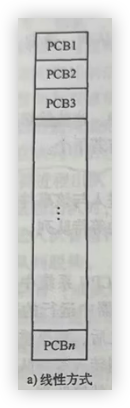
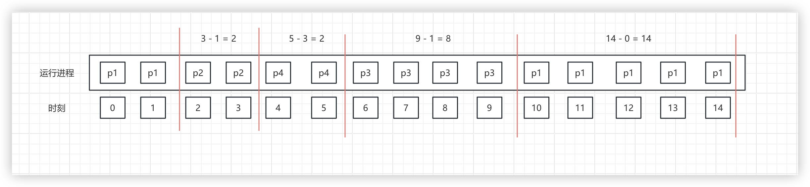
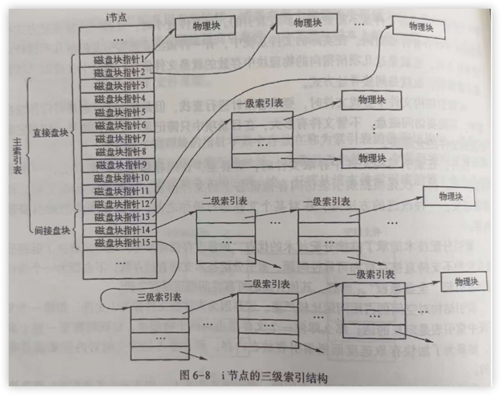
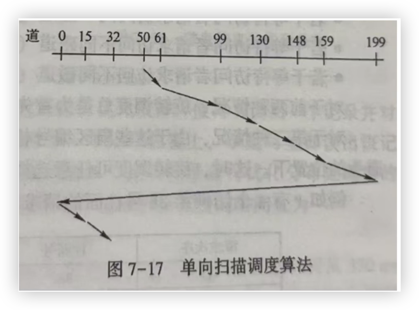

# 操作系统

## 第一章 操作系统概论

### 1.**计算机系统**

可以按照用户的要求接收和存储信息，自动进行数据处理并输出结果的信息系统

计算机系统包括<font color='#EF4444'>硬件（子）系统</font>和<font color='#EF4444'>软件（子）系统</font>

​	<font color='#EF4444'>硬件系统</font>是计算机系统赖以工作的`实体`

​	<font color='#EF4444'>软件系统</font>保证计算机系统按`用户指定的要求协调工作`

计算机系统的`资源`包括两大类：<font color='#EF4444'>硬件资源</font>和<font color='#EF4444'>软件资源</font>

在计算机系统中，集中了资源管理功能和控制程序的执行功能的一种软件称为操作系统

### 2.操作系统的特征

1. **并发性**：并发性是指在计算机系统中同时存在若干正在运行的程序，从<font color='#EF4444'>宏观</font>上来看，这些程序在同时向前推进

   <font color='#EF4444'>见到宏观选并发</font>

   体现在两个方面：

   1. 用户程序与<font color='#EF4444'>用户程序</font>之间并发执行
   1. 用户程序与<font color='#EF4444'>操作系统</font>之间并发执行

   <font color='#EF4444'>并行性</font>与<font color='#EF4444'>并发性</font>的区别

   并行性：同一<font color='#EF4444'>时刻</font>发生，微观意义（比如ABC三人同时六点起床）

   并发性：<font color='#EF4444'>同一时间间隔内</font>发生，宏观意义（ABC三人都在六点到六点十五起床）

1. **共享性**：操作系统程序与多个用户程序<font color='#EF4444'>共用</font>系统中的各种资源

   这种共享性是在<font color='#EF4444'>操作系统</font>控制下实现的

   资源的共享性主要针对计算机系统中的以下几个重要资源：中央处理器、内存储器、外存储器、外部设备 <font color='#EF4444'>所有硬件资源</font>

   在计算机系统中，对资源的共享一般有两种形式<font color='#EF4444'>互斥</font>共享和<font color='#EF4444'>同时</font>共享

   <font color='#EF4444'>互斥</font>共享：<font color='#67C23A'>打印机、磁带机、扫描仪等</font>，在某个时间段内<font color='#409EFF'>只能由某一个用户程序使用</font>（对于互斥共享的资源称为<font color='#EF4444'>临界资源</font>）

   <font color='#EF4444'>同时</font>共享：<font color='#67C23A'>在线文档</font>、<font color='#67C23A'>硬盘</font>，在某个时间段内<font color='#409EFF'>可以由多个用户程序使用</font>

1. **虚拟性**：是一种管理技术，将物理上的一个实体变为逻辑上的多个对应物，或将物理上的多个实体变为逻辑上的一个对应物。为用户提供易于使用，方便高效的操作环境

   例如<font color='#EF4444'>分时系统</font>将一体虚拟机分为多机，使得未来用户资源共享更加方便

   具体表现为：

   1. **虚拟内存**：当需要处理的任务比内存大时，先加载一部分到内存，处理完成后再换入下一部分。这样，程序会“以为”内存足够大，实现了对更大内存的模拟。
   1. **虚拟外设**：当计算机连接多个外部设备时，让多个外设工作时间差处在可接收的范围内，近似于同时工作，

1. **异步性**：在操作系统中，允许程序并发执行，但资源有限，进程的执行不是一贯到底的，而是走走停停，以不可预知的速度向前推进，进程的执行顺序和执行时间不确定

   例如：下载一个大文件和运行一个游戏比速度

### 3.研究操作系统的观点

**进程**的观点：进程可以看作运行中的程序是动态的，分为两大类<font color='#EF4444'>用户进程</font>、<font color='#EF4444'>系统进程</font>

**资源管理**的观点：一个是硬件资源，一个是软件资源。操作系统负责登记谁在使用什么资源，系统中有哪些空闲资源，当前响应了对谁的资源要求，以及回收了哪些资源。操作系统需要提供一些机制去协调程序间的竞争与同步，通过机制对资源进行合理使用，加以保护，以及采用虚拟技术来扩充资源

**虚机器**的观点：

​	**虚机器**：直接使用硬件称为`裸机`，通过操作系统控制`裸机`为`裸机`扩充了强大的功能后称为`虚机器`

​	将操作系统的功能分为若干层次，每个层次完成特定的功能，从而构成一个虚机器，并为上一层次提供支持

**服务提供者**的观点：把操作系统看作是服务提供者，这个服务提供者提供了一组功能强大，方便易用的广义的指令称为`系统调用`

### 4.操作系统的功能

1. **进程管理**：

   实质：对`中央处理器（CPU）`进行管理

   进程管理的主要内容：

   1. **进程控制**：

      `进程`是操作系统进行资源分配的`单位`

      主要处理<font color='#67C23A'>进程的创建</font>、<font color='#67C23A'>状态转换</font>、<font color='#67C23A'>进程撤销</font>以及相关进程资源的分配与回收等事物

   1. **进程同步**：

      主要处理进程之间的关系，包括进行的<font color='#67C23A'>同步</font>和<font color='#67C23A'>互斥</font>

      **互斥**：多个进程对临界资源的访问采用互斥的形式

      **同步**：在相互协作共同完成任务的进程之间，用同步机制协调他们之间的执行顺序

      最简单实现互斥的方法是给资源加锁，并提供操纵锁变量的`原语`，包括开锁和关锁的原语。原语是指具有某种功能，运行时具有`原子性`的一小段程序，原子性保证这一段程序要不全部被执行，要不全部不起作用，即这一操作不能被进一步分割或打断。

   1. **进程间通信**：主要处理<font color='#67C23A'>进程之间相互协作</font>信息<font color='#67C23A'>交换</font>问题

      一个比较典型的例子是通过网络在线流媒体播放。流媒体获取线程（线程是现代操作系统中处理时间分配的基本单位，它代表一个指令的执行流及执行上下文，一个进程可以包含多个线程）负责将媒体数据从远端的服务站点下载到本地的数据缓存中；流媒体的播放线程负责对缓存中的数据作流媒体数据分离（视频流和音频流）和解码，还原成图像帧和音频数据；然后渲染线程将前面的数据送往显示设备和声音设备。整个播放过程中，为了保证播放的流畅，这三个线程的执行是有一定关系的，原始数据的获取速度要比解码速度快，解码又要和渲染输出的速度匹配。这种执行速度的协调以及数据在不同线程之间的传递就需要进程间通信和进程同步机制来共同保证。

   1. **调度**：按照一定的<font color='#67C23A'>算法</font>从就绪队列中挑选一个<font color='#67C23A'>进程执行</font>

      `调度`又称为`处理器调度`，通常包括`线程调度`、`进程调度`、`作业调度`。

      `进程/线程`调度的任务就是按照一定的算法把处理器资源分配给就绪队列中的一个`进程/线程`，并准备好特定的`执行上下文`让其执行起来。`作业调度`的基本任务则是从`作业后备队列`中按照一定的算法挑出若干个作业，并按照`作业说明书`为它们分配一定的资源，把它们装入内存中并为每个作业建立相应的`进程`

      <font color='#EF4444'>控制通信步（同步）调（调度）</font>

1. **存储管理**：

   存储管理的任务是管理计算机内存的资源

   概括地说，存储管理有三个方面的任务

   1. **内存的分配与回收**

      操作系统要为每个进程分配内存空间，在分配的过程中还要尽可能提高内存资源的使用效率。对于已经退出运行的进程所占的内存空间，操作系统还要将它们加以回收，重新使用。人们在使用计算机时会经常发现，原本很大的内存在使用一段时间之后，似乎丢失了一部分空间，经过仔细检查，会看到内存空间使用图中有一大堆空间碎片，这种现象就是内存的分配与回收算法中的缺陷造成的。可见，内存的分配与回收对计算机系统有效运行的影响是很大的。

   1. **存储保护**

      由于内存是供多个程序共享的，因此，从理论上来讲，每个程序都应该在分配给自己的内存区中运行。但是必须要考虑某个程序发生越界的情况。因为程序自身可能存在一些错误或隐患，造成程序突然越界运行，不仅自身发生问题，而且影响或破坏其他程序的运行。如果发生故障的程序越界到操作系统运行的内存空间，那么受到的危害将更加严重，整个计算机系统有可能崩溃。其次，如果某个程序具有恶意，比如病毒程序或外界的入侵程序，那么就更有必要防止它们危害其他用户和整个计算机系统了

      在现代计算机系统中，由硬件提供存储保护机制，操作系统则利用这一机制实现进程的保护

   1. **内存扩充**

      在虚拟存储技术中，操作系统通常将空间划分为 4kB 大小的页面，并且以页面为单位进行存储空间的调度。进程所需的总页面数对应空间可以超出实际物理空间。但是操作系统只是把正在使用的页面保持在内存中或将即将使用的页面调入内存中，而将不用的页面置换到外存中，用户感受不到实际内存对使用空间的限制，仿佛有一个虚拟的大容量内存存在。

      系统要实现这一机制，必须提供请求页面调入和页面置换的功能

1. **文件管理**：

   在计算机系统中的信息资源（如程序和数据）是以<font color='#EF4444'>文件</font>的形式存储在外存储器（如磁盘、磁带）上的，需要时再把他们装入内存

   有三方面任务

   1. **文件存储空间的管理**

      文件系统为每一个文件分配一定的外存空间，并提高外存空间的利用率和访问效率，文件系统提供专门的数据结构记录文件系统的空间使用情况，为了提高利用率，存储空间通常采用离散分配方式，以 512B 或几 KB 的块为单位进行分配

   1. **目录管理**

      为每一个文件建立目录项，并对众多的目录项加以有效组织，方便用户按名存取

   1. **文件系统的安全性**

      包括读写权限以及存取控制，防止未经允许的用户读取文件，防止越权访问，防止以不正确的方式访问

1. **设备管理**：

   由操作系统的设备管理功能负责外部设备的分配、启动和故障处理，用户不必详细了解设备及接口的技术细节，就可以方便地通过操作系统提供的设备管理手段，对设备进行操作

1. **用户接口**：

   提供面向用户使用的交互接口

   1. 命令接口（cmd、shell、图形交互界面）
   1. 应用程序接口（API）

<font color='#EF4444'>用户存储进程设备文件</font>

### 5.不同时期的操作系统

**历史时期**：

1. 第一代电子管时代（1946 年～1957 年）
1. 第二代晶体管时代（1958 年～1964 年）
1. 第三代集成电路时代（1965 年～1970 年）
1. 第四代大规模/超大规模集成电路时代（1971 年至今）

**不同时期的操作系统**：

1. **手工操作**、**独占方式**

   对应电子管时代使用人工方式将需要计算的内容输入到计算机中

1. **监控程序（早期批处理）**

   由于手工操作的速度与计算机的计算速度不匹配，因此，人们设计了监控程序（管理程序），实现作业的自动转换，操作员将作业成批的输入到计算机中，由监控程序识别一个作业，进行处理后再取下一个作业，这种处理方式被称为`批处理`，由于是串行执行作业，因此被称为`单道批处理`

1. **多道批处理**

   所谓多道是指允许多个程序同时存在内存中，由 CPU 以切换方式为之服务

   `不适合`交互式作业

1. **分时系统**

   指多个用户通过终端设备于计算机交互作用来运行自己的作业，并且共享一个计算机系统而互不干扰，就好像自己有一台计算机

   `适合`交互式作业

1. **UNIX**通用操作系统

   是用 C 语言编写的，因此它是可移植的

1. **个人计算机操作系统**

   如 DOS、Windows、苹果、Linux

1. **现在操作系统的量大发展方向**

   **宏观应用**：大型操作系统，分布式操作系统和机群操作系统

   **微观应用**：微型操作系统，嵌入式操作系统

### 6.操作系统的分类

1. **批处理操作系统**

   **基本工作方式**：用户将作业交给系统操作员，系统操作员在收到作业后，并不立即将作业输入到计算机，而是在收到一定数量的用户作业后，组成一批作业，再把这批作业输入到计算机中；这批作业可以再系统中形成一个连续的、自动转接的作业流；系统操作员然后就启动操作系统，系统自动、依次执行每个作业。最后由操作员将执行完毕的作业结果交给用户

   特点是<font color='#EF4444'>成批</font>处理

   目标是系统<font color='#EF4444'>资源利用率高，作业吞吐率高</font>

   **优点**：作业流程自动化较高，资源利用率较高，作业吞吐量大

   **缺点**：用户<font color='#EF4444'>不能</font>直接于计算机<font color='#EF4444'>交互</font>，不适合调试程序

   **关键技术**：用多道程序运行、<font color='#EF4444'>假脱机（SPOOLing）</font>技术等

   **假脱机基本思想**：用磁盘设备作为主机的直接输入输出设备，主机直接从磁盘上选取作业运行，作业的执行结果也存在磁盘上；相应的，通道则负责将用户作业从卡片机上动态写入硬盘，而这一操作与主机并行

   **多道程序运行基本思想**：在内存中同时保持多个作业，主机可以交替的方式同时处理多个作业

1. **分时操作系统**

   采用时间片轮转方式处理服务请求，并通过交互方式在终端上向用户展示结果

   为了弥补批处理方式不能向用户提供交互式快速服务的不足而发展起来

   具有<font color='#EF4444'>多路性</font>、<font color='#EF4444'>交互性</font>、<font color='#EF4444'>独占性</font>和<font color='#EF4444'>及时性</font>的特点

   **多路性**：多个用户同时使用一台计算机

   **交互性**：用户向系统发出请求，系统进行响应，用户可以直接干预操作的每一步

   **独占性**：用户感知不到计算机正在被其他人使用

   **及时性**：系统对用户的请求给予快速响应

   在通用操作系统中，对于分时与批处理的处理原则：<font color='#EF4444'>分时优先，批处理在后</font>

   在通用操作系统中，一般把系统的分时和批处理运行状态称为前台和后台。把处理终端用户的、交互式的、比较小的、需要及时处理的作业，即分时作业，称为`前台作业`；而把那些需要运行时间较长、要调用其他外部设备的、比较大的、无须终端用户干预的，且不需要立即处理的作业，即可以批量处理的作业称为`后台作业`。换句话说，在系统的`前台`响应需要频繁交互的作业，如大量终端的处理要求；而`后台`则处理对时效性要求不强的作业

1. **实时操作系统**

   1. <font color='#EF4444'>硬实时</font>系统（火箭和导弹控制、飞行控制系统、核反应堆控制等）`高度可靠性`在规定的时间内实时响应外部事件的请求，同时完成对该事件的处理
   1. <font color='#EF4444'>软实时系</font>系统（视频处理、飞机订票） 对事件的响应和处理时间有一定的时间范围要求，不满足相关要求会影响系统的服务质量，但通常不会引发灾难性后果

   能力：

   1. **实时时钟管理**：针对实时任务能够进行实时处理

      根据时间要求可以分为`定时任务`与`延时任务`

      ​	**定时任务**：依据用户的定时启动，并按照严格的时间间隔重复运行

      ​	**延时任务**：非周期的运行，允许被延后执行，但是往往有一个严格的时间界限

      根据功能可以分为`主动式任务`与`从动式任务`

      ​	**主动式任务**：依据时间间隔主动运行，多用于实时监控

      ​	**从动式任务**：依赖外部事件的发生，当外部事件出现时（例如中断），这种实时任务应可能快地进行处理，并尽量保证不丢失事件

   1. **过载防护**：有大量的任务需要系统处理，但是任务的数量已经超出了当前系统的处理能力，系统需要有一定的防护能力对意外情况进行处理（通过延后或抛弃次要任务保证主要任务的执行成功）

   1. **高可靠性**

1. **个人计算机操作系统**

   是一种<font color='#EF4444'>单用户</font>的操作系统

   主要特点是：

   1. 计算机在某一时间内为单个用户服务
   1. 采用图形界面人机交互的工作方式，界面友好
   1. 使用方便，用户无须具备专门知识，也能熟练地操纵系统

1. **网络操作系统**

   <font color='#EF4444'>基于</font>计算机<font color='#EF4444'>网络</font>的、为计算机<font color='#EF4444'>网络配置</font>的操作系统，将计算机网络中的各个计算机有机的连接起来，实现相互通信以及资源共享

   1. **集中式模式**：运算处理在主计算机中发生，终端仅作为输入输出设备使用，通过连接两台以上的主机构成计算机网络
   1. **分布式模式**：每台计算机都有运算处理能力，多台计算机通过网络交互数据并共享资源和服务以及共享运算能力。

1. **分布式操作系统**

   <font color='#409EFF'>机群（cluster）是分布式系统的一种</font>

   将<font color='#EF4444'>大量</font>的计算机通过网络联结到一起，可以获得<font color='#EF4444'>极高的运算能力</font>及实现广泛的<font color='#EF4444'>数据共享</font>

   分布式操作系统是网络操作系统的更高级形式，它除了保持了网络操作系统的各种功能之外，还有如下特征：                                                                                                                                                                                                 

   1. 分布式操作系统是一个统一的操作系统，在系统中的所有主机使用的是<font color='#EF4444'>同一个</font>操作系统
   1. 实现资源的<font color='#EF4444'>深度共享</font>。在网络操作系统中，由于各个主机使用的操作系统不同，因此不能随意将一个计算任务从一台主机迁移到另一台主机，在分布式系统中，通过统一的操作系统调度，在某台主机上执行的任务可以迁移到另一台主机上执行
   1. **透明性**：在网络操作系统中，用户能够清晰的感觉本地主机与非本地主机的区别，但是在分布式操作系统中用户感觉不到本地主机与非本地主机的区别
   1. **自治性**：在分布式系统中的各个主机都处于平等地位，一个主机失效不会影响整个分布式系统

   **优点**：

   1. 以<font color='#EF4444'>较低</font>的成本获得<font color='#EF4444'>较高的运算性能</font>
   1. <font color='#EF4444'>可靠性</font>

1. **嵌入式操作系统**

   是一种`实时操作系统`，嵌入式操作系统在<font color='#409EFF'>工业控制</font>、<font color='#409EFF'>交通管理</font>、<font color='#409EFF'>信息家电</font>等

   **特点**：

   1. 系统内核小
   1. 专业性强
   1. 系统精简
   1. 高实时性
   1. 多任务的操作系统

### 7.操作系统设计

1. **设计难点**                                                                                                                                                                                                                                                                                                                                                                                   

   1. **设计复杂程度高**：程序长、接口信息多、动态性强、并行性强
   1. **正确性难以保证**：操作系统包含的功能成分多，外部接口设备复杂，导致操作系统源代码的正确性难以保证
   1. **研制周期长**：需求分析、制作软件规格说明书、进行软件设计、编写程序、调试、测试、整理开发文档

1. **设计过程**

   1. **功能设计**：根据系统的设计目标和使用要求确定所设计的操作系统应该具备哪些功能

   1. **算法设计**：某些算法能促进操作系统更快的响应

   1. **结构设计**：按照系统的功能和特性要求选择合适的结构，将系统逐层分解，使系统简单适应性强

      <font color='#EF4444'>能结算</font>

1. **设计目标**

   1. **可靠性**：正确性和健壮性

   1. **高效性**：提高系统运行的效率

   1. **易维护性**：易读性、易扩充性、易剪裁性、易修改性

   1. **可移植性**：将一个程序从一个计算机系统环境移动到另一个计算机系统环境中并可以正常运行

   1. **安全性**：是计算机系统安全性的基础

      <font color='#EF4444'>靠高位可安全</font>

1. **结构设计** 

   操作系统结构设计的重要性

   操作系统结构研究的目标

   1. **系统模块化**：一组数据结构以及定义在这组数据结构上的一组操作

      对模块的访问只能通过操作来完成，称为`信息隐蔽`

   1. **模块标准化**：

      1. 模块规格统一，按照标准化设计，模块构造一致，符合规范。
      1. 提炼操作系统核心，将关键组件固定为构建模块的基础单元，形成操作系统积木化设计

   1. **通信规范化**：模块之间的接口清晰划一，模块之间的通信方式统一

      <font color='#EF4444'>系统标准通信</font>

### 8.操作系统的体系结构

1. **整体式结构**：

   将整个操作系统拆分成若干模块，通过接口将这些模块连接在一起

   **优点**：结构紧密、接口简单直接、系统效率较高

   **缺点**：

   1. 模块间转接随便，各<font color='#EF4444'>模块相互牵连</font>，独立性差，系统结构不清晰
   1. 数据基本上作为<font color='#EF4444'>全程量</font>处理，相当<font color='#EF4444'>复杂</font>
   1. 可<font color='#EF4444'>适应性比较差</font>

1. **层次式结构**

   将操作系统的所有功能模块，按功能留图的调用次序，分别排列成若干层，各层之间的模块只能是单向依赖或单向调用关系。这样，不但操作系统的结构清晰，而且不会构成循环

   **优点**：

   1. 单向依赖或单向调用，结构清晰，不会构成循环
   1. 很容易对操作系统增加或替换掉一层而不影响其他层次
   1. 易于调试，易于修改、易于扩充、易于维护、易于保证正确性

1. **客户/服务器（微内核）结构**

   **特点**：

   1. 运行在核心态的内核：内核提供所有操作**系统基本**都具有的**操作**
   1. 运行在用户态的并以客户/服务器方式运行的进程层：**除内核部分外**，操作系统所有的其他部分都被分成若干个相对独立的进程，每一个进程实现一组服务，称为**服务进程**

   客户机进程发出消息，内核将消息传递给服务进程，服务进程执行相应的操作，将结果通过内核返回给客户机

   **优点**：

   1. **可靠**：每个服务进程都是相互独立且自包含的，因此某个服务进程出现问题也不会影响其他服务进程
   1. **灵活**：每个服务进程是自包含的，接口规范，修改一个服务进程代码不影响其他服务进程，便于增加新的服务功能
   1. **适用分布式处理的计算环境**：不同的服务进程可以运行在不同的处理器或计算机上，所以使操作系统自然拥有分布式的能力

   **缺点**：主要是对于<font color='#EF4444'>效率</font>的考虑，所有的用户进程只能通过微内核相互通信，微内核本身就成为系统的瓶颈

1. **外核结构**

   **内核**：仅仅为简单的申请操作以及释放和复用硬件资源

   **外核**：一些关键的硬件资源管理功能放在内核之外，通过一些特殊的机制让应用程序能够更直接地访问和控制这些硬件资源

   **比如**：传统的操作系统内核会对硬盘资源（像磁盘、内存）进行集中式管理。而外核结构就像是把这些管理权限部分地`下放`，让不同的应用程序或用户程序可以由更多的自主性

### 9.操作系统启动

1. **引导方式**：BIOS引导和UEFI引导

1. **启动机制**：BIOS自检、系统引导、启动内核、初始化系统 

1. **程序执行流程**：

   1. 用户通过操作系统<font color='#EF4444'>启动程序</font>

   1. 操作系统将程序从磁盘<font color='#EF4444'>加载到内存中</font>

   1. 操作系统为程序<font color='#EF4444'>分配资源</font>，如CPU时间，内存空间和输入输出设备

   1. 程序开始执行，由 CPU 按顺序<font color='#EF4444'>执行</font>指令

   1. 程序可能会与操作系统<font color='#EF4444'>交互</font>，请求服务，如读写文件或访问网络

   1. 程序执行完毕后，操作系统<font color='#EF4444'>回收</font>其占用的<font color='#EF4444'>资源</font>

      <font color='#EF4444'>启动加载分配执行交互回收</font>

### 习题

1. 微内核结构是常见的操作系统结构。在该结构下，操作系统在内核中建立起最小的机制，而把策略留给用户空间中的服务进程，其带来的直接好处包括可靠性、灵活性和适宜于

   1. 并行处理
   1. 并发处理
   1. <font color='#EF4444'>分布式处理</font>
   1. 同步式处理

1. 下列对操作系统的描述中，不正确的是

   1. 操作系统向用户提供各种服务
   1. 操作系统是一个大型的软件程序
   1. 操作系统合理、公平地对待不同的用户程序
   1. <font color='#EF4444'>操作系统管理计算机的硬件资源，不需要管理计算机的软件资源</font>

1. 在计算机系统中，对资源的共享方式分为同时共享和互斥共享。下列资源中，属于互斥共享的是

   1. 硬盘
   1. 内存
   1. <font color='#EF4444'>磁带机</font>
   1. 用重入码编写的文件

1. 下面关于并发性的叙述中正确的是

   1. 并发性是指若干事件在不同时刻发生
   1. 并发性是指若干事件在同一时刻发生     <font color='#EF4444'>并行性</font>
   1. 并发性是指若干事件在不同时间间隔内发生
   1. <font color='#EF4444'>并发性是指若干事件在同一时间间隔内发生</font>

1. 一个设备可在任何时候向处理器发出中断请求，因此操作系统处于什么样的状态是无法确切知道的，这体现了操作系统的

   1. 并发性
   1. <font color='#EF4444'>随机性</font>
   1. 共享性
   1. 并行性

1. 操作系统中，为了防止用户的错误而导致整个系统发生不可预料的后果，通常为中央处理器引入了运行模式的概念。运行模式一般分为用户模式和

   1. 调用模式
   1. 共享模式
   1. <font color='#EF4444'>特权模式</font>
   1. 恢复模式

1. 对 OS 功能的概括中，正确的是

   1. 进程管理、存储管理、虚存管理、文件管理和设备管理
   1. <font color='#EF4444'>进程管理、存储管理、作业管理、用户接口和设备管理</font>
   1. 进程管理、处理机管理、存储管理、文件管理和设备管理
   1. 进程管理、存储管理、文件管理、目录管理和设备管理

1. 进程间通信主要发生在哪些进程之间

   1. <font color='#EF4444'>相互协作</font>
   1. 相互竞争
   1. 相互联系
   1. 以上都不正确

1. 以下那一项不属于进程管理的内容

   1. <font color='#EF4444'>进程约束</font>
   1. 进程控制
   1. 进程同步
   1. 进程调度

   <font color='#EF4444'>应该是进程通信</font>

1. 存储管理的任务是管理计算机

   1. 文件资源
   1. 目录资源
   1. 设备资源
   1. <font color='#EF4444'>内存的资源</font>

1. 操作系统的发展过程中，按照由早到晚出现的顺序，以下排序正确的是

    1. <font color='#EF4444'>手工操作、监控程序、多道批处理，分时/实时系统</font>
    1. 多道批处理、监控程序、分时/实时系统，UNIX 操作系统
    1. 监控程序，个人计算机操作系统，多道批处理，分时/实时系统
    1. 多道批处理，分时/实时系统，手工操作，个人计算机操作系统

1. 下列关于计算机微内核操作系统结构的描述中，错误的是

    1. 内核运行在核心态
    1. 具有良好的灵活性，便于操作系统增加新的功能
    1. <font color='#EF4444'>模块之间可以任意相互调用，结构紧密，接口简单</font>
    1. 除内核之外，操作系统其他部分以进程方式运行在用户态

1. 操作系统的设计过程一般可分为功能设计、算法设计和<font color='#EF4444'>结构设计</font>

1. 并发性是操作系统的基本特征。计算机程序的并发性体现在下面两个方面，一是用户程序与<font color='#EF4444'>用户程序</font>之间的并发执行，二是用户程序与<font color='#EF4444'>操作系统</font>之间的并发执行

1. 共享性是指操作系统程序与多个用户程序<font color='#EF4444'>共用</font>系统中的各种资源，这种共享性是在<font color='#EF4444'>操作系统</font>控制下实现的

1. 它是操作系统结构研究的目标之一，在该目标下，模块之间的接口清晰划一，模块的联系方式统一。基于上述的描述，操作系统结构研究的这种目标是<font color='#EF4444'>通信规范化</font>

1. 按照用户界面的使用环境和功能特征的不同，把操作系统分为三种基本类型，即批处理操作系统、分时操作系统和<font color='#EF4444'>实时操作系统</font>

1. 分时操作系统的特点包括独占性、交互性、及时性和<font color='#EF4444'>多路性</font>

1. Android 操作系统的体系结构分为四层，从高层到低层分别是应用程序层、<font color='#EF4444'>应用框架层</font>、系统运行库层和<font color='#EF4444'>Linux内核层</font>

1. Linux 操作系统的体系结构包括四个主要部分，即 Linux 内核、Linux Shell、<font color='#EF4444'>Linux文件系统</font>和<font color='#EF4444'>Linux应用程序</font>

1. Windows 体系结构的主要层次中，执行操作系统中最基本的操作且始终运行在核心态的是<font color='#EF4444'>内核</font>，隐藏了与硬件有关的细节、为操作系统的硬件平台提供低级接口的是<font color='#EF4444'>HAL硬件抽象层</font>

1. 计算机系统包括<font color='#EF4444'>硬件系统和软件系统</font>

1. 计算机赖以工作的实体是<font color='#EF4444'>硬件系统</font>，<font color='#EF4444'>软件系统</font>保证计算机系统按用户指定要求协调工作

1. 在单处理机操作系统中，多个程序交替地在处理器上运行，从宏观上看，这些程序同时向前推进。这体现了操作系统的<font color='#EF4444'>并发性</font>

1. 进程控制的主要任务是创建进程、撤销结束的进程以及控制进程运行时的各种<font color='#EF4444'>状态转换</font>

1. 实时操作系统的主要目标是在严格的时间范围内，对外部请求做出反应。因此系统应该具有高度的<font color='#EF4444'>可靠性</font>

1. 用户提交作业后，再也无法干预其作业的运行的操作系统是<font color='#EF4444'>批处理操作系统</font>

1. 对可靠性要求极高，并且要求有强健壮性和坚固性的操作系统是<font color='#EF4444'>实时操作系统</font>

1. 将大量的计算机通过网络连结在一起，可以获得极高的运算能力及广泛的数据共享。这样一种系统称为<font color='#EF4444'>分布式系统</font>

1. 将操作系统分成用于实现操作系统最基本功能的内核和提供各种服务的服务进程两个部分，这样的操作系统结构是<font color='#EF4444'>微内核结构</font>

1. 操作系统的功能包括：<font color='#EF4444'>进程管理</font>、<font color='#EF4444'>存储管理</font>、<font color='#EF4444'>作业管理</font>、<font color='#EF4444'>设备管理</font>和<font color='#EF4444'>用户接口</font>

1. 在多道批处理系统中，作业成批输入、自动选择和控制作业的执行，减少了作业交接时间和<font color='#EF4444'>人工操作</font>时间，有利于提高系统的<font color='#EF4444'>吞吐率</font>。

1. 操作系统结构研究的目标<font color='#EF4444'>系统模块化</font>、<font color='#EF4444'>模块标准化</font>和<font color='#EF4444'>通信规范化</font>

1. 常见的操作系统结构有<font color='#EF4444'>整体式</font>结构、<font color='#EF4444'>层次式</font>结构和<font color='#EF4444'>微内核</font>结构

1. 把一个程序系统从一个计算机环境移植到另一个计算机环境中，并能正常运行的特性是<font color='#EF4444'>可移植性</font>

1. 多道程序设计环境具有<font color='#EF4444'>多道性</font>、<font color='#EF4444'>随机性</font>和<font color='#EF4444'>异步性</font>等特点

1. 并发性和并行性是操作系统中两个相似但又有区别的概念。在单处理器系统中，多个程序的并发执行不具有任何的并行性，因为它们在微观上是<font color='#EF4444'>顺序</font>执行的，没有任何两条指令是<font color='#EF4444'>并行</font>执行的。

1. 分布式操作系统有哪些特征？

   1. 分布式操作系统是一个统一的操作系统，在系统中的所有主机使用的是同一个操作系统。

   1. 实现资源的深度共享。

   1. 透明性。

   1. 自治性

1. 操作系统设计目标有哪些？

   1. 可靠性（正确性和健壮性）
   1. 高效性（提高系统的运行效率）
   1. 易维护性
   1. 可移植性
   1. 安全性

1. 操作系统启动执行流程？

   1. 用户通过操作系统启动程序
   1. 操作系统将程序从磁盘加载到内存中
   1. 操作系统为程序分配资源，如 CPU 时间、内存空间和输入输出设备
   1. 程序开始执行，由 CPU 按顺序执行指令
   1. 程序可能会与操作系统交互，请求服务，如读写文件或访问网络
   1. 程序执行完毕后，操作系统回收其占用的资源

   <font color='#EF4444'>启动加载分配执行交互回收</font>

## 第二章 操作系统运行环境与运行机制

### 1. 中央处理器CPU

CPU 一般由<font color='#EF4444'>运算器</font>、<font color='#EF4444'>控制器</font>、一系列的<font color='#EF4444'>寄存器</font>以及<font color='#EF4444'>高速缓存</font>构成

<font color='#EF4444'>运算器</font>实现指令中的<font color='#EF4444'>算术</font>和<font color='#EF4444'>逻辑</font>运算，是计算机计算的核心

<font color='#EF4444'>控制器</font>负责<font color='#EF4444'>控制程序运行</font>的流程，包括取指令、维护CPU状态、CPU 与内存的交互等

**寄存器**：一种暂时存储器件，用于在 CPU 处理指令期间暂存数据、地址以及指令信息	

1. `用户可见`的寄存器，包括：数据寄存器，地址寄存器以及条件码寄存器 <font color='#EF4444'>数地条（速递条）</font>
1. 控制和状态寄存器，常见：程序计数器（PC）、指令寄存器（IR）和<font color='#EF4444'>程序状态字（PSW）</font> <font color='#EF4444'>两程序一指令</font>

高速缓存：cache

指令执行的基本过程

开始 $\rightarrow$ 取指令  $\rightarrow$  执行 $\rightarrow$  停止

### 2. 特权指令和非特权指令

**特权指令**：指令系统中那些只能由`操作系统`使用的指令，不允许一般用户使用，如果用户可以随意使用特权指令，会造成系统混乱

如：设置程序状态字、启动某设备、设置中断屏蔽、设置时钟指令、清内存指令和建立存储保护指令等

**非特权指令**：操作系统、普通用户都能使用的

**用户程序如何使用特权指令**：通过处理器的处理机制，将处理器状态切换到操作系统运行的特权状态，然后将处理权移交给操作系统中的一段特殊代码，通常将这个过程称为陷入

### 3. 处理器的状态

**内核态**：又叫`管态`、`特权态`、`系统态`、`核心态`。指`操作系统`管理程序运行的状态，具有`较高`的特权级别 

**用户态**：又叫`目态`、`普通态`。指`用户程序`运行时的状态，具有较低的特权级别

当处理器处于内核态时，可以运行全部指令，可以使用全部资源并具有改变状态的能力。当处理器处于用户态时，只有非特权指令可以执行。不同的处理器状态的区别就是赋予运行程序的特权级别不同，可以运行的指令集合也不同。特权级别越高，可以运行的指令集合越大，高特权级别可以运行的指令集合包含低特权级别的

**CPU状态的转换**

1. **用户态 $\rightarrow$ 内核态的转换** 

   其转换的<font color='#EF4444'>唯一途径</font>是中断。中断响应时交换中断向量，新的中断向量中的 `PSW` 的 CPU 状态位标志为内核态

1. **内核态 $\rightarrow$ 用户态的转换**

   可通过<font color='#EF4444'>设置PSW指令</font>（修改程序状态字），实现从操作系统向用户程序的转换

   <font color='#EF4444'>系统启动</font>时，CPU的初始状态<font color='#EF4444'>是内核态</font>

   操作系统退出执行时，让用户程序运行在<font color='#EF4444'>用户态</font>

1. **限制用户程序执行特权指令**

   用户程序不能使用特权指令，当用户程序占用 CPU 时，应让 CPU 在用户状态下工作。若此刻收到了一条特权指令，CPU 将拒绝执行该指令，并生成一个非法操作事件。中断机制识别到该事件后，转交给操作系统处理，生成一个通知：程序中有非法指令

### 4. 程序状态字

**程序状态字的作用是指示处理器状态**

处理器的状态字（`PSW`）通常包括以下状态码

1. <font color='#EF4444'>CPU的工作状态码</font>：指明当前处理器的工作状态是管态还是目态，用来说明当前在处理器上执行的是操作系统还是一般用户，从而决定其是否可以使用特权指令或拥有其他的特殊权利

1. <font color='#EF4444'>条件码</font>：反应指令执行后的结果特征

1. <font color='#EF4444'>中断屏蔽码</font>：指出是否允许中断

   <font color='#EF4444'>C（塞）条中华</font>

**标准条件位**：

1. **CF**：进位标志位
1. **ZF**：零标志位
1. **SF**：符号标志位
1. **OF**：溢出标志位

1. **TF**：陷阱标志位
1. **IF**：中断使能标志位
1. **VIF**：虚拟中断标志位
1. **VIP**：虚拟中断待决标志位
1. **IOPL**：IO 特权级别

`VIF` 和`VIP`用于支持对一类可屏蔽的硬件中断处理


### 5. 存储器类型

<font color='#EF4444'>随机访问存储器（RAM）</font>：存放随机存取的程序的数据

<font color='#EF4444'>只读存储器（ROM）</font>：只能读取数据，不能随意地用普通方法写数据

`PROM`是一种可编程的只读存储器，它可以被特殊的 PROM 写入器向其中写入数据

`EPROM` 可以用一种特殊的紫外线照射芯片，擦去其中的信息位，使其恢复原来的状态，然后使用特殊的 EPROM 写入器来写入数据

**RAM**（随机存取存储器）和 **ROM**（只读存储器）有以下区别:

- **读写特性**：RAM 可读可写，ROM 通常只能读不能写
- **数据易失性**：RAM 中的数据在断电后丢失，ROM 的数据断电后仍可以保存
- **用途**：RAM 用于存储正在运行的程序或数据，ROM 用于存储固化的程序和数据

存储的<font color='#EF4444'>最小单位</font>是：二进位（又叫：比特或 bit 或 b ）

存储器的<font color='#409EFF'>最小编址单位</font>是：字节（又叫 Byte 或 B）

内存空间的<font color='#67C23A'>最小分配单位</font>是：块（又叫物理页或 Page）

1B = 8b 1kb = 1024B 1MB = 1024KB 1GB = 1024KB 1TB = 1024GB

### 6. 存储器的层次结构

计算机存储系统的设计主要考虑三个问题

1. **容量**：容量是存储系统的基础
1. **速度**：存储系统的速度则要能匹配处理器的速度，在处理器工作时不应该因为等待指令和操作符而发生暂停
1. **成本**：存储器的成本和其他部件相比应该在一个合适的范围内


### 7. 存储访问局部性原理

提高存储系统效能的关键在于`程序的存储访问局部性原理`

存储器存取 N 级存储器：

I 级存储器，若命中则返回数据；若不命中，在方位 II 级存储器，命中则返回数据，若不命中，在访问 III 级存储器，命中则返回数据....


公式解读：一级存储器的命中概率 * 一级存储器的存取时间 + 二级存储器的命中概率 * （一级存储器的存取时间 + 二级存储器的存取时间）

### 8. 存储保护

**界地址寄存器**:

在 CPU 中设置一对界限寄存器来存放该用户作业在内存中的<font color='#EF4444'>下限</font>和<font color='#EF4444'>上限地址</font>，分别称为下限寄存器和上限寄存器。

也可以使用一个寄存器作为基址寄存器，另一个寄存器作为限长寄存器（指示存储区长度）来指出程序在内存中的存放区域。每当 CPU 要访问内存时，硬件会自动将被访问的内存地址与界限寄存器的内容进行比较，以判断是否越界。如果未越界，则按此地址访问内存，否则将产生的程序中断——越界中断或存储保护中断

**存储保护键**：

当一个用户作业被允许进入内存时，操作系统会为其分配一个唯一的，不与其他用户作业相同的存储保护键号；将分配给该作业的各存储块的存储保护键也设置成同样的键号，当操作系统挑选该作业到 CPU 上运行时，操作系统同时也会将该作业的存储保护键号放到 PSW 的存储保护键（<font color='#EF4444'>“钥匙”</font>）域中。这样每当 CPU 访问内存时，都将对内存块的存储保护键与 PSW 中的<font color='#EF4444'>钥匙</font>进行比较。如果相匹配，则允许访问。否则拒绝并报警                      

### 9. 中断机制

**中断的概念**：

所谓中断是指<font color='#EF4444'>CPU</font>对系统中或系统外发生的<font color='#EF4444'>异步事件</font>的<font color='#EF4444'>响应</font>

**异步事件**：无一定时序关系的随机发生的事件

**中断的来源**：当发生某个异步事件以后，处理器会中断当前事件的执行，而转去处理该异步事件（称为执行该事件的中断处理程序）。在该异步事件处理完之后，处理器在转回源程序的中断点继续执行

​	**举例**：某人正在看书，此时电话响了（异步事件），于是用书签记住正在看的那一页（中断点），再去接电话（响应异步事件并进行处理），接完电话后再从被打断的那一页继续看（返回原程序的中断点继续执行）

中断是所有要打断处理器的正常工作顺序，并要求其去处理某一事件的一种常用手段

引起中断的事件称为`中断事件`或`中断源`

中断源向处理器发出的请求称为`中断请求`

处理中断事件的程序称为`中断处理程序`

发生中断时正在执行的程序的暂停点称为`中断断点`

处理器暂停当前程序转而处理中断程序的过程称为`中断响应`

中断处理结束之后恢复原来程序的执行称为`中断返回`

**中断的作用**

1. 能充分发挥处理器的使用效率，I/O 设备可以通过中断与 CPU 进行通信，主动向 CPU 报告当前输入的输入情况，可以避免 CPU 不断的查询和等待
1. 提高系统的实时能力，对于有较高实时处理要求的设备可以通过中断方式使请求可以及时处理

**中断的分类**

1. **强迫中断**：正在运行的程序不期望发生的，随机性较强
   1. **程序性中断**：算数运算溢出、被零除、用户态程序执行非法指令、访问不被允许的存储位置、虚拟存储缺页
   1. **时钟中断**：处理器内部的计时器产生，允许操作系统以一定规律执行函数，如时间片到，硬件实时时钟到时
   1. **输入输出（I/O）中断**：I/O 控制器产生，用于通知一个 I/O 操作是完成还是出现错误
   1. **控制台中断**：程序员在控制台发出命令
   1. **硬件故障中断**：掉电等硬件故障
1. **自愿性中断**：程序有意安排的，由`访管指令`引起，目的是要求操作系统提供系统服务，发生时间以及位置具有确定

**同步中断和异步中断区别**

1. **异步中断**：一般由当对当前程序而言的<font color='#EF4444'>外部事件</font>激发的，属于<font color='#EF4444'>外源</font>性质

   比如：用户输入、硬件故障等

   1. 时钟中断
   1. I/O 中段
   1. 控制台中断
   1. 硬件故障中断

1. **同步中断（异常）**：由当前程序的编码和逻辑激发的，属于<font color='#EF4444'>内因</font>性质

   比如：非法指令

   1. 程序性中断
   1. 访管指令异常


### 10. 中断系统

中断系统是现代计算机系统的<font color='#EF4444'>核心机制</font>之一，他不是单纯的硬件或软件的概念，而是`硬件`和`软件`<font color='#EF4444'>相互配合</font>、<font color='#EF4444'>相互渗透</font>而使得计算机系统得以充分发挥能力的`计算模式`

**两大组成部分**：<font color='#EF4444'>硬件中断装置</font>和<font color='#EF4444'>软件中断处理程序</font>

**硬件中断装置**负责<font color='#EF4444'>捕获</font>中断源发出的<font color='#EF4444'>中断请求</font>，并以一定的方式响应中断源，然后将处理器的<font color='#EF4444'>控制权移交</font>给特定的`中断处理程序`

硬件中断装置提供了中断系统的`基本框架`，是中断系统的`机制部分`

中断处理程序是中断系统的`策略部分`，它利用中断机制来实现对处理能力的`扩展`和对多种处理需求的适应

中断处理程序则针对中断事件的性质而执行相应的一系列操作

**中断请求的接收**：

在计算机硬件的<font color='#EF4444'>中断逻辑线路</font>和<font color='#EF4444'>中断寄存器</font>实现的

`中断逻辑线路`用于接收中断信号，并把收到的中断信号寄存在线路的`硬件触发器`上

由于计算机中可能有很多中断源请求，它们可能同时发生，因此由中断逻辑线路按中断优先级加以判定，即究竟应该响应哪个中断请求

**中断响应**：

1. **扫描中断**：指令执行周期结束时，处理器检查中断寄存器，看是否有中断信号。
   - **无中断**：执行下一条指令。
   - **有中断**：接收中断信号的编号（中断向量）。
1. **保存状态**：<font color='#EF4444'>保护现场</font>， 将中断程序状态字 PSW 的值和程序计数器 PC 的值存入系统堆栈。
1. **切换内核态**：进入内核态，处理中断更安全。
1. **查询中断向量表**：<font color='#EF4444'>分析</font>中断向量，<font color='#EF4444'>取得</font>中断处理程序的<font color='#EF4444'>入口</font>地址。
1. **执行中断处理程序**：转移控制权，<font color='#EF4444'>调用</font>中断处理程序

<font color='#EF4444'>扫信号，存状态，切内核，查表跳，控转移。</font>


### 11. 典型中断的处理

1. **I/O中断**：由 I/O 设备的控制器或通道发出

   **分类**：I/O 操作<font color='#EF4444'>正常结束</font>以及I/O<font color='#EF4444'>异常</font>

1. **时钟中断**

   **维护软件时钟**：定时维护、更新软件时钟。

   **处理器调度**：时间片到时切换到下一个进程。

   **控制系统定时任务**：定时启动任务，如死锁监测、记账、审计

   **实时处理**：触发信号，监控硬件健康

   <font color='#EF4444'>维护处理器要定时处理</font>

1. **硬件故障中断**

   **硬件故障**：通常需要人工干预，例如复位或更换设备。

   **保存现场**：确保当前状态数据不丢失

   **警告通知**：提醒管理员并提供诊断信息

   <font color='#EF4444'>硬件故障需干预，保存现场发警示</font>

1. **程序性中断**：程序指令出错，指令越权、寻址越界引发的系统保护

   **分类**：

   1. 程序性中断只能由<font color='#EF4444'>操作系统</font>完成。例如程序尝试做不能做的操作
   1. 程序性中断可以由<font color='#EF4444'>程序</font>自己完成。例如系统调试中断，断点和单步跟踪等

1. **系统服务请求（自愿性中断）**

   系统服务请求一般由处理器提供的<font color='#EF4444'>专用指令</font>（又称<font color='#EF4444'>访管指令</font>）来激发

### 12. 中断优先级、中断屏蔽与中断嵌套

- **多级中断与中断优先级**

  现代的微处理器都提供有多级中断系统，在多级中断系统中，<font color='#EF4444'>硬件</font>决定了各个中断的优先级别

  **多级中断作用**：

  1. 对各类中断信号依据其<font color='#EF4444'>紧急程度</font>和<font color='#EF4444'>重要性</font>划分级别
  1. 解决如果有重要程度相当的多个中断信号同时到达的，<font color='#EF4444'>如何选择首个</font>被处理的中断信号问题，在<font color='#EF4444'>同一中断级</font>中的<font color='#EF4444'>多个设备</font>接口中<font color='#EF4444'>同时都有中断请求</font>时，一般有两种办法可以采用、
     1. **固定优先级**：给每个设备接口安装一个不同的、固定的优先级。比如以该设备在总线中的位置来定优先级，离 CPU 近的设备的优先级高于离 CPU 远的设备
     1. **轮转法**：用一个表格，依次轮转响应，这是一个比较公平，合理的方法

- **中断屏蔽**：是一种用于控制中断处理的机制，通过设置特定的<font color='#EF4444'>中断屏蔽位</font>位或寄存器来临时禁止某些中断信号的处理。它主要用于在关键任务执行过程中避免某些不重要或低优先级的中断打断，从而保证系统的稳定性与任务的完整性

  程序状态字（PWS）中的<font color='#EF4444'>中断屏蔽位</font>决定，这些屏蔽位标识了被屏蔽的中断类或者中断。一旦某个 I/O 中断被程序状态字中的中断屏蔽位加以屏蔽，那么即使有 I/O 中断信号，处理器也不予响应

  <font color='#EF4444'>机器故障中断</font>不可屏蔽。比如：内存奇偶校验错，以及掉电等使得机器无法继续操作一类得故障

- **中断嵌套**

  计算机系统中都有多个中断源，如果一个中断处理过程中又发生了新的中断那么将引起`多个中断处理问题`

  **多级中断处理的策略分两种**:

  1. **禁止其他中断**：处理中断时，暂时屏蔽其他中断，新中断信号需等当前处理完成后再响应。通过**禁止和放开中断指令**实现，但无法根据中断紧急程度优先处理，不能满足严格的时间要求

     <font color='#EF4444'>处理中断禁他信，优先紧急难达成</font>

     

  1. **中断嵌套**：允许优先级较高的中断打断优先级较低的中断处理过程

     由于中断嵌套中高优先级中断可以打断低优先级的中断，因此需要为低优先级中断保存现场，压入堆栈中

### 13. I/O 技术

- **I/O结构**

  一台计算机中有大量的外部设备，为了满足这些外部设备的控制要求，**提高处理器和外部设备的运行效率，每台外部设备中都配有各自的设备控制器**

- **通道**

  `独立于处理器`，专门负责数据 I/O 传输工作的处理单元，又称为` I/O 处理机`

  **通道作用**：

  ​	•	处理器与外设**并行工作**，双方可同时访问内存。

  ​	•	处理器与外设、外设之间**并行分工**，提升效率。

  **访问冲突处理**：

  ​	•	若同时申请访问内存，由内存控制线路协调，**保证同步有序执行**。

  **多程序并行**：

  ​	•	操作系统通过通道技术，**多程序并行运行**，每个程序占用不同系统资源。

  <font color='#EF4444'>通道并行协调忙，多程共享资源强</font>

  通道技术一般用于大型机系统和那些对 I/O 处理能力要求比较高的系统。低档次的微机中没有通道

- **直接存储器访问技术（DMA）**

  **DMA（直接存储器访问）的作用**：

  ​	•	**自动化数据传输**：DMA 控制器通过系统总线，自动管理内存与 I/O 设备间的大块数据传输。

  ​	•	**指令执行**：处理器只需发送包含目标地址、数据长度等信息的指令，然后可以继续处理其他任务。

  ​	•	**完成通知**：DMA 传输完成后，会通过中断通知处理器。

  **优点**：

  ​	•	**提高效率**：处理器仅在传输开始和结束时参与，大幅减少干预。

  ​	•	**简化操作**：无需程序逐字节操作。

  **限制**：

  ​	•	**总线竞争**：DMA 传输与处理器访问总线可能冲突，处理器需要短暂等待，总线访问速度略降。

  ​	•	**整体提升**：尽管如此，对于大块数据传输，DMA 依然非常高效。

  <font color='#EF4444'>DMA 传块自动忙，传前传后处理想。冲突竞争短暂停，数据高效效能强。</font>

- **缓冲技术**

  <font color='#EF4444'>缓冲区</font>是应用设备之间进行数据传输时，专门用来暂存这些数据的一个存储区域

  缓冲技术一般在以下情况使用：

  1. 处理器与内存之间
  1. 处理器与其他外部设备之间
  1. 设备与设备之间的通信上

  缓冲技术用来解决部件之间速度不匹配的问题

  缓冲区可以供多个用户使用以及反复使用

### 14. 时钟

**主要功能总结**

​	1.	**死循环检测**：多道程序运行环境中，时钟用于发现陷入死循环的程序，避免资源浪费。

​	2.	**分时系统**：通过时钟间隔实现时间片轮转机制，确保任务公平调度。

​	3.	**实时控制**：在实时系统中，按固定间隔输出信号用于实时设备控制。

​	4.	**定时唤醒**：用于按需唤醒特定时间点需要执行的任务。

​	5.	**时间记录**：记录用户设备使用时长或事件时间间隔。

​	6.	**绝对时间记录**：提供系统日期和时间信息（年、月、日、时、分、秒）。

**时钟分类**

**按实现方式：**

​	1.	**硬件时钟**：

​	•	基于晶体振荡器的固定频率脉冲。

​	•	通过时钟寄存器记录脉冲数。

​	2.	**软件时钟**：

​	•	使用内存模拟时钟寄存器。

​	•	程序通过增减内存值来模拟时间。

**按用途：**

​	1.	**绝对时钟**：

​	•	运行独立，不受外界影响，即使断电仍保持准确时间。

​	•	提供完整的时间信息。

​	2.	**相对时钟**：

​	•	记录从设定初值开始的时间间隔。

​	•	支持倒计时功能，触发中断后用于任务管理或时间控制。

这类时钟的功能和分类为操作系统中的时间管理提供了基础支持。

### 15. 系统调用

用户在程序中<font color='#EF4444'>调用操作系统</font>所提供的一些子功能。这是一种特殊的过程调用，这种调用通常是由特殊的机器指令实现的，并且将系统转入特权方式（管态）

系统调用程序被看成是一个低级的过程，只能由<font color='#EF4444'>汇编语言</font>直接访问

系统调用是操作系统<font color='#EF4444'>提供给编程人员的唯一接口</font>

编程人员利用系统调用，动态请求和释放系统资源，调用系统中已有的功能来完成与计算机硬件部分相关的工作以及控制程序的执行速度等

**系统调用与一般过程调用的区别**

1. **运行在不同的系统状态**

   系统调用运行在用户态，但是被调用程序运行在内核态，一般过程调用中的调用程序与被调用程序都是运行在相同的状态下

1. **状态的转换**

   一般过程调用不涉及状态转换，系统调用通过软中断机制由用户态转换为内核态，由操作系统分析后，转入相应的系统子程序

1. **返回问题**

   一般的过程调用在被调用过程执行完毕后，将返回调用过程继续执行。但是，在采用抢占调度方式的系统中，被调用过程执行完后，系统对所有要执行的进程进行优先级分析。如果调用进程仍然有最高优先级则返回到调用过程继续执行；否则让优先级最高的进程先执行

1. **嵌套调用**：

   与一般调用过程一样，系统调用也允许嵌套调用，在一个被调用过程执行期间，还可以利用系统调用命令去调用另一个系统。一般情况下，每个系统对嵌套调用的深度都会有限制

   <font color='#EF4444'>运行 状态 回调</font>

**操作系统按功能分为两大部分**

1. 是<font color='#EF4444'>系统自身</font>所需要的
1. 是作为服务<font color='#EF4444'>提供给用户</font>的

**通用操作系统系统调用分类**

1. **进程控制类系统调用**

   主要针对进程的控制，如创建和关闭进程、获得和设置进程

1. **文件操作类系统调用**

   创建、打开、关闭、读\写文件、目录管理、移动文件指针、改变文件属性

1. **进程通信类系统调用**

   用于进程之间的消息和信号传递

1. **设备管理类系统调用**

   用来请求和释放有关设备，以及启动设备操作

1. **信息维护类系统调用**

   用户可以用该类系统调用获得当前日期和时间、设置文件访问和修改时间、了解系统当前的用户数、操作系统版本号、空闲内存和磁盘空间大小

**用户程序和系统程序之间的<font color='#EF4444'>参数传递</font>，常用方法**

1. 由陷入指令自带参数
1. 通过有关通用寄存器来传递参数
1. 在内存中开辟专用堆栈来传递参数

### 练习

1. 在处理器的所有寄存器中，对用户不可见的是

   1. <font color='#EF4444'>指令寄存器</font>
   1. 条件码寄存器
   1. 地址寄存器
   1. 数据寄存器

1. 计算机处理器中用于管理程序运行流程的是

   1. <font color='#EF4444'>控制器</font>
   1. 高速缓存
   1. 运算器
   1. 寄存器

1. 以下属于非特权指令的是

   1. 启动 I/O 设备
   1. 设置中断屏蔽
   1. <font color='#EF4444'>执行数据算数计算</font>
   1. 设置程序状态字

   **特权指令**：设置程序状态字、启动某设备、设置中断屏蔽、设置时钟指令、清内存指令和建立存储保护指令等

1. 在多用户或多任务的多道程序设计环境中，以下不是特权指令的是

   1. 启动设备
   1. 设置中断屏蔽
   1. 清内存
   1. <font color='#EF4444'>算数运算指令</font>

1. 程序状态字的内容不包含

   1. CPU 的工作状态代码
   1. 条件码
   1. 中断屏蔽码
   1. <font color='#EF4444'>执行代码的用户</font> ID

   其他三个都是

1. 以下关于处理器工作状态的描述，正确的是

   1. 操作系统管理程序运行的状态称为目态
   1. <font color='#EF4444'>当处理器处于管态时，可以执行全部指令</font>
   1. 系统启动时，处理器的初始状态为目态
   1. 当用户程序占用处理器时，应让处理器在管态下工作

1. 存储器的最小编址单位是字节，1024 个字节称为

   1. 1B
   1. <font color='#EF4444'>1KB</font>
   1. 1MB
   1. 1GB

1. 可用作随机存取数据的存储器是

   1. <font color='#EF4444'>RAM</font>
   1. ROM
   1. PROM
   1. EPROM

1. 内存空间的最小分配单位是

   1. 二进制位
   1. 字节
   1. 字
   1. <font color='#EF4444'>块</font>

1. 计算机系统采用层次化的存储体系，以下存储装置中容量最小的是

   1. 硬盘
   1. 内存
   1. 高速缓存
   1. <font color='#EF4444'>寄存器</font>

1. 如果处理器的上限寄存器值为 3000，下限寄存器值为 4000，那么当处理器要访问内存地址 4100 时，会产生

      1. 硬件故障中断
      1. <font color='#EF4444'>存储保护中断</font>
      1. 时钟中断
      1. I/O 中断

1. 以下可用于存储保护的技术是

      1. 缓冲技术
      1. DMA 技术
      1. 通道技术
      1. <font color='#EF4444'>界地址寄存器</font>

1. 时钟中断处理程序的主要内容不包括

      1. 维护软件时钟
      1. <font color='#EF4444'>监控管理</font>
      1. 处理器调度
      1. 实时处理

      维护软件时钟、处理器调度、控制系统定时任务、实时处理

      <font color='#EF4444'>维护处理器要定时处理</font>

1. 下列哪一种中断一般由处理器提供的专用指令（又称访管指令）来激发

      1. 程序性中断
      1. I/O 中断
      1. 控制台中断
      1. <font color='#EF4444'>自愿性中断</font>

1. 需要做的工作是保存现场，使用一定的手段警告管理员并提供一些辅助的诊断信息的是

      1. <font color='#EF4444'>硬件故障中断处理程序</font>
      1. 时钟中断处理程序
      1. 程序性中断处理程序
      1. 自愿性中断处理程序

1. 中断系统接收中断源的中断请求的途径是计算机硬件的

      1. 中断源和中断逻辑线路
      1. <font color='#EF4444'>中断逻辑线路和中断寄存器</font>
      1. 中断逻辑线路和中断位
      1. 中断位和中断寄存器

1. 中断处理结束时，处理器的状态

      1. 保持目态不变
      1. 从目态恢复为被中断时的管态
      1. 保持管态不变
      1. <font color='#EF4444'>从管态恢复为被中断时的目态</font>

1. 在多级中断系统中，同时有多个中断请求，处理器将

      1. 向用户发出询问请求
      1. <font color='#EF4444'>接收中断优先级最高的中断</font>
      1. 接收处理时间最短的中断
      1. 根据先来先服务的方式进行响应

1. 中断按照优先度分级，允许优先级较高的中断打断优先级较低的中断处理过程称为

      1. 中断断点
      1. 中断响应
      1. <font color='#EF4444'>中断嵌套</font>
      1. 中断事件

1. 在多级中断系统中，决定了各个中断的优先级别的是

      1. 通道
      1. 软件
      1. <font color='#EF4444'>硬件</font>
      1. 时间

1. 多级中断系统中，各中断优先级由硬件决定。但在某些情况下（如低优先级的事件正在执行），操作系统不能立即响应高优先级的中断，此时采用的技术是

      1. 软件设置中断优先级
      1. 中断挂起
      1. 中断嵌套
      1. <font color='#EF4444'>中断屏蔽</font>

1. 以下关于处理器工作状态转换的说法中，不正确的是

      1. 处理器处于管态时可以执行一切机器指令，包括特权指令
      1. 处理器处于目态时不允许执行特权指令
      1. 系统启动时，处理器的初始状态为管态
      1. <font color='#EF4444'>用程序计数器（PC）来指示处理器状态</font>

1. 处理器处理数据的速度与设备传输数据的速度不匹配时，可用于缓解两者之间速度矛盾的技术是

      1. 通道技术
      1. DMA 技术
      1. <font color='#EF4444'>缓冲技术</font>
      1. I/O 控制技术

1. 下列关于通道的作用的描述中，不正确的是

      1. 可以实现中央处理器和各种外部设备并行工作
      1. 可以实现各种外部设备之间的并行工作
      1. <font color='#EF4444'>通道既能负责数据I/O传输，也能负责数据计算</font>
      1. 采用通道后，处理器和外部设备能够访问存储器

1. 以下关于系统调用、库函数和应用程序的叙述中，正确的是

      1. <font color='#EF4444'>应用程序通过系统调用来获得操作系统内核提供的服务</font>

      1. 应用程序可以通过库函数来获得操作系统内核提供的服务

      1. 库函数是操作系统提供给应用程序的接口

      1. 应用程序在目态执行系统调用

         <font color='#EF4444'>应用程序在管态执行系统调用</font>

1. 关于系统调用与函数调用的区别的叙述中，正确的是

      1. 函数调用的调用程序和被调用程序运行在不同状态

      1. 系统调用的调用程序运行在系统态

      1. <font color='#EF4444'>一般函数调用可直接由调用过程转向被调用过程</font>

      1. 系统调用由可调用过程直接转向被调用过程

         <font color='#EF4444'>系统程序的调用程序运行在目态</font>

1. 存储器的最小编址单位是

      1. 二进位
      1. <font color='#EF4444'>字节</font>
      1. 字
      1. 双字

1. 在处理器的寄存器中，用于记录处理器的运行模式信息的是

      1. 地址寄存器
      1. 数据寄存器
      1. 指令寄存器
      1. <font color='#EF4444'>程序状态字</font>

1. 系统调用的目的是

      1. <font color='#EF4444'>请求系统服务</font>
      1. 中止系统服务
      1. 申请系统资源
      1. 释放系统资源

1. 用户程序向系统提出使用外设的请求方式是

      1. 作业申请
      1. 原语
      1. I/O 指令
      1. <font color='#EF4444'>系统调用</font>

1. 下列关于系统调用、库函数、应用程序之间的关系的描述中，正确的是

      1. <font color='#EF4444'>应用程序可以通过系统调用来获得操作系统内核提供的服务</font>
      1. 应用程序不能直接调用系统调用，只能通过库函数来获得内核提供的服务
      1. 库函数是操作系统提供给应用程序的接口
      1. 应用程序在执行文件操作时不需要系统调用的支持，只需库函数支持即可

1. 用户程序在执行过程中使用系统调用，此时处理器的工作状态

      1. <font color='#EF4444'>从目态转换为管态</font>
      1. 从管态转换为目态
      1. 维持目态
      1. 维持管态

1. 当计算机提供了管态和目态时，必须在管态下执行的指令是

      1. 读时钟周期指令
      1. 存数指令
      1. <font color='#EF4444'>屏蔽中断指令</font>
      1. 取数指令

1. 计算机系统将处理器工作状态划分为管态和目态，必须在管态下执行的指令是

      1. 从内存中取数的指令
      1. 把运算结果写入内存的指令
      1. 算数运算指令
      1. <font color='#EF4444'>I/O指令</font>

      <font color='#EF4444'>设置程序状态字、启动某设备、设置中断屏蔽、设置时钟指令、清内存指令和建立存储保护指令</font>

1. 在多用户或多任务的多道程序设计环境中，不是特权指令的是

      1. 启动设备
      1. 设置中断屏蔽
      1. 清内存
      1. <font color='#EF4444'>算数运算指令</font>

      <font color='#EF4444'>设置程序状态字、启动某设备、设置中断屏蔽、设置时钟指令、清内存指令和建立存储保护指令</font>

1. CPU 一般由<font color='#EF4444'>运算器</font>、<font color='#EF4444'>控制器</font>、<font color='#EF4444'>一系列寄存器</font>以及<font color='#EF4444'>高速缓冲存储器</font>构成

1. 运算器实现指令中的<font color='#EF4444'>算数</font>和<font color='#EF4444'>逻辑</font>运算，是计算机计算的核心

1. 用户可见寄存器，包括：<font color='#EF4444'>数据寄存器</font>、<font color='#EF4444'>地址寄存器</font>以及<font color='#EF4444'>条件码寄存器</font>

1. 控制状态寄存器，常见：<font color='#EF4444'>程序计数器PC</font>、<font color='#EF4444'>指令寄存器IR</font>和<font color='#EF4444'>程序状态字PSW</font>

1. 用户态到内核态的转换，其转换的唯一途径是<font color='#EF4444'>中断</font>

1. 计算机存储系统的设计主要考虑三个问题：<font color='#EF4444'>容量</font>、<font color='#EF4444'>速度</font>和<font color='#EF4444'>成本</font>

1. 存储器的类型，包括<font color='#EF4444'>随机访问存储器RAM</font>和<font color='#EF4444'>只读存储器ROM</font>

1. 中断系统两大组成部分：<font color='#EF4444'>硬件中断装置</font>和<font color='#EF4444'>软件中断处理程序</font>

1. 中断请求的接收：在计算机硬件的<font color='#EF4444'>中断逻辑线路</font>和<font color='#EF4444'>中断寄存器</font>实现

1. 在 UNIX 系统的各个寄存器中，程序计数器寄存器用来存放<font color='#EF4444'>指令地址</font>，当出现某个中断事件时，程序计数器寄存器中当前值就是被中断程序的<font color='#EF4444'>断点</font>

1. 在典型的计算机系统硬件结构中，CPU 与内存在最里层，通过总线与第二层的<font color='#EF4444'>接口</font>部件相连，第三层是<font color='#EF4444'>各种外围设备控制器</font>，最外层是外围设备

1. UNXI 操作系统的内核分成两大部分：一部分是<font color='#EF4444'>进程控制</font>子系统，负责处理器管理和存储器管理；另一部分是文件子系统，负责管理所有的<font color='#EF4444'>设备</font>和文件

1. 什么是中断，中断和异常的区别是什么

      中断是指处理器对系统中或系统外发生的异步事件的响应

      区别：中断是由外部事件引发的，异常则是由正在执行的指令引发的

1. 什么是中断屏蔽？采用什么方式来屏蔽？被屏蔽的中断信号保存在哪里？哪些中断不可屏蔽

      中断系统中，可以允许或禁止对某些中断的响应。中断屏蔽是通过 **PSW 的中断屏蔽位** 控制 CPU 是否响应某些中断，屏蔽的中断信号存储在 **中断寄存器** 中。**机器故障中断**（如内存奇偶校验错误、掉电）不可屏蔽，必须立即处理。

1. 中断系统由哪两大部分组成？请介绍计算机系统中比较典型的中断有哪些

      1. 硬件中断装置和软件中断处理程序
      1. I/O 中断、时钟中断、硬件故障中断、程序性中断、系统服务请求（或自愿性中断）

1. 中断和异常的区别是什么？请指出`时间片到时`、`算数溢出`、`掉电`和`虚拟存储中的缺页`分别属于中断和异常中的哪一种

      中断是指处理器对系统中或系统外发生的异步事件的响应

      中断：时间片到时、掉电

      异常：算数溢出、虚拟存储中缺页

1. 什么是系统调用？操作系统为什么要提供系统调用

      所谓系统调用，就是用户在程序中调用操作系统所提供的一些功能

      是操作系统给编程人员的接口。编程人员利用系统调用，请求和释放资源，调用系统中已有的功能来完成硬件部分相关的功能以及控制程序的运行速度等

1. 什么是系统调用？在执行系统调用时，调用程序和被调用程序分别运行在什么状态？在执行一般的函数调用时，调用程序和被调用程序分别运行在什么状态？

      系统调用，就是用户在程序中调用操作系统所提供的一些功能

      执行系统调用时，调用程序自身运行在目态，而被调用程序则运行在管态

      执行一般的函数调用时，其调用程序和被调用程序都运行在相同的状态：管态或目态

1. 什么是中断？如果同一级中断中的多个设备接口中同时都有中断请求时，如何处理

      中断是指处理器对系统中或系统外发生的异步事件的响应

      如果同一级中断中的多个接口中同时都有中断请求，可以采用固定优先数或者轮转法

1. 简述异步中断和同步中断的主要差别

      异步中断：属于外源性质，与当前程序没有逻辑关联，随机发生

      同步中断：属于内因性质，由当前程序的编码和逻辑激发，必然事件

1. 中断系统由哪两大部分组成？并简明说明一下

      中断系统由硬件中断装置和软件中断处理程序组成

      硬件中断装置捕获中断源发出的中断请求，并响应中断源，然后将处理器的控制权移交给中断处理程序

      中断处理程序针对中断性质执行相应操作

1. 中断响应的工作过程是什么

      1. 处理器接收中断信号
      1. 保护现场，将中断断点的程序状态字 PSW 和程序计数器 PC 值存入系统堆栈
      1. 分析中断向量，取得中断处理程序的入口地址
      1. 将程序计数器值置为中断处理程序的入口地址
      1. 调用中断处理程序

1. 中断处理的内容有哪些

      中断处理主要包括 **检查 I/O 状态、操纵设备或数据传输**。处理结束时，**CPU 识别中断返回指令，恢复程序上下文，切换回目态**，然后继续执行被中断的程序，从新指令周期开始运行。

1. 中断处理的步骤/过程是什么

      1. 接收和响应中断
      1. 保护现场，将中断断点的程序状态字 PSW 和程序计数器 PC 值存入系统堆栈
      1. 分析中断向量，取得中断处理程序的入口地址
      1. 调用中断处理程序
      1. 中断处理结束恢复现场
      1. 原有程序继续执行

1. 多级中断与中断优先级作用是什么

      现代的微处理器都提供多级中断系统，硬件决定了各个中断的优先级别

      中断优先级的作用：

      1. 对各类中断信号依据其紧急程度和重要性划分级别
      1. 解决如果有优先级相同的多个中断信号同时到达时，如何选择第一个要处理的中断信号的问题。在同一级中断中多个设备接口同时都有中断请求时，一般由两种办法可以采用，固定优先数和轮转法

1. 什么是中断嵌套

      一个中断的处理过程中又发生了新的中断有两种处理方案：

      1. 禁止其他中断，不去处理新发生的中断，可以使用软件实现
      1. 中断嵌套：允许优先级高的中断打断优先级低的中断

1. 什么是程序性中断？程序性中断都必须由操作系统来完成吗？举例说明

      程序性中断是指令出错、指令越权或者指令越界而引发的系统保护。不一定。可以由程序自己完成，如系统调试中断和算数错误

## 第三章 进程/线程模型

###   1.  进程

进程是具有一定独立功能的程序在某个数据集合上运行的活动，是操作系统进行资源分配和调度的单位

从操作系统的角度来看，可将进程分为用户进程和系统进程，系统进程的优先级高

#### 进程与程序的区别与联系

1. **进程和程序的联系**

   程序是进程的组成部分之一，一个进程的目标是执行它所对应的程序，如果没有程序进程就失去了意义。从静态角度来看，进程是由程序、数据和控制块（PCB）组成的

1. **进程与程序的区别**

   程序是静态的，进程是动态的。

   程序是永久存在的，进程是为了程序的一次执行而短暂存在的

   一个进程可以包含若干程序的执行，一个程序也可以产生多个进程。

   进程具有创建其它进程的功能。被创建的进程称为子进程，创建者称为父进程。

   **例如**：一个编译程序在执行时就要执行词法分析、语法分析、代码生成和优化等若干个程序。而一个编译程序有时需要同时生成几个编译进程，为几个用户服务。

#### 可再入程序

一个能被多个用户同时调用的程序，在执行中自身不可以改变

**通俗讲**：可再入程序必须和有关的<font color='#EF4444'>数据区分离</font>

#### 进程的特征

 1. **并发性**：

    多个进程可以同时运行，互不干扰。

 2. **动态性**：

    进程有生命周期，从创建到消亡，状态会不断变化。

 3. **独立性**：

    每个进程是独立的资源分配和运行单位。

 4. **交互性**：

    进程之间可以通过通信或共享资源进行交互。

 5. **异步性**：

    进程独立运行，进度不可预测。

 6. **结构性**：

    由程序、数据和控制信息（PCB）组成。

    <font color='#EF4444'>并动态交互，异步独立结构</font>

### 2. 进程状态及状态转换

#### 三状态进程模型 重点


1. **运行状态**

   进程已获得 CPU 并已在 CPU 上执行。在单 CPU 系统，最多只有一个进程处于运行状态

1. **就绪状态**

   已满足运行条件，但因未获得 CPU 而等待分配。多个进程可同时处于就绪状态。

1. **阻塞状态**

   也称`等待状态`或`封锁状态`，因等待资源或事件而暂停运行（如等待文件输入或竞争资源失败）。等待条件消失后，转为就绪状态，可再次争取 CPU。

**状态转换**

1. **就绪 → 运行**：

   就绪进程因获得 CPU 开始运行，调度程序按算法分配 CPU，并启动进程运行。

1. **运行 → 就绪**：

   时间片耗尽，触发超时中断，保存进程现场，将其状态设为就绪，等待重新调度。

1. **运行 → 阻塞**：

   进程因等待资源（如文件输入）暂停运行，保存现场，标记阻塞原因，CPU 转给其他就绪进程。

1. **阻塞 → 就绪**：

   阻塞条件解除，进程转为就绪，等待 CPU 分配后继续运行。

#### 五状态进程模型


1. **运行状态**：

   已获得 CPU 资源，正在执行代码。

   当系统无其他可运行进程时，执行系统的空闲进程

1. **就绪状态**：

   已具备运行条件，等待 CPU 分配。

   就绪进程通常按优先级排队，可能形成多个优先级队列。

1. **阻塞状态**：

   因等待 I/O 或同步事件暂停执行，即使分配到 CPU 也无法运行。

   进入阻塞队列，按事件分类，等待条件解除。

1. **创建状态**：

   系统为进程分配资源、加载程序、建立控制块，但进程尚未投入运行

1. **退出状态**：

   进程执行结束，系统回收资源并传递相关信息给父进程。

操作系统中多个进程的并发执行时通过交替进入运行状态来实现的

**五状态模型状态转换方式**

1. **调度与超时**：当一个运行状态的进程超时后，放入`低优先级就绪队列`，并修改其状态为就绪状态，然后调度另一个就绪状态的进程进入运行状态
1. **调度、等待事件、事件出现**：当一个处在运行状态的进程需要等待某个事件的发生时，主动放弃 CPU，进入阻塞状态；调度另一个就绪状态的进程进入运行状态，当上一个进程等待的事件出现后将相应从阻塞状态队列取出，放入`高优先级就绪`队列，将状态改为就绪状态

**状态转换**：

1. **创建新进程**：

   产生一个新进程，用于运行某程序，例如用户登录或系统创建服务。

1. **提交**：

   新进程创建完成，进入就绪状态等待 CPU 分配。

   系统可能限制并发进程数以优化性能。

1. **调度运行**：

   从就绪队列中选择进程分配 CPU，进入运行状态。

1. **释放**：

   进程因完成任务或出现问题终止，进入结束状态

   **正常退出**：任务完成。

   **异常退出**：如内存不足、非法操作或被其他进程终止。

1. **超时**：

   时间片用尽或高优先级进程抢占 CPU，当前进程暂停运行，返回就绪状态。

1. **事件等待（进入阻塞状态）**：

   等待资源或事件（如 I/O 操作、通信），暂时无法继续执行。

1. **事件出现（进入就绪状态）**：

   等待的事件完成或条件满足，阻塞状态解除，返回就绪队列。

#### 七状态进程模型


五状态进程模型没有`区分进程地址空间是外存还是内存`，在操作系统中引入`虚拟存储管理技术`后，需要进一步区分进程的地址空间状态

**出现的原因**：由于进程之间存在优先级，低优先级的进程等待时间可能较长，为了内存充足，将低优先级的进程移动到外存

**优点**：

1. **提高处理机效率**：

   就绪队列为空时，可利用空闲内存提交新进程，提高处理器使用率。

1. **灵活内存分配**：资源不足时，可将部分进程移至外存，为运行进程腾出内存。

1. **有利于调试**：调试时可挂起目标进程，方便对其地址空间进行操作。

**对比五状态进程模型增加了两个<font color='#EF4444'>状态</font>**

1. **就绪状态**：进程在`内存`且可立即进入运行状态
1. **阻塞状态**：进程在`内存`并等待某事件的出现
1. **阻塞挂起状态**：进程在`外存`并等待某事件出现
1. **就绪挂起状态**：进程在`外存`，但只要进入内存，即可运行

七状态进程模型中，新引入的<font color='#EF4444'>状态转换</font>有挂起和激活两类，意义有变化的转换有`事件出现`和`进程提交`

1. **挂起**：进程从内存移到外存

   **阻塞到阻塞挂起**：内存不足时，为提交新进程或运行就绪进程。

   **就绪到就绪挂起**：有高优先级阻塞，挂起低优先级就绪进程。

   **运行到就绪挂起**：抢占式系统中，为高优先级进程腾内存。

1. **激活**：进程从外存移回内存

   **就绪挂起到就绪**：优先级高于当前就绪进程或无就绪进程。

   **阻塞挂起到阻塞**：内存释放，且事件可能即将出现。

1. **事件出现**：进程等待的事件发生

   **阻塞到就绪**：事件满足，内存中的进程。

   **阻塞挂起到就绪挂起**：外存中进程的事件满足。

1. **进程提交**：完成新进程创建，进入就绪或就绪挂起状态（维持较大就绪队列）。

### 3. 进程控制块

为了便于系统控制和描述进程的活动过程，在操作系统内核中定义了一个专门的数据结构，称为进程控制块 PCB

#### PCB 的内容

1. **调度信息**：进程名和进程号共同标识一个进程，一个进程的进程号必须是唯一的
1. **现场信息**：进程的运行情况，每个进程都有自己的专用的工作存储区，其他进程运行时不会改变它的内容

#### 进程的组成

进程由程序、数据和 PCB 三部分组成，PCB 是进程的灵魂，程序和数据是进程的躯体

#### PCB 的组织方式

1. **线性方式**：

   将所有 PCB 不分状态组织在一个连续的表中

   优点是简单不需要额外的开销，适用于进程数目不多的系统

   缺点是需要扫描整个 PCB 表才能找到需要的PCB

   

1. **索引方式**：

   具有相同状态的进程，分别设置各自的 PCB 索引表

   

1. **链接方式**：指针

   

#### 进程队列的分类

1. **就绪队列**

   所有就绪状态的进程都排在就绪队列中

1. **等待队列**

   对于每一个等待事件组成一个队列

1. **运行队列**

   在单 CPU 系统中，整个系统有一个运行队列


#### 进程队列的组成

进程队列可以用进程控制块的链接来形容

常用的链接方式有`单向链接`（C 语言的单链表）、`双向链接`（C 语言中的双向链表）

一个进程从所在队列中退出称为`出队`

一个进程排入指定队列称为`入队`

一个进程插入某个进程队列中间称为`插队`

#### 进程出队的具体过程

1. 队首进程出队
1. 非队首（或队尾）进程出队
1. 队尾进程出队

###  4. 进程控制

进程有一个从创建到消亡的生命周期，需要对进程的生命周期中的各种状态转换进行控制，称为进程控制。进程控制是通过进程控制原语实现的

#### 原语

​	由若干条指令组成的指令序列，用来实现某个特定的操作功能。这个指令序列的执行是连续的，具有不可分割性，执行时也不可以间断，直至该指令执行结束

​	原语必须在内核态下执行，并且常驻内存。

​	原语和系统调用都可以被进程所调用，两者的差别在于原语具有不可中断性，它是通过其执行过程中关闭中断实现的，而且原语往往被系统进程所调用

用于进程创建的原语一般由创建原语、撤销原语、挂起原语、激活原语、阻塞原语、唤醒原语、改变进程优先级原语

1. **创建原语**：

   创建一个新的进程。创建一个进程的主要任务是建立 PCB。

   **创建进程的具体操作是**：先申请一个空闲 PCB 区域，将有关信息填入 PCB，置该进程为就绪状态，将其插入就绪队列中

1. **撤销原语**：

   释放进程所占用资源，撤销进程实质上就是撤销 PCB

1. **阻塞原语**：

   进程从运行状态转换为阻塞状态

1. **唤醒原语**：

   一个进程因为等待某个事件而发生阻塞，当该事件发生后，使用唤醒原语将该进程转化为就绪状态

### 5. 线程


#### 线程的引入


​	进程是调度的基本单位还是独立分配资源的单位，如果可以将这两个基本单位的功能分开，即作为调度和分派的基本单位，不作为独立分配资源的单位，则可以让进程轻装运行，面对拥有资源的基本单位，不频繁的对其进行切换，可以提高并发程度并避免消耗过多的系统资源

#### 什么是线程

​	**线程**是进程中的一个实体，是**CPU调度和分派的基本单位**（重点）。

​	•	**资源**：线程自身只拥有少量资源（如程序计数器、寄存器和栈），但可以共享进程的全部资源。

​	•	**特性**：线程之间可并发执行，同一进程的线程可相互创建和撤销（重点）。

#### 线程的属性

 1. **唯一标识与描述表**：

    每个线程有**唯一标识符**和线程描述表，记录其执行的寄存器、栈等状态信息（重点）。

 2. **执行独立性**：

    不同线程可以执行相同程序，例如同一个服务被多个用户调用时，系统为其创建多个线程（重点）。

 3. **共享内存**：

    同一进程内的线程**共享进程的内存空间**（重点）。

 4. **调度单位**：

    线程是**独立的调度单位**，支持并发执行：

​	•	单处理器系统：线程交替占用 CPU。

​	•	多处理器系统：线程可**并行**运行，减少总时间（重点）。

 5. **生命周期**：

    线程从创建到终止，会经历**阻塞**、**就绪**、**运行**三种状态（重点）。

**简化总结**：线程是共享进程资源的调度单位，有独立标识和状态描述表，支持并发和并行，生命周期包含阻塞、就绪、运行三种状态。

#### 引入线程的好处

 1. **创建快，开销低**：

    创建线程**无需分配资源**，比创建进程更快，系统开销更少（重点）。

 2. **切换效率高**：

    线程间切换速度比进程切换快（重点）。

 3. **通信高效**：

    同一进程内线程**共享内存和文件**，线程通信无需调用内核，**速度快、机制简单**（重点）。

 4. **并行能力强**：

    线程可独立执行，充分利用处理器和外部设备的**并行工作能力**（重点）。

**简化总结**：线程的创建、切换速度快，通信简单高效，并能充分发挥并行性能。

#### 线程的组成

**线程控制块 (thread 结构) 简化版**

用于保存线程私有信息。

**组成**

​	1.	**线程描述符**：唯一标识线程的编号。

​	2.	**寄存器组**：记录线程运行状态，包括程序寄存器、状态寄存器、通用寄存器。

​	3.	**双栈指针**：

​		•	**内核栈指针**：线程切换到内核态时使用。

​		•	**用户栈指针**：线程在用户态执行时使用。

​	4.	**私有存储区**：存储线程的**现场保护信息**和相关统计数据。

**记忆重点**

线程控制块包含 **唯一描述符**、**寄存器组**、**双栈指针**、**私有存储区**。

线程必须在某个进程内执行，它所需的资源都由它所属的进程拥有，操作系统分配资源时以进程为单位

一个进程可以包含多个线程。传统的进程只有一个线程。当一个进程包含多个线程时，这些线程，除各自私有的少量资源外，还要共享所属进程的所有资源

#### 线程与进程的关系

线程具有许多传统进程所具有的特征，所以线程又称为`轻量级进程`或`进程元`；传统的进程称为`重量级进程`

**线程与进程比较**

1. **调度**：

   线程是 CPU 调度的基本单位，进程是资源分配的基本单位

1. **并发性**：

   引入线程后，操作系统的并发性变得更强

1. **拥有资源**：

   只有进程才拥有资源，一个进程中的所有线程共享进程中的资源

1. **系统开销**：

   线程调度的系统开销远小于进程调度的系统开销

#### 线程的实现方式

**线程的分类**

1. **用户级线程**

   

   用户级线程由应用程序管理，与操作系统内核无关。

   **存在于用户空间**：线程创建、切换、撤销均在用户空间完成，无需依赖系统调用。

   **内核感知**：内核无法识别用户级线程，仅管理普通进程。

   **优点**：

   1. **切换速度快**：线程切换无需陷入内核，性能高效。
   1. **灵活调度**：应用程序可使用专用调度算法，满足特殊需求。
   1. **兼容性强**：适用于任何操作系统，包括不支持线程机制的系统。

   **缺点**：

   1. **阻塞问题**：
      1. 典型系统调用为阻塞式。
      1. 当某线程因系统调用阻塞时，同一进程内所有线程均被阻塞。
   1. **多处理器劣势**：
      1. 单用户级线程在多处理器系统中无法并行，内核一次仅为一个进程分配一个处理器。
      1. 同一进程内其他线程需等待当前线程释放 CPU。

   **记忆重点**

   **优点**：切换快、灵活调度、跨系统兼容。

   **缺点**：阻塞影响整体、无多处理器优势。

1. **内核级线程**

   

   线程的创建、切换和管理均由操作系统内核负责，内核感知线程的存在并通过线程控制块(TCB)进行管理。

   **特点**

   ​	•	**依赖内核**：线程操作（如创建、撤销、调度）均需通过内核完成。

   ​	•	**系统支持**：内核为每个线程保留独立的线程控制块，以感知和管理线程。

   **优点**：

   1. **多处理器并行支持**：

      在多处理器系统中，内核能同时调度同一进程中的多个线程，实现真正的并行操作

   1. **阻塞问题缓解**：

      若进程内一个线程阻塞，内核可调度该进程中的其他线程继续执行。

   1. **内核线程本身可多线程**

      支持高并发任务处理。

   **缺点**：

   1. **切换开销大**：

      线程切换需从用户态转至内核态，增加控制转移的成本。

   1. **固定调度算法**：

      线程调度由内核控制，应用程序无法自定义线程切换策略。

   **记忆重点**

   **优点**：多处理器支持、阻塞可切换、线程并发高效。

   **缺点**：切换耗时、调度算法受限。

   

1. **混合方式实现的线程**

    线程创建在用户空间完成，线程调度在核心空间完成

   **线程实现方式的比较**：

   1. **线程的调度与切换速度**

      用户级线程切换的速度特别快

   1. **系统调用**

      1. **用户级线程**

         **行为**：

         用户级线程的系统调用由进程控制，内核不了解用户级线程的存在。

         **结果**：

         - 当一个线程执行系统调用时，内核认为这是整个进程的行为，因此会阻塞整个进程。
         - 其他线程无法执行，导致低效率。

      1. **内核级线程**

         **行为**：内核感知线程的存在，系统调用被识别为单个线程的行为。

         **结果**：

         - 当某线程因系统调用被阻塞时，内核可调度同一进程的其他线程运行。
         - 提升并发度和系统资源的利用率。

   1. **线程执行时间**

      - 用户级线程系统，调度是以进程为单位的
      - 内核级线程系统，调度是以线程为单位的 

### 6. 协程

当线程的数量非常大的时候，系统线程会占用非常多的内存空间，过多的线程切换会占用大量的系统时间。为了解决这两个问题，许多编程语言提出了协程机制，例如 C++语言、Python 语言、Go 语言。

协程是`运行在线程之上的轻量级线程`，当一个协程执行完成后，可以选择主动退出，让另一个协程运行在当前线程之上。协程并没有增加线程的数量，只是在线程的基础上通过`分时复用`的方式运行多个协程，而且协程的切换在用户态完成，切换的代价比线程从用户态到内核态的代价小很多

### 练习

1. 当阻塞队列中唯一的一个进程所等待的事件发生后，该进程应转变为

   1. 运行状态
   1. <font color='#EF4444'>就绪状态</font>
   1. 阻塞状态
   1. 退出状态

   对于处于等待状态的进程，在其被阻塞的原因获得解除后，其状态将变为<font color='#EF4444'>就绪</font>，仅当得到<font color='#EF4444'>CPU</font>时，才可恢复运行

1. 某进程已获得处理器外的所有资源，正等待分配处理器资源，此时进程处于

   1. 运行状态
   1. 创建状态
   1. 等待状态
   1. <font color='#EF4444'>就绪状态</font>

1. 正在运行的进程，由于规定的时间片用完而使得系统发出超时中断请求，此时进程状态被修改为

   1. <font color='#EF4444'>就绪状态</font>
   1. 阻塞状态
   1. 就绪挂起状态
   1. 阻塞挂起状态

1. 以下关于线程的属性的叙述中，正确的是

   1. 每个线程有多个标识符和一张线程描述表
   1. <font color='#EF4444'>同一个进程中的各个线程共享该进程的内存地址空间</font>
   1. 不同的线程不可以执行相同的任务
   1. 多个线程是不可以并发执行的

1. 以下关于引入线程的好处叙述中，不正确的是

   1. 线程能独立执行
   1. 线程之间切换花费时间少
   1. 创建一个新线程花费的时间少
   1. <font color='#EF4444'>线程之间相互通信包含多种通信机制</font>

1. 对于只设置了用户级线程的系统，调度的进行单位是

   1. 线程
   1. 管程
   1. 通道
   1. <font color='#EF4444'>进程</font>

1. 线程的实现方式不包括

   1. 混合实现方式
   1. 内核级线程
   1. <font color='#EF4444'>商业级线程</font>
   1. 用户级线程

1. 以下关于用户级线程的叙述中，不正确的是

   1. <font color='#EF4444'>用户级线程依赖于内核</font>
   1. 用户级线程只存在于用户态中
   1. 用户级线程包可以在不支持线程的操作系统上实现
   1. 允许不同的应用程序采用适合自己要求的不同的调度算法

1. 以下关于线程的陈述中，错误的是

   1. 内核不知道用户级线程的存在
   1. <font color='#EF4444'>无论何种线程，其切换都需要内核的支持</font>
   1. 在支持线程的系统中，线程是调度和分派的基本单位
   1. 无论系统是否支持线程，进程都是资源分配的基本单位

1. 下列关于进程概念的描述中，不正确的是

   1. <font color='#EF4444'>进程是在多道程序环境中的完整程序</font>  进程不是完整程序

   1. 一个程序可以产生多个进程

   1. 进程是程序的一个执行过程

   1. 进程是系统进行资源分配的基本单位

1. 在多道程序环境中，竞争和分配计算机系统资源的基本单位是

      1. <font color='#EF4444'>进程</font>

      1. 程序

      1. 线程

      1. 用户

1. 多道程序设计的优势之一是

      1. 避免发生资源竞争
      1. 缩短作业执行时间
      1. <font color='#EF4444'>减少处理器空闲时间</font>
      1. 减少调度次数

1. 进程和程序的一个本质区别是

      1. 进程在一个文件中，程序在多个文件中
      1. 进程存储在内存，程序存储在外存
      1. 进程分时使用 CPU，程序独占 CPU
      1. <font color='#EF4444'>进程为动态的，程序为静态的</font>

1. 下列不可能发生的进程状态转换是

      1. 就绪态 $\rightarrow$ 运行态 
      1. 运行态 $\rightarrow$ 就绪态
      1. 运行态 $\rightarrow$ 阻塞态
      1. <font color='#EF4444'>阻塞态 $\rightarrow$ 运行态</font>

1. 在一个单处理器系统中，进程有运行、就绪和阻塞 3 个基本状态。假如某时刻该系统中有 12 个进程并发执行，则处于就绪态的进程数最多有

      1. 12 个
      1. <font color='#EF4444'>11 个</font>
      1. 10 个
      1. 9 个

      <font color='#EF4444'>肯定至少有一个正在运行所以是12 - 1 = 11</font>

1. 如果有 10 个进程并发执行，则以下不可能出现的情形是

      1. 1 一个进程处于运行态，没有就绪态的进程，9 个阻塞态的进程
      1. 1 一个进程处于运行态，9 个就绪态的进程，没有阻塞态的进程
      1. 一个进程处于运行态，1 一个就绪态的进程，8 个阻塞态的进程
      1. <font color='#EF4444'>没有进程处于运行态，2个就绪态的进程，8个阻塞态的进程</font>

1. 某进程在运行过程中需要等待从磁盘中读入数据，此时该进程的状态

      1. <font color='#EF4444'>从运行变为阻塞</font>
      1. 从运行变为就绪
      1. 从就绪变为运行
      1. 从阻塞变为就绪

1. 下列状态中不属于三状态进程模型的是

      1. 运行状态
      1. 就绪状态
      1. <font color='#EF4444'>创建状态</font>
      1. 等待状态

1. 只要程序的输入初始条件相同，则无论何时重复执行该程序，执行结果都相同，这体现了程序顺序执行的特点是

      1. 并发性

      1. 顺序性

      1. 程序执行结果的确定性

      1. <font color='#EF4444'>程序执行结果的可再现性</font>

1. 进程控制块的内容不包括

      1. 进程号
      1. 进程名称
      1. <font color='#EF4444'>进程执行代码</font>
      1. 进程优先级

1. 创建一个进程的具体操作过程不包括

      1. 建立一个进程控制块
      1. 为该进程分配内存
      1. <font color='#EF4444'>为该进程分配CPU</font>
      1. 将该进程控制块插入就绪队列

1. 在多道程序系统中，进程是<font color='#EF4444'>资源分配</font>和<font color='#EF4444'>调度</font>的基本单位

1. 从操作系统的角度来看，可将进程分为<font color='#EF4444'>系统进程</font>和<font color='#EF4444'>用户进程</font>两类

1. 线程的实现方式有两种，分别是<font color='#EF4444'>用户级线程</font>和<font color='#EF4444'>内核级线程</font>

1. 线程的两种实现方式中，不依赖于内核的是<font color='#EF4444'>用户级线程</font>，而所有线程的创建、撤销和切换都由内核实现的是<font color='#EF4444'>内核级线程</font>

1. 进程控制通常采用原语来实现，当需要产生一个新进程时，系统使用<font color='#EF4444'>创建</font>原语；当该进程完成任务后，系统使用<font color='#EF4444'>撤销</font>原语来结束进程

1. 从静态角度看，进程是由数据、<font color='#EF4444'>程序</font>和<font color='#EF4444'>进程控制块 PCB</font> 三个部分组成的

1. 在多道程序环境中，由于系统资源的<font color='#EF4444'>共享和竞争</font>，本来并无逻辑关系的程序之间产生了<font color='#EF4444'>相互制约</font>的关系

1. 顺序性、封闭性是程序顺序执行时的基本特征，由此可以引出程序顺序执行时，其执行结果具有两个特性，即执行结果的<font color='#EF4444'>确定性</font>和<font color='#EF4444'>可再现性</font>

1. 程序顺序执行时具有<font color='#EF4444'>顺序性</font>和<font color='#EF4444'>封闭性</font>两个基本特性，由此可以确定其执行结果具有确定性和可再现性

1. 五状态进程模型中，进程状态被分成创建状态、就绪状态、<font color='#EF4444'>运行状态</font>、<font color='#EF4444'>阻塞状态</font>和退出状态

1. 对于处于等待状态的进程，在其被阻塞的原因获得解除后，其状态将被转变为<font color='#EF4444'>就绪</font>状态，仅当得到<font color='#EF4444'>处理器</font>时，才可恢复运行

1. 在七状态进程模型中，被对换至外存的进程可能处于两种进程状态之一，即<font color='#EF4444'>就绪挂起</font>和<font color='#EF4444'>阻塞挂起</font>

1. 进程具有三个基本状态。在单处理器系统中，处于<font color='#EF4444'>就绪</font>和<font color='#EF4444'>阻塞</font>两个状态的进程可能有多个，可以将它们组成相应的队列

1. 在引入线程的操作系统中，线程作为<font color='#EF4444'>CPU调度</font>的基本单位，而进程作为资源分配的基本单位

1. 为了实现对进程的管理，系统通常将相同状态的进程分别组成<font color='#EF4444'>就绪队列</font>、等待队列和运行队列

1. 原语和系统调用都可以被进程所调用，两者的差别在于原语具有不可中断性，它是通过在其执行过程中<font color='#EF4444'>关闭中断</font>来实现的

1. 进程控制通常采用原语来实现，当某进程在执行过程中需要执行 I/O 操作时，系统使用<font color='#EF4444'>阻塞</font>原语；当进程所等待的事件发生后，系统使用<font color='#EF4444'>唤醒</font>原语将其转换为就绪状态

1. 原语是操作系统核心的一个组成部分，由若干条<font color='#EF4444'>指令</font>组成，用来实现某个特定的操作功能，执行时具有<font color='#EF4444'>不可中断性</font>

1. 同一个进程的多个线程共享该进程的<font color='#EF4444'>内存</font>地址空间和文件，它们之间的同步和通信无需调用<font color='#EF4444'>内核</font>，实现容易且开销小

1. 为实现进程管理，系统采用链接方式对所有的进程控制块（PCB）进行组织。其中，<font color='#EF4444'>单向</font>链接方式只有一个指针，前一进程的PCB中的指针值为下一个进程的PCB的地址；<font color='#EF4444'>双向</font>链接方式包含2 个指针，分别指向前一个进程的地址和后一个进程的 PCB 地址。

1. 内核级线程的创建、撤销和切换由<font color='#EF4444'>内核</font>实现，内核中保留了一个<font color='#EF4444'>线程控制块</font>，系统根据它来感知线程的存在并对它进行控制

1. 操作系统中每创建一个进程就要为该进程建立一个<font color='#EF4444'>进程控制块</font>。一个刚被创建的进程，它的初始状态为<font color='#EF4444'>就绪状态</font>

1. 进程控制块（PCB）的内容可以分成<font color='#EF4444'>调度信息</font>和<font color='#EF4444'>现场信息</font>两大部分

1. 通常系统会将所有的进程控制块（PCB）采用某种方式进行组织，将 PCB 放在一个连续表中进行管理的方式称为<font color='#EF4444'>线性方式</font>，将具有相同状态进程的PCB放在一个队列中进行管理的方式称为<font color='#EF4444'>链接方式</font>

1. 为了便于管理，操作系统把所有 PCB 用适当方式组织起来。一般的组织方式有：<font color='#EF4444'>线性方式</font>、<font color='#EF4444'>链接方式</font>、<font color='#EF4444'>索引方式</font>

1. 每个线程具有唯一的<font color='#EF4444'>标识符</font>和<font color='#EF4444'>线程描述表</font>，后者记录了线程执行的寄存器以及栈等现场状态

1. 同一进程各个线程共享该进程的<font color='#EF4444'>主存地址空间</font>

1. 进程具有哪六种特性

      进程具有并发性、动态性、独立性、交互性、异步性和结构性六种特征

1. 进程的组成是什么

      进程由程序、数据和进程控制块三部分组成

      PCB 是进程的灵魂，程序和数据是进程的躯体

1. 进程控制块的内容是什么

      为了便于系统控制和描述进程，在操作系统中定义了一个数据结构，称为进程控制块

      进程控制块内容分为调度信息和现场信息两部分

      调度信息有进程名、进程号等

1. 进程与程序的联系与区别

      程序是静态的，进程是动态的，进程是程序的执行过程。程序可长期存在，进程随执行而创建、终止。进程由程序、数据和进程控制块组成，没有程序就没有进程。

1. 从调用程序和被调用程序的运行状态的角度，说明系统调用与一般函数调用的区别

      对于一般的函数调用，其调用程序和被调用程序都运行在相同的状态，管态或目态

      对于系统调用，调用程序运行在目态，被调用程序运行在管态

1. 进程控制原语有哪些

      1. **创建原语**

         申请 PCB，填入信息，设为就绪状态，插入就绪队列。

      1.  **撤销原语**

         找到 PCB，从队列移除，释放资源，删除 PCB。

      1. **阻塞原语**

         保存进程状态，设为等待状态，插入等待队列。

      1. **唤醒原语**

         从等待队列移除，设为就绪状态，插入就绪队列等待调度。

1. 引入线程的好处

      1. 线程创建无需分配额外资源，比进程更快，系统开销小，切换时间短。
      1. 同一进程内的线程共享内存和文件，通信无需内核干预，信息传输速度快。
      1. 线程可独立运行，能充分利用处理器与外设的并行工作能力，提高系统吞吐量。
      
1. 线程实现机制是什么

      1. **用户级线程**

         完全在用户态管理，创建、撤销和切换由用户程序控制，不依赖内核。内核视其为单线程进程。

      1. **内核级线程**

         由内核管理，线程的创建、撤销和切换都通过内核来实现。内核能够通过线程控制块感知和控制每个线程。

1. 根据进程的行为可以将进程分为计算密集型进程和 I/O 密集型进程，请解释这两个概念。随着 CPU 变得越来越快，更多的进程倾向于哪一种类型？可以采用什么应对策略

      计算密集型进程：花费大部分时间在计算上

      I/O 密集型进程：花费大部分时间在等待 I/O 上

      倾向于I/O 密集型

      对于 I/O 密集型进程，应尽快让其发起磁盘请求，保持磁盘忙碌；同时，可以运行更多这类进程，充分利用处理器。

1. 在七状态进程模型中，什么是阻塞状态？什么是挂起阻塞状态？两个状态间如何转换

      进程阻塞：进程在内存并等待某事件出现

      阻塞挂起：进程在外存并等待某事件的出现

      当内存不足时，系统可能会将阻塞的进程挂起，移至外存。当系统拥有足够的内存时，可以将挂起阻塞的进程恢复并激活，转为阻塞状态，继续等待事件的发生。


## 第四章 进程/线程调度

### 1. 进程调度的基本概念

**进程调度即处理器的调度**

进程调度的任务是`控制`、`协调`进程对 CPU 的`竞争`，按照`调度算法`，使某个`就绪进程`获得 CPU 的控制权，转换为`运行状态`。进程调度也叫`低级调度`

实际上，进程调度完成的是将一个物理的 CPU 转变成多个虚拟的 CPU 的工作

进程调度程序是操作系统真正的核心，直接负责 CPU 的分配

#### 进程调度的主要功能

1. **保存现场**：

   当前进程放弃 CPU 时，保存程序计数器、寄存器等信息到 **PCB**，以便后续恢复。

1. **挑选进程**：

   按 **调度算法** 从就绪队列选出一个进程，将其状态改为运行，并分配 CPU。

1. **恢复现场**：

   为新选中的进程 **恢复现场信息**，让其从上次中断的地方继续执行。

#### 进程调度的时机

1. **创建进程**：

   决定继续运行 **父进程** 或切换到 **子进程**。

1. **任务完成**：

   当前进程完成任务后，主动释放 CPU。

1. **等待资源**：

   因资源或事件未满足，当前进程进入阻塞状态，放弃 CPU。

1. **中断发生**：

   设备完成任务发出 **I/O 中断**，调度程序决定是继续运行当前进程还是切换到新就绪的进程。

1. **运行到时**：

   在分时系统中，当前进程用完时间片，触发时钟中断，CPU 被分配给其他就绪进程。

#### 两级调度模型

进程调度和作业调度是 CPU 主要的两级调度，区别：执行频率不同

1. **进程调度**：

   负责从**内存中的就绪队列**中挑选进程，将其分配给 CPU 运行。

   属于微观调度，根据一定的算法，把处理器动态、实际地分配给所选择进程

   决定哪些进程获得 CPU；关注的是**CPU 的使用效率**。

   类似于站台调度，决定哪些乘客（进程）可以登上列车（CPU）。

1. **作业调度**：

   负责从**外存上的作业队列**中挑选作业，将其调入内存，创建对应的进程，加入就绪队列。

   属于宏观调度，具有获得处理器的资格，但尚未占有处理器，不能立即运行

   执行的次数少，甚至没有

   决定哪些作业进入内存；关注的是**整个系统的资源分配**。

   类似于车站检票，决定哪些乘客（作业）可以进入候车厅。

#### 三级调度模型

1. **进程调度**

   负责从**内存中的就绪队列**中挑选进程，将其分配给 CPU 运行。

1. **作业调度**

   负责从**外存上的作业队列**中挑选作业，将其调入内存，创建对应的进程，加入就绪队列。

1. **中级调度**

   将内存中驻留时间较长的进程切换到磁盘上，从就绪队列转换到就绪/挂起队列，或从阻塞队列转换到阻塞/挂起队列。

   当内存中有足够的空间时，中级调度就从就绪/挂起队列中选择一些合适的进程放入内存，使它们进入就绪队列

### 2. 进程调度算法的设计思路	

#### 调度策略的选择

1. **设计目标**：

   **核心**：不同系统侧重点不同。

   **批处理系统**：提高资源利用率和平均吞吐量。

   **分时系统**：缩短响应时间，确保均衡响应。

   **实时系统**：确保事件及时可靠处理。

1. **公平性**：

   公平分配 CPU，不偏袒某一进程或作业。

1. **均衡性**：

   平衡系统资源使用，最大化利用资源。

1. **统筹兼顾**：

   **兼顾**响应时间和资源利用率，尤其分时系统需快速响应用户输入。

1. **优先级**：

   ​	按优先级调度，避免进程无限期等待。

   ​	提升等待时间长的低优先级进程的优先级。

1. **开销**：

   **控制系统开销**，选用简单高效的算法，减少复杂性带来的负担。

#### 性能评价标准

1. **CPU 利用率**：

   CPU 的价格昂贵，希望尽可能充分利用

1. **吞吐量**：

   单位时间内 CPU 的完成数量

1. **周转时间**

   从作业提交到作业完成的时刻

   **作业 i 的周转时间为**：$T_i = t_(ci) - t_(si)$  <font color='#EF4444'>完成时间-提交时间</font>

   **带权周转时间**：$W = T/R$ <font color='#EF4444'>周转时间 / 实际运行时间</font>

1. **就绪等待时间**：

   通过缩短就绪等待时间，可以提高系统的吞吐量和并发性能，增加 CPU 的利用率

1. **响应时间**：

   提交第一个请求到产生第一个响应所用的时间

### 3. 经典进程调度算法

#### 先来先服务算法（FCFS）

1. **核心思想**：

   类似排队买票，按到达时间先后依次分配 CPU。

   进程执行时，**一直占用 CPU**，直至完成或阻塞才释放。

1. **优点**：

   **简单易实现**：实现逻辑清晰，操作简单。

   **对长作业有利**：无需频繁切换，长时间运行的进程能快速完成。

1.  **缺点**

   **短作业不友好**：短作业可能因长作业等待过久，导致 **带权周转时间变长**。

   **I/O 繁忙型作业不利**：频繁请求 I/O 后可能需排队等待，增加 **周转时间** 和 **带权周转时间**。

   **效率低**：不考虑作业特性，难以提高系统资源的整体利用率。


#### 时间片轮转调度（RR）

**核心思想**

1. 把所有就绪进程排成**先入先出（FIFO）队列**。
1. 每次调度选择队首进程运行一个**时间片**（10～100 毫秒）。
1. 若时间片用完未完成任务，则将进程放到队尾，轮到下一个队首进程运行。

**特点**

​	**适用场景**：主要用于**分时操作系统**，确保多个进程公平共享 CPU 时间。

​	**公平性**：所有进程都能获得执行机会。

**时间片的影响**

​	**过长**：退化为**先来先服务（FCFS）**，短进程需等待较长时间。

​	**过短**：频繁切换进程，**系统开销增加**，效率降低。

**时间片长度的影响因素**

1. **系统的响应时间**：

   时间片与系统响应时间成正比。

1. **就绪队列进程的数目**：

   时间片与就绪队列长度成反比。

1. **进程的转换时间**：

   若执行进程调度时的转换时间为 t，时间片为 q，比值 t/q 不大于某一数值， 如 1/10

1. CPU **运行指令速度**

   性能越高，时间片可越短。


#### 4. 优先级调度

**核心思想**

​	从就绪队列中选择优先级最高的进程，把 CPU 分配给它。

**优先级调度方式**

1. **非抢占式优先级**

   **特点**：当前进程**不会被打断**，即使出现更高优先级的进程。

   **条件**：当前进程**运行完成**或**主动让出 CPU**时，系统才调度高优先级进程。

1. **抢占式优先级**

   **特点**：**实时打断**当前运行的进程，优先调度更高优先级的进程。

   **触发条件**：有高优先级进程进入就绪队列时，强制分配 CPU。

**确定优先级的方式**

1. **静态优先级**

   **特点**：在进程创建时确定，不会随时间改变。

   **优点**：实现简单，系统开销小。

   **缺点**：容易出现**饥饿**问题，低优先级进程可能长时间无法获得 CPU。

1. **动态优先级**

   **特点**：优先级会随着时间动态调整，解决**饥饿问题**。

   **策略**：随等待时间增长，逐步提升进程优先级（“论年头”）。

   **优点**：提高系统公平性，减少长时间等待。

   **缺点**：系统开销较高，需要额外记录和计算。


#### 5. 最短作业优先法

**核心思想**：

​	从作业的后背队列中挑选那些需要运行时间最短的作业放入内存

**非抢占的策略**

**优点**：

​	有效降低作业的平均等待时间和提高系统的吞吐量

**缺点**：

​	对长作业很不利，并且不能保证紧迫性作业会被及时处理

 **主要用于作业调度**


#### 6. 最短剩余时间优先算法

**核心思想**：

​	采用抢占式策略。当新进程加入就绪队列时，如果它需要的运行时间比当前进程所需的剩余时间还短，则运行进程被强行剥夺 CPU 的控制权，把那个新进程调度去运行。

**优点**：

​	可以保证新的短作业一旦进入系统就会很快得到服务

**缺点**：

​	实现这种算法要增加系统开销

进程 A 正在运行，需要运行 10s，已经运行了 5s，这时进程 B 来了

1. B 需要运行 6s，先执行 A 还是 B

   进程 A 剩余运行时间 10 - 5 = 5s，进程 B 需要运行 6s，5 < 6 先执行进程 A

1. B 需要运行 4s，先执行 A 还是 B

   进程 A 剩余运行时间 10 - 5 = 5s，进程 B 剩余运行时间 4s，5 < 4，所以先执行 B

#### 7. 多级队列调度

通过将进程分配到不同优先级的队列中进行调度

#### 8. 多级队列反馈算法

是在多级队列的基础上增加了根据进程运行情况动态调整其在队列间移动的策略

### 4. 多处理器调度算法

#### 多处理器系统分类：

1. **松耦合、分布式多处理器、集群**：

   由一系列相对自治的系统组成，每个处理器有自己的主存和 I/O 通道

1. **专门功能的处理器**：

   主处理器控制专用处理器（如 I/O 处理器），完成特定任务。

1. **紧耦合多处理器**：

   处理器共享主存，由操作系统统一管理。

#### 粒度

考虑系统中进程之间的同步粒度，或者称为同步频率

1. **无约束并行性**：

   进程之间无同步，各自独立运行。典型场景：分时操作系统，每个用户执行独立任务。

1. **粗粒度和非常粗粒度的并行性**

   进程间有少量同步，支持多处理器运行，需较少软件改动。

1. **中粒度并行性**：

   程序员明确利用程序的并行特性。

1. **细粒度的并行性**：

   高复杂度场景，比线程级并行更细致。

#### 进程调度

将进程分配到不同的处理器上运行

#### 线程调度

线程切换时的开销远远小于进程切换时的开销，在多处理器这个环境中，线程可以用于开发应用程序中真正的并行性

多处理器线程调度和处理器分配的各种方案中，有以下四种比较突出的方法

1. **负载分配**：

   使用全局就绪队列，处理器空闲时直接从队列中取线程运行。

1. **组调度**：

   按线程组分配，一组线程同时调度到对应的处理器组上运行。

1. **专用处理器分配**：

   为每个线程分配专用处理器，线程与处理器一一对应，程序结束后处理器归还池中

1. **动态调度**：

   执行过程中线程数量可动态调整，适应任务需求变化。

### 5. 实时调度算法

#### 概述

1. **静态表驱动调度算法**：

   **特点**：运行前固定时间表，不随任务状态变化调整。

   **适用场景**：任务周期和截止时间固定，模式简单的系统。

1. **静态优先级驱动抢占调度算法**：

   **特点**：任务分固定优先级，高优先级可抢占低优先级。

   **适用场景**：需要快速响应高优先级任务的系统。

1. **基于动态规划调度算法**：

   **特点**：基于当前状态和未来分析优化任务顺序，追求整体最优。

   **适用场景**：任务关系复杂，需精细规划资源分配的系统。

1. **动态尽力调度算法**：

   **特点**：运行时尽量满足任务执行需求，无精细规划。

   **适用场景**：实时性较强，但不需过多精细优化的系统。

#### 限期调度（重点关注任务的完成期限）

每个任务都有一个必须完成的截止时间，调度器会根据这些截止时间来安排任务的执行顺序

#### 速率单调调度

任务的优先级是根据任务周期来分配的。任务周期越短，优先级越高

#### 优先级反转

高优先级任务被低优先级任务阻塞的现象

低优先级任务占用了资源，但高优先级任务需要使用被低优先级任务占据的资源

### 练习

1. 轮转算法最早来自

   1. 实时系统
   1. 批处理系统
   1. <font color='#EF4444'>分时系统</font>
   1. 定时系统

1. 在交互式系统中，进程从提交第一个请求到产生第一个响应所用的时间，称为<font color='#EF4444'>响应时间</font>

1. 有 5 个进程 P1、P2、P3、P4和 P5，它们在 0 时刻同时依次进入就绪队列，其执行时间和优先数（优先数小的进程优先级高）

    <table border="1" style="width: 100%; text-align: center; vertical-align: middle;">
      <!-- 第一行表头，第一列、第二列、第三列向下合并一行，第四列拆分成三列 -->
      <tr>
        <th rowspan="2"></th>
        <th rowspan="2">执行时间</th>
        <th rowspan="2">优先数</th> 
        <th colspan="3">FCFS</th>
        <th colspan="3">最高优先级</th>
      </tr>
      <!-- 第二行表头，列4拆分成三列 -->
      <tr>
        <th>开始时间</th>
        <th>完成时间</th>
        <th>周转时间</th>
        <th>开始时间</th>
        <th>完成时间</th>
        <th>周转时间</th>
      </tr>
      <!-- 数据行 -->
      <tr>
        <td>P1</td>
        <td>5</td>
        <td>3</td>
        <td>0</td>
        <td>5</td>
        <td>5</td>
        <td>10</td>
        <td>15</td>
        <td>15</td>
      </tr>
      <tr>
        <td>P2</td>
        <td>7</td>
        <td>2</td>
        <td>5</td>
        <td>12</td>
        <td>12</td>
        <td>3</td>
        <td>10</td>
        <td>10</td>
      </tr>
      <tr>
        <td>P3</td>
        <td>3</td>
        <td>1</td>
        <td>12</td>
        <td>15</td>
        <td>15</td>
        <td>0</td>
        <td>3</td>
        <td>3</td>
      </tr>
      <tr>
        <td>P4</td>
        <td>8</td>
        <td>4</td>
        <td>15</td>
        <td>23</td>
        <td>23</td>
        <td>15</td>
        <td>23</td>
        <td>23</td>
      </tr>
      <tr>
        <td>P5</td>
        <td>10</td>
        <td>5</td>
        <td>23</td>
        <td>33</td>
        <td>33</td>
        <td>23</td>
        <td>33</td>
        <td>33</td>
      </tr>
    </table>

    1. 计算先来先服务算法（FCFS）下各进程的周转时间和平均周转时间

       (5 + 12 + 15 + 23 + 33) / 5 = 17.6 

    1. 计算最高优先级算法下各进程的周转时间和平均周转时间

       (15 + 10 + 3 + 23 + 33) / 5 = 16.8 

1. 有 5 个进程 P1、P2、P3、P4和 P5，它们在 0 时刻同时依次进入就绪队列，执行时间如下

   <table border="1" style="width: 100%; text-align: center; vertical-align: middle;">
     <!-- 第一行表头，第一列、第二列、第三列向下合并一行，第四列拆分成三列 -->
     <tr>
       <th rowspan="2"></th>
       <th rowspan="2">执行时间</th>
       <th colspan="3">FCFS</th>
       <th colspan="3">SJF</th>
     </tr>
     <!-- 第二行表头，列4拆分成三列 -->
     <tr>
       <th>开始时间</th>
       <th>完成时间</th>
       <th>周转时间</th>
       <th>开始时间</th>
       <th>完成时间</th>
       <th>周转时间</th>
     </tr>
     <!-- 数据行 -->
     <tr>
       <td>P1</td>
       <td>30</td>
       <td>0</td>
       <td>30</td>
       <td>30</td>
       <td>40</td>
       <td>70</td>
       <td>70</td>
     </tr>
     <tr>
       <td>P2</td>
       <td>20</td>
       <td>30</td>
       <td>50</td>
       <td>50</td>
       <td>20</td>
       <td>40</td>
       <td>40</td>
     </tr>
     <tr>
       <td>P3</td>
       <td>10</td>
       <td>50</td>
       <td>60</td>
       <td>60</td>
       <td>0</td>
       <td>10</td>
       <td>10</td>
     </tr>
     <tr>
       <td>P4</td>
       <td>40</td>
       <td>60</td>
       <td>100</td>
       <td>100</td>
       <td>70</td>
       <td>110</td>
       <td>110</td>
     </tr>
     <tr>
       <td>P5</td>
       <td>10</td>
       <td>100</td>
       <td>110</td>
       <td>110</td>
       <td>10</td>
       <td>20</td>
       <td>20</td>
     </tr>
   </table>

   1. 请在表中给出先来先服务算法（FCFS）和最短进程优先算法（SJF）下各进程的开始时间（即开始运行时间）、完成时间和周转时间

   1. 请在上述两种算法下的平均周转时间

      FCFS：(30 + 50 + 60 + 100 + 110) / 5 = 70

      SJF：(70 + 40 + 10 + 110 + 20) / 5 = 50

1. 有 5 个进程 P1、P2、P3、P4和 P5，它们在 0 时刻同时依次进入就绪队列，执行时间如下

   <table border="1" style="width: 100%; text-align: center; vertical-align: middle;">
     <!-- 第一行表头，第一列、第二列、第三列向下合并一行，第四列拆分成三列 -->
     <tr>
       <th rowspan="2"></th>
       <th rowspan="2">执行时间</th>
       <th colspan="3">FCFS</th>
       <th colspan="3">SJF</th>
     </tr>
     <!-- 第二行表头，列4拆分成三列 -->
     <tr>
       <th>开始时间</th>
       <th>完成时间</th>
       <th>周转时间</th>
       <th>开始时间</th>
       <th>完成时间</th>
       <th>周转时间</th>
     </tr>
     <!-- 数据行 -->
     <tr>
       <td>P1</td>
       <td>8</td>
       <td>0</td>
       <td>8</td>
       <td>8</td>
       <td>15</td>
       <td>23</td>
       <td>23</td>
     </tr>
     <tr>
       <td>P2</td>
       <td>3</td>
       <td>8</td>
       <td>11</td>
       <td>11</td>
       <td>1</td>
       <td>4</td>
       <td>4</td>
     </tr>
     <tr>
       <td>P3</td>
       <td>1</td>
       <td>11</td>
       <td>12</td>
       <td>12</td>
       <td>0</td>
       <td>1</td>
       <td>1</td>
     </tr>
     <tr>
       <td>P4</td>
       <td>5</td>
       <td>12</td>
       <td>17</td>
       <td>17</td>
       <td>4</td>
       <td>9</td>
       <td>9</td>
     </tr>
     <tr>
       <td>P5</td>
       <td>6</td>
       <td>17</td>
       <td>23</td>
       <td>23</td>
       <td>9</td>
       <td>15</td>
       <td>15</td>
     </tr>
   </table>

   1. 请在表中给出先来先服务算法（FCFS）和最短进程优先算法（SJF）下各进程的开始时间（即开始运行时间）、完成时间和周转时间

   1. 请在上述两种算法下的平均周转时间（计算结果保留一位小数）

      FCFS：(8 + 11 + 12 + 17 + 23) / 5 =14.2

      SJF：(23 + 4 +1 + 9 + 15) / 5 =10.4

1. 假设一个系统有 5 个进程，它们的到达时间和运行时间如下表所示，忽略 I/O 以及其他开销时间

   <table border="1" style="width: 100%; text-align: center; vertical-align: middle;">
     <!-- 第一行表头，第一列、第二列、第三列向下合并一行，第四列拆分成三列 -->
     <tr>
       <th rowspan="2">进程</th>
       <th rowspan="2">到达时间</th>
       <th rowspan="2">运行时间</th>
       <th colspan="2">FCFS</th>
       <th colspan="2">SJF</th>
     </tr>
     <!-- 第二行表头，列4拆分成三列 -->
     <tr>
       <th>完成时间</th>
       <th>周转时间</th>
       <th>完成时间</th>
       <th>周转时间</th>
     </tr>
     <!-- 数据行 -->
     <tr>
       <td>A</td>
       <td>0</td>
       <td>3</td>
       <td>3</td>
       <td>3</td>
       <td>3</td>
       <td>3</td>
     </tr>
     <tr>
       <td>B</td>
       <td>2</td>
       <td>6</td>
       <td>9</td>
       <td>7</td>
       <td>9</td>
       <td>7</td>
     </tr>
     <tr>
       <td>C</td>
       <td>4</td>
       <td>4</td>
       <td>13</td>
       <td>9</td>
       <td>15</td>
       <td>11</td>
     </tr>
     <tr>
       <td>D</td>
       <td>6</td>
       <td>5</td>
       <td>18</td>
       <td>12</td>
       <td>20</td>
       <td>14</td>
     </tr>
     <tr>
       <td>E</td>
       <td>8</td>
       <td>2</td>
       <td>20</td>
       <td>12</td>
       <td>11</td>
       <td>3</td>
     </tr>
   </table>

   <font color='#EF4444'>如果进程是在不同时刻到达，那么周转时间需要用完成时间 - 到达时间</font>

   1. 请在表中给出先来先服务算法（FCFS）和最短进程优先算法（SJF）下各进程的完成时间和周转时间

   1. 请在上述两种算法下的平均周转时间

      FCFS：(3 + 7 + 9 + 12 + 12) / 5 = 8.6

      SJF：(3 + 7 + 11 + 14 + 3) / 5 = 7.6

1. 某 CPU 系统有如下一批处于就绪状态的进程

   

   1. **给出先来先服务算法(SCFS)和最短进程优先算法(SJF)下各进程的开始时间、完成时间、周转时间**

      

   1. **计算在各算法下的平均周转时间**

      FCFS：(10 + 11 + 13 + 14 + 19) / 5 = 13.4

      SJF：(19 + 1 + 4 + 2 + 9) / 5 = 7

1. 有 5 个进程 P1、P2、P3、P4和 P5，它们在 0 时刻同时依次进入就绪队列，其执行时间和优先数（优先数小的进程优先级高）

   <table border="1" style="width: 100%; text-align: center; vertical-align: middle;">
     <!-- 第一行表头，第一列、第二列、第三列向下合并一行，第四列拆分成三列 -->
     <tr>
       <th rowspan="2"></th>
       <th rowspan="2">执行时间</th>
       <th rowspan="2">优先数</th> 
       <th colspan="3">HPF</th>
       <th colspan="3">SJF</th>
     </tr>
     <!-- 第二行表头，列4拆分成三列 -->
     <tr>
       <th>开始时间</th>
       <th>完成时间</th>
       <th>周转时间</th>
       <th>开始时间</th>
       <th>完成时间</th>
       <th>周转时间</th>
     </tr>
     <!-- 数据行 -->
     <tr>
       <td>P1</td>
       <td>5</td>
       <td>3</td>
       <td>12</td>
       <td>17</td>
       <td>17</td>
       <td>4</td>
       <td>9</td>
       <td>9</td>
     </tr>
     <tr>
       <td>P2</td>
       <td>8</td>
       <td>2</td>
       <td>4</td>
       <td>12</td>
       <td>12</td>
       <td>14</td>
       <td>22</td>
       <td>22</td>
     </tr>
     <tr>
       <td>P3</td>
       <td>4</td>
       <td>1</td>
       <td>0</td>
       <td>4</td>
       <td>4</td>
       <td>0</td>
       <td>4</td>
       <td>4</td>
     </tr>
     <tr>
       <td>P4</td>
       <td>10</td>
       <td>4</td>
       <td>17</td>
       <td>27</td>
       <td>27</td>
       <td>22</td>
       <td>32</td>
       <td>32</td>
     </tr>
     <tr>
       <td>P5</td>
       <td>5</td>
       <td>5</td>
       <td>27</td>
       <td>32</td>
       <td>32</td>
       <td>9</td>
       <td>14</td>
       <td>14</td>
     </tr>
   </table>

   1. 请给出最高优先级算法（HPF）和最短进程优先算法（SJF）下个进程的开始时间（即开始运行时间）、完成时间和周转时间。（对于 SJF，当进程执行时间相同时，按先来先服务方式进行调度）

   1. 计算上述两种算法下的平均周转时间

      HPF：(17 + 12 + 4 + 27 + 32) / 5 = 18.4

      SJF：(9 + 22 + 4 + 32 + 14) / 5 = 16.2 

1. 单 CPU 的多道批处理环境下，有四个进程 P1、P2、P3、P4，到达系统的时刻 t 和运行时间如题表 36 所示，忽略进程切换等其他开销

   

   1. 若 t = 0 时，对该 4 个进程开始进行调度，采用最短时间优先调度算法，计算各进程的周转时间和平均周转时间（四舍五入，保留两位小数）

      **周转时间 = 完成时间 - 到达时间**

      

      1. 0时刻只有 p1 到达所以运行 p1，运行 1 个时间单位
      1. 1 时刻 p2、p3 到达，因为是抢占式，p2 的运行时间最短优先运行 p2，运行两个时间单位
      1. 3 时刻 p2 运行完成，p2 的周转时间是 `3 - 1 = 2`，并且 p4 到达，p1 运行时间剩余 5 个时间单位，p3 运行时间 4 个时间单位，p4 运行时间 2 个时间单位由于是抢占式运行 p4
      1. 3～5 时刻，p4 运行完成，`5 - 3 = 2`
      1. 5 时刻，p1 剩余 5 个时间单位，p3 剩余 4 个时间单位，所以运行 p3，` 9 - 1 = 8`
      1. 9 时刻，运行p1 `14 - 0 = 14`
      1. 平均周转时间( 2  + 2 + 8 + 14 ) / 4= 6.5

   1. 若 t = 2 时，对该 4 个进程开始进行调度，采用最短作业优先调度算法，最先选中运行的进程是哪一个？该进程的带权周转时间是多少（四舍五入，保留两位小数）

      在 t = 2 的时候，CPU 开始调度，也就是在 t=2 以前所有进程处于就绪状态，虽然p1、p2、p3 到达，但是 P1、P2、P3 不会执行，P4 没有到达，在 2 时刻只能运行 P1、P2、P3 中的一个，采用最短作业优先调度是非抢占式的，P2 的运行时间最短所以最先运行 p2

      **带权周转时间 = 周转时间 / 运行时间**

      p2 的完成时间是 t + 2 = 4

      **周转时间 = 完成时间 - 到达时间**

      4 - 1 = 3

      3 / 2 = 1.5

1. 有 4 个进程 P1、P2、P3、P4，它们的到达时间、服务时间和服务优先数如下表所示。忽略 I/O 以及其它开销时间。若分别采用先来先服务算法、非抢占式最高优先级算法（优先数小的进程优先级高），计算各进程的完成时间、周转时间和平均周转时间，并填写下表（结果四舍五入，保留一位小数）

   | 进程 | 到达时间 | 服务时间 | 优先数 |
   | :--: | :------: | :------: | :----: |
   |  P1  |    0     |    50    |   4    |
   |  P2  |    20    |    40    |   1    |
   |  P3  |    40    |    10    |   3    |
   |  P4  |    60    |    20    |   2    |

   <table border="1" style="width: 100%; text-align: center; vertical-align: middle;">
     <tr>
       <th>调度算法</th>
       <th>进程</th>
        <th>P1</th>
        <th>P2</th>
        <th>P3</th>
        <th>P4</th>
     </tr>
     <tr>
      <td rowspan="3">先来先服务算法</td>
      <td>完成时间</td>
      <td>50</td>
      <td>90</td>
      <td>100</td>
      <td>120</td>
    </tr>
    <tr>
      <td>周转时间</td>
      <td>50</td>
      <td>70</td>
      <td>60</td>
      <td>60</td>
    </tr>
    <tr>
      <td>平均周转时间</td>
      <td colspan="4">60</td>
    </tr>
    <tr>
     <td rowspan="3">非抢占式最高优先级算法</td>
     <td>完成时间</td>
     <td>50</td>
     <td>90</td>
     <td>120</td>
     <td>110</td>
     </tr>
    <tr>
      <td>周转时间</td>
      <td>50</td>
      <td>70</td>
      <td>80</td>
      <td>50</td>
     </tr>
     <tr>
      <td>平均周转时间</td>
      <td colspan="4">62.5</td>
     </tr>
   </table>

     调度顺序：$P1 \rightarrow P2 \rightarrow P4 \rightarrow P3$

1. 有 5 个进程 P1，P2，P3，P4，P5，它们的到达时间和服务时间分别为P1(0,30)，P2(10,60)，P3(20,40)，P4(30,50)，P5(50,30)，忽略 I/O以及其他时间开销，若分别采用最短进程优先算法、非抢占式多级反馈队列调度算法（进程最初进入第1 级，执行完一个时间片后进入第 2 级，以此类推，第 i 级队列的时间片为 10*i）。请计算各进程的完成时间、周转时间、平均周转时间（四舍五入，保留一位小数），在答题纸上列表作答

    | 进程 | 到达时间 | 服务时间 |
    | :--: | :------: | :------: |
    |  P1  |    0     |    30    |
    |  P2  |    10    |    60    |
    |  P3  |    20    |    40    |
    |  P4  |    30    |    50    |
    |  P5  |    50    |    30    |

    <table border="1" style="width: 100%; text-align: center; vertical-align: middle;">
      <tr>
        <th>调度算法</th>
        <th>进程</th>
         <th>P1</th>
         <th>P2</th>
         <th>P3</th>
         <th>P4</th>
         <th>P5</th>
      </tr>
      <tr>
       <td rowspan="3">最短进程优先</td>
       <td>完成时间</td>
       <td>30</td>
       <td>210</td>
       <td>70</td>
       <td>150</td>
       <td>100</td>
     </tr>
     <tr>
       <td>周转时间</td>
       <td>30</td>
       <td>200</td>
       <td>50</td>
       <td>120</td>
       <td>50</td>
     </tr>
     <tr>
       <td>平均周转时间</td>
       <td colspan="5">90</td>
     </tr>
     <tr>
       <td rowspan="3">非抢占式多级反馈队列</td>
       <td>完成时间</td>
       <td>60</td>
       <td>180</td>
       <td>190</td>
       <td>210</td>
       <td>150</td>
     </tr>
     <tr>
       <td>周转时间</td>
       <td>60</td>
       <td>170</td>
       <td>170</td>
       <td>180</td>
       <td>100</td>
     </tr>
     <tr>
       <td>平均周转时间</td>
       <td colspan="5">136</td>
     </tr>
    </table>

    **非抢占式多级反馈队列计算方式**：

    ​	**解析：到达时间不一样**

    ​	非抢占式多级反馈算法：第一级队列时间片是 10 * 1 = 10；第二级队列时间片是 10 * 2 = 20；第三级是 10 * 3 = 30 ....

    ​	也就是一级队列只能执行10 个时间单位，二级队列只能执行 20 个时间单位....

    1. **P1(0 时刻到达)，第 1 级执行 10(0 - 10)**，**<font color='#409EFF'>剩余30 - 10 = 20(40 - 60) 进行第 2 级</font>**，完成，**<font color='#EF4444'>完成时间 = 60</font>**，检查第一级队列，P5 到达，调度 P5，然后检查第二级队列，调度 P2
    1. **P2(10 时刻到达)，第 1 级执行 10(10 - 20)**，**<font color='#409EFF'>剩余60 - 10 = 50(70 - 90)进行第 2 级</font>**，**<font color='#67C23A'>剩余60 - 10 - 20 =30(150 - 180)进行第 3 级</font>**，完成，**<font color='#EF4444'>完成时间180</font>**
    1. **P3(20 时刻到达)，第 1 级执行 10(20 - 30)**，**<font color='#409EFF'>剩余40 - 10 = 30(90 - 110)进行第 2 级</font>**，**<font color='#67C23A'>剩余40 - 10 - 20 =10(180-190)进行第 3 级</font>**，完成，**<font color='#EF4444'>完成时间190</font>**
    1. **P4(30 时刻到达)，第 1 级执行 10(30 - 40)**，**<font color='#409EFF'>剩余50 - 10 = 40(110 - 130)进行第 2 级</font>**，**<font color='#67C23A'>剩余50 - 10 - 20 =20(190 -210)进行第 3 级</font>**，完成，**<font color='#EF4444'>完成时间210</font>**
    1. **P5(50 时刻到达)，第 1 级执行  10(60-70)**，**<font color='#409EFF'>剩余30 - 10 = 20(130 - 150)进行第 2 级</font>**，完成，**<font color='#EF4444'>完成时间150</font>**

    **重点**：**当时间来到 40 时刻时，P5 还未到，第1级队列为空，去执行第 2 级队列**

1. 有 4 个进程 P1、P2、P3、P4，它们的到达时间、服务时间和优先数分别为 P1(0,30,2)、P2(10,60,3)、P3(20,40,1)、P4(30,50,4)，优先数小的进程优先级高，忽略 I/O 以及其它开销时间，若分别采用最短进程优先算法和抢占式最高优先级算法，请计算各进程的完成时间、周转时间和平均周转时间，并填写在下表中（四舍五入，保留一位小数）

    | 进程 | 到达时间 | 服务时间 | 优先数 |
    | :--: | :------: | :------: | :----: |
    |  P1  |    0     |    30    |   2    |
    |  P2  |    10    |    60    |   3    |
    |  P3  |    20    |    40    |   1    |
    |  P4  |    30    |    50    |   4    |

    <table border="1" style="width: 100%; text-align: center; vertical-align: middle;">
      <tr>
        <th>调度算法</th>
        <th>进程</th>
         <th>P1</th>
         <th>P2</th>
         <th>P3</th>
         <th>P4</th>
      </tr>
      <tr>
       <td rowspan="3">最短进程优先</td>
       <td>完成时间</td>
       <td>30</td>
       <td>180</td>
       <td>70</td>
       <td>120</td>
     </tr>
     <tr>
       <td>周转时间</td>
       <td>30</td>
       <td>170</td>
       <td>50</td>
       <td>90</td>
     </tr>
     <tr>
       <td>平均周转时间</td>
       <td colspan="4">85</td>
     </tr>
     <tr>
       <td rowspan="3">抢占式最高优先级</td>
       <td>完成时间</td>
       <td>70</td>
       <td>130</td>
       <td>60</td>
       <td>180</td>
     </tr>
     <tr>
       <td>周转时间</td>
       <td>70</td>
       <td>120</td>
       <td>40</td>
       <td>150</td>
     </tr>
     <tr>
       <td>平均周转时间</td>
       <td colspan="4">95</td>
     </tr>
    </table>

1. 有 5 个进程 P1，P2，P3，P4，P5，它们的到达时间和服务时间分别为 P1(0,50)、P2(20,20)、P3(40,90)、P4(60,20)、P5(80,10)。忽略 I/O 以及其它开销时间。若采用先来先服务调度算法，计算各进程的完成时间、周转时间和平均周转时间 

    | 进程 | 到达时间 | 服务时间 |
    | :--: | :------: | :------: |
    |  P1  |    0     |    50    |
    |  P2  |    20    |    20    |
    |  P3  |    40    |    90    |
    |  P4  |    60    |    20    |
    |  P5  |    80    |    10    |

    <table border="1" style="width: 100%; text-align: center; vertical-align: middle;">
      <tr>
        <th>调度算法</th>
        <th>进程</th>
         <th>P1</th>
         <th>P2</th>
         <th>P3</th>
         <th>P4</th>
         <th>P5</th>
      </tr>
      <tr>
       <td rowspan="3">先来先服务调度算法</td>
       <td>完成时间</td>
       <td>50</td>
       <td>70</td>
       <td>160</td>
       <td>180</td>
       <td>190</td>
     </tr>
     <tr>
       <td>周转时间</td>
       <td>50</td>
       <td>50</td>
       <td>120</td>
       <td>120</td>
       <td>110</td>
     </tr>
     <tr>
       <td>平均周转时间</td>
       <td colspan="5">90</td>
     </tr>
    </table>

1. 抢占式调度和非抢占式调度有何区别

    **抢占式调度**：当有更高优先级的进程进入就绪队列时，系统会立即中断当前运行的进程，将 CPU 让给优先级更高的进程。

    **非抢占式调度**：进程一旦获得 CPU，除非执行完毕或因 I/O 阻塞等原因主动放弃，否则不会被强行剥夺 CPU。

1. 什么是抢占式进程调度？先来先服务算法属于抢占式进程调度吗？为什么

    **抢占式调度**：当有更高优先级的进程进入就绪队列时，系统会立即中断当前运行的进程，将 CPU 让给优先级更高的进程。

    不属于抢占式进程调度，在FCFS 中，一旦进程开始执行，它会一直执行到结束，才会调度下一个进程。

1. 简述进程最短剩余时间优先调度算法的基本思路以及实现方法

     采用抢占式策略。新进程加入就绪队列时，如果它的运行的时间比当前进程剩余时间还短，则运行进程被强行剥夺 CPU ，调度新进程运行。

     优点是可以保证新的短作业一旦进入系统就很快得到服务，但会增加系统开销

1. 什么是轮转调度算法？请分析时间片长短对算法性能的影响

     将处理器的处理时间划分为一个个时间片，就绪队列中的进程轮流运行一个时间片。当时间片结束时，让出处理器，进入就绪队列，等待下一次调度

     时间片太短，进程切换过于频繁，增加了系统开销

     时间片太长，对短的交互请求的响应时间有影响

1. 简述通常引起进程调度的原因

     1. 正在执行的进程运行结束或由于某种错误而终止
     1. 正在执行的进程由于等待 I/O 而阻塞
     1. 时间片用完，当前进程从运行态变为就绪态
     1. 抢占式调度中高优先级进程就绪

1. 为了掌握系统的工作状态，可以用吞吐量和周转时间来衡量系统的性能，能够使吞吐量最大的调度算法，其周转时间是否也最小？为什么？

     不是。对于一个确定的短进程和长进程组合，短进程优先能够获得更高的吞吐量，但是长作业时间的周转时间会增加，使得吞吐量高但周转时间长

1. 进程调度的主要功能是什么？轮转调度算法的基本思想是什么

     记录系统中所有进程的执行状况；根据调度算法，从就绪队列中选出一个进程，把处理器分配给该进程，提升系统性能与资源利用率

     轮转调度算法的基本思想：将处理器的处理时间划分为大小相等的时间片，就绪队列中的进程轮流运行一个时间片

1. 进程调度的作用是什么？通常有哪些情况会引起进程调度

     记录系统中所有进程的执行状况；根据调度算法，从就绪队列中选出一个进程，把处理器分配给该进程，提升系统性能与资源利用率

     引发情况：进程终止、阻塞；新进程创建；抢占式调度中高优先级进程就绪

1. 什么是进程调度？在设计调度算法时使用吞吐量、周转时间和处理器利用率为衡量指标，请解释吞吐量和周转时间的含义

     进程调度：记录系统中所有进程的执行状况；根据调度算法，从就绪队列中选出一个进程，把处理器分配给该进程，提升系统性能与资源利用率

     吞吐量：系统每小时完成的进程数量

     周转时间：指从一个批处理进程提交时刻开始直到该进程完成时刻为止的时间

## 第五章 存储管理

计算机系统中的存储器可以分为两类：内存储器（简称内存）和外存储器（简称外存）。

处理器可以直接访问内存，但不能直接访问外存

处理器只有通过相应的输入/输出设备才可以将可以将外存装入内存或内存存存放到外存

### 1. 概述

#### 存储体系


1. **寄存器**：

   通常是 MB 数量级

   **特点**：少量的、速度非常快、昂贵的、内容易变

1. **内存**：

   通常是 GB 数量级

   **特点**：中等速度、中等价格、内容易变

1. **外存**：

   通常是 TB 数量级

   **特点**：低速的、廉价的，内容不易变

`快速存储设备`和`大容量存储设备`必须成为统一的整体，由操作系统协调这些存储器的使用

**对于内存速度和容量的要求是**：

1. 尽量快到与处理器存取速度相匹配
1. 能装下当前运行的程序与数据

各种速度和容量的存储器硬件，在操作系统协调之下形成了一种存储器层次结构，或称存储体系

#### 存储管理的任务

**内存空间**：由存储单元（字或字节）组成的一维连续地址空间，用来存放当前正在运行程序的代码及数据

**分为两部分**：

1. **系统区**：

   存放操作系统常驻内存部分。

   包含操作系统的公共代码和数据，不可被用户程序占用。

1. **用户区**：

   分配给用户，存放用户程序和数据。

   内容随运行程序的变化而更新。

#####  内存的分配和回收

一个有效的内存分配机制，应对用户提出的需求予以快速响应，为之分配相应的内存空间；在用户程序不需要它时，及时回收，以供其他用户使用

**功能**：

1. **记住每个内存区域的状态**

   记录内存空间的分配与空闲状态。

1. **实施分配**

   按需分配，方式有静态和动态两种。

1. **回收**

   接收并释放用户不用的内存区域。

**内存分配表**：

1. **位图表示法**：

   用 1 位表示一个内存块状态，0 表示空闲，1 表示占用。

1. **链表法**：

   **已分配链表**：记录已用内存的首地址和长度。

   **空闲链表**：记录未分配内存并合并相邻空闲区域。

**内存分配的两种方式**：

1. **静态分配**：

   **特点**：内存空间在程序加载前分配，运行中不可申请额外空间或移动内存。

   **场景**：适用于资源需求固定的程序。

1. **动态分配**：

   **特点**：内存空间可在运行时按需分配或调整，提高利用率。

   **优势**：灵活性高，适应程序动态需求。

##### 内存共享

指两个或多个进程共用内存中相同区域

1. 能使多道程序动态地共享内存，提高内存率用率
1. 能共享内存中某个区域的信息

共享的内容包括代码共享和数据共享，特别是代码共享要求代码必须是纯代码

**目的**：

1. 通过代码共享节省内存空间，提高内存率用率
1. 通过数据共享实现进程通信

##### 存储保护

**内存保护的内容**：

1. 保护系统程序区不被用户有意或无意侵犯
1. 不允许用户程序读写不属于自己程序的内存空间，如系统区地址空间、其他用户程序的地址空间

**保护分类**：

1. **地址越界保护**：

   **作用**：防止进程访问超出自己地址空间范围的数据，避免影响其他进程或操作系统。

   **机制**：运行时检查地址范围，越界则触发中断，由操作系统处理。

1. **权限保护**：

   **规则**：

   1. 自己的数据：可读写。
   1. 公共区域（获授权）：可读不可写。
   1. 未授权数据：不可读写。

##### “扩充”内存容量

在硬件支持下，软件硬件相互协作，将内存和外存结合起来使用

借助虚拟存储技术或其他交换技术，达到在逻辑上扩充内存容量的目的

#### 地址转换

存储器以字节为编址单位，每个字节都有一个地址与其对应

假定存储器的容量为 n 个字节，其地址编号顺序为 0、1、2、……、n-1

这些地址称为内存的`绝对地址`，由绝对地址对应的内存空间称为`物理地址空间`

用户程序中使用的地址称为`逻辑地址`，由逻辑地址对应的存储空间称为`逻辑地址空间`

##### 地址重定位

把逻辑地址转换为绝对地址

1. **静态重定位**：

   地址转换工作是在程序开始执行前集中完成的，所以程序在执行过程中就无须再进行地址转换工作

1. **动态重定位**：

   再程序执行过程中，每当执行一条指令时都由硬件的`地址转换机构`将程序中的`逻辑地址`转换成`绝对地址`。这种方式的地址转换是在程序`执行时动态`完成的

   是由`硬件`和`软件相互配合`来实现。硬件要有一个`地址转换机构`，该机构可由一个`基址寄存器`和一个`地址加法器`组成

若程序执行时，被改变了存放区域仍能正确执行，则称程序是`可浮动`的

采用`动态重定位`的系统`支持程序浮动`

采用`静态重定位`的系统`不支持程序浮动`

### 2. 分区管理方案

**基本思想**：

把内存划分成若干个`连续区域`，称为分区，每个分区装入一个运行程序

#####  固定分区


**基本思想**：

系统先把内存划分成若干个大小固定的分区，一旦划分好，在系统运行期间便不再重新划分。

用于固定分区管理的<font color='#EF4444'>内存分配表/分区说明表</font>

表头内容包括序号、大小、起始地址以及状态

**缺点**：

1. `不能充分利用内存`。因为一个程序的大小，不可能刚好等于某个分区的大小
1. 固定分区方案`灵活性差`，可接纳程序的大小受到了分区大小的限制

##### 可变分区

**基本思想**：

是指系统不预先划分固定分区，而是在装入程序时划分内存分区，使为程序分配的分区的大小正好等于该程序的需求量，且分区的个数时可变的


**优点**：

1. 可变分区有较大的`灵活性`
1. 较之固定分区能获得较好的`内存率用率`

###### 紧锁技术


 **基本思想**：

内存经过一段时间的分配回收后，会存在很多`很小的空闲块`，折现空闲块称为碎片

**优点**：

1. 集中分散的空闲区
1. 提高内存利用率
1. 便于进程动态扩充内存

**注意问题**：

1. 紧缩技术会增加系统的开销
1. 移动是有条件的

在采用紧缩技术时，应该尽可能减少需要`移动`的`进程数`和`信息量`

###### 可变分区的实现


当逻辑地址小于限长寄存器中的限长值时，则逻辑地址加基址寄存器值就可得到绝对地址。当逻辑地址大于限长寄存器中的限长值时，表示欲访问的内存地址超出了所分配的分区范围。这时就不允许访问，形成一个地址越界程序性中断

在采用可变分区方式管理时，要有硬件的`地址转换机构`支持

`限长寄存器`用来存储程序所占分区的`长度`

`基址寄存器`用来存储程序所占分区的`起始地址`

**内存分配表**：


1. **已分配区表**：

   记录已装入的程序在内存中占用分区的起始地址和长度，用标志位指出占用分区的程序名

1. **空闲区表**：

   记录内存中可供分配的空闲区的起始地址和长度，用标志位指出该分区是未分配的空闲区

###### 空闲区的分配策略

1. **最先适应算法**：

   当接到内存申请时，顺序查找分区说明表，找到`第一个满足申请长度`的空闲区

   此算法简单，可以快速做出分配决定

1. **最优适应算法**：

   当接到内存申请时，查找分区说明表，找到`第一个能满足申请长度的最小空闲区`

   **优点**：最节约空间

   **缺点**：可能会形成碎片

1. **最坏适应算法**：

   当接到内存申请时，查找分区说明表，找到能满足申请要求的最大空闲区

   **优点**：可以避免形成碎片

   **缺点**：分割了大的空闲区后，如果再遇到较大的程序申请内存时，无法满足要求的可能性较大

###### 分区的回收

当用户程序执行结束后，系统要**回收已使用完毕的分区**，将其记录在`空闲区表`中

假定进程归还的分区`起始地址`为 S，`长度`为 L

**应考虑以下四种可能**：

1. **回收分区的`上邻分区`是空闲的**

   

   需要将两个空闲区`合并`成一个`更大的空闲区`，然后修改空闲区表

   **公式**：

   起始地址`不变`

   长度 = 原长度 + L

   空闲区第 i 个登记栏中的起始地址为 1000，长度为 1000，而回收的分区起始地址 S 为 2000，长度 L 为 1000。空闲区表中第 i 个登记栏中 起始地址 + 长度 = 2000，正好等于 S。于是要修改第 i 栏登记项的内容，即起始地址不变，长度为原长度加上 L，即 1000 + 1000 = 2000。实现了回收的分区与上邻空闲区的合并

1. **回收分区的`下邻分区`是空闲的**

   

    需要将两个空闲区合并成一个更大的空闲区，然后修改空闲区表

   **公式**：

   起始地址 = S

   长度 = 原长度 + L

   之前 3000 ～ 4000 是空闲的，现在 2000～3000 需要回收，回收时发现 3000 ～ 4000 也是空闲的所以进行合并合并后 2000 ～ 4000

1. **回收分区的`上邻`和`下邻分区`都是空闲的**

   

   需要将三个空闲区合并成一个更大的空闲区，然后修改空闲区表

   **公式**：

   起始地址 = 上邻的起始地址

   长度 = 上邻的长度 + L + 下邻的长度

   之前1000 ～ 2000 是空闲的，3000 ～ 4000 也是空闲的，现在 2000 ～ 3000 需要回收，发现上邻和下邻都是空闲的1000 ～ 4000

   下邻被合并后要改为空状态

1. **回收分区的`上邻`和`下邻分区`都不是空闲的**

   直接将空闲分区记录在空闲区表中

   找一个标志位`空`的登记栏，把回收的分区的起始地址和长度登记入表，把该栏目中的标志位修改成`未分配`，表示该登记栏中指示了一个空闲区

###### 分区的保护


 **两种保护方法**：

1. **设置界限寄存器**

   系统会设置一对界限寄存器。界限寄存器可以是上、下界限寄存器或基址、限长寄存器。

   通常系统会设置一对界限寄存器，用来存放先行进程的内存界限。在进程的 PCB 中保存界限值，当轮到该进程执行时，将界限值作为进程现场的一部分恢复。对于进程执行过程中产生的每一个访问内存的地址，硬件都将自动将其与界限寄存器的值进行比较，若发生地址越界，便产生保护性地址越界中断

1. **保护键方法**

   为每个分区分配一个保护键，相当于一把锁。同时为每个进程分配一个相应的保护键，相当于一把钥匙，存放在程序状态字中。每当访问内存时，都需要检查钥匙和锁是否匹配，若不匹配，将产生保护性中断

#### 分区管理方案的优缺点

`分区管理`是实现多道程序设计的一种简单易行的`存储管理技术`

**优点**：

1. 算法简单
1. 实现容易
1. 内存开销少
1. 存储保护措施简单
1. 内存利用率方面，可变分区的内存利用率比固定分区高

**缺点**：

1. 内存使用不充分，存在较为严重的碎片问题
1. 浪费了处理器时间
1. 不能为用户提供虚存，不能实现内存的扩容，受到物理存储器实际存储容量的限制
1. 内存中可能包含一些实际不使用的信息

### 3. 覆盖与交换技术

主要区别是`控制交换`方式不同，`覆盖技术`主要用在`早期系统`中，`交换技术`主要用于`小型分时系统`

#### 覆盖技术

指的是一个程序的若干程序段，或几个程序的某些部分共享一个存储空间

覆盖技术不需要`操作系统`的特殊支持，可以完全由`用户实现`，覆盖技术是用户程序自己附加的控制

覆盖技术可以由`编译程序`提供支持。覆盖可以从用户级解决内存小装不下程序的问题

#### 交换技术

进程从`内存移到磁盘`，并再`移回内存`称为交换

交换技术是进程在`内存与外存`之间的动态调度，是由`操作系统`控制的

**主要特点**：打破了一个程序一旦进入内存便一直运行到结束的限制

`减少信息交换量`是交换技术的关键问题

**与覆盖技术相比**：

1. 交换技术对用户而言是`透明`的
1. 交换可以发生在不同的进程或程序之间，而覆盖发生在同一进程或程序内部，而且只能覆盖哪些与覆盖段无关的程序段

因此，交换技术比覆盖技术`更加广泛`地用于现代操作系统

### 4. 虚拟页式存储管理方案

#### 虚拟存储技术

把一个逻辑地址`连续的程序`分散存储到`几个不连续的内存区域`中，并且保证程序的`正确执行`，既可充分利用内存空间，又可减少移动所花费的内存开销

页式存储管理就是这样一种有效的管理方式

将`虚拟存储技术`与`页式存储管理方案`结合后的一种典型的、大多数操作系统采用的`虚拟页式存储管理方案`

**基本思想**：

利用大容量的`外存`来`扩充内存`，产生一个比有限的实际内存空间大的多的、逻辑的虚拟内存空间，简称`虚存`，以便能够有效地支持多道程序系统的实现和大型程序运行的需要，从而`增强系统的处理能力` 

**实现虚拟存储器需要以下硬件支持**

1. 系统有容量足够大的外存
1. 系统有一定容量的内存
1. 最主要的是：硬件提供实现虚-实地址映射的机制

**虚拟存储器的工作原理**：

1. 先加载部分程序到内存，剩余部分保留在外存。
1. 若执行指令不在内存，系统自动从外存调入。
1. 内存不足时，系统将部分内容交换到磁盘，释放空间供其他进程使用。

#### 虚拟页式存储管理

支持页式存储管理的`硬件部件`通常称为`存储管理部件`。首先把内存分成`大小相等`的许多区，把每个区称为物理页面，物理页面是进行内存空间分配的物理单位。同时，要求程序中的逻辑地址也进行分页，也的大小与物理页面的大小一致

逻辑地址也可称为`虚拟地址`

由两部分组成：`虚拟页号`和`页内地址`

#### 页表

1. 多级页表
1. 散列页表
1. 反置页表

大多数操作系统中采用`二级页表`，即页表页和页目录一起构成进程页表

第一级表示`页目录`，保存页表页的地址

第二级表示`页表页`，保存物理页面号

#### 转换检查缓冲区（TLB）快表

按给定的虚拟地址进行读写时，必须访问`两次内存`

`第一次`按页号读出页表中对应的块号

`第二次`按计算出来的绝对地址进行读写

两次访问内存显然`延长了指令的执行周期，降低了执行速度`

为了提高存取速度，有两种方法

1. 在地址映射机制中增加一组`高速寄存器`保存页表
1. 在地址映射机制中增加一个小容量的联想寄存器（相联存储器），它由`高速缓冲存储器`组成

增加 TLB 后，`命中时`，访问一次 TBL，访问一次内存；不命中时，访问两次内存

**TLB的更新原理**：

1. **查找 TLB（快表）**：

   先在 TLB（一个缓存）中查找对应的逻辑页号。如果找到了页号，就直接拼接页内地址形成物理地址，无需进一步操作。

1. **TLB 不命中（缺页）**：

   如果在 TLB 中找不到该逻辑页号，就需要访问内存中的页表来找到对应的页框号（逻辑页与物理页的对应关系）。

   找到页框号后，将它添加到 TLB 中以提高后续访问效率

1. **TLB 空间管理**：

   如果 TLB 中有空闲单元，就直接将新页号填入。

   如果 TLB 已满，使用淘汰算法（如最近最少使用 LRU）替换掉一个旧页号。

1. **并行优化**：

   系统会同时查找 TLB 和内存页表。如果在查找过程中，发现 TLB 已经命中，就立即停止访问页表，直接使用 TLB 中的结果，提升效率。

**例**：假定访问内存的时间为 200 飞秒，访问高速缓冲存储器的时间为 40 飞秒，查 TLB 的命中率为 90%

平均访问时间为：$(200 + 40) \times 90\% + (200 + 200) \times 10\% = 256 飞秒$

#### 缺页异常及缺页率

若在页表中`发现所要访问的页面不在内存`，则产生`缺页异常`

如果程序执行中访问页面的`总次数为 A`，其中有` F `次访问的页面`尚未装入内存`，故产生了 F 次缺页异常

定义：f = F / A，把 f 称为`缺页率`

显然，缺页率与`缺页异常`的次数有关

**影响缺页率的因素**：

1. **分配给程序的物理页面数**：

    分配给程序的物理页面多，则同时装入内存的页面数就多，故减少了缺页异常的次数，也就降低了缺页率。反之，缺页率就高

1. **页面的大小**：

   虚拟页面的大小取决于物理页面的大小，物理页面大则虚拟页面也大，每个页面大了，则程序的页面数就少。装入程序时是按页存放在内存中的，因此，装入一页的信息量就大，就减少了缺页异常的次数，降低了缺页率。反之，若页面小，则缺页率就高

1. **程序的编制方法**：

   程序的编写方法不同，对缺页异常的次数也会有很大的影响

1. **页面置换算法的性能**：

   页面置换算法对缺页率的影响也很大，置换不好就会出现`颠簸`。理想页面置换算法（OPT）能使缺页率最低

   采用 FIFO 页面置换算法产生的缺页率约为 OPT 置换算法的三倍

#### 页面置换算法 重点

##### 理想页面置换算法（OPT）最佳

淘汰以后不需要的或者在最长时间以后才会用到的页面。这一算法`一般不可能实现`，但它可以作为衡量其他页面淘汰算法优劣的一个标准。`如果遇到多个页面要淘汰，选择时间短的页面`

**核心**：命中时，`位置不变`，淘汰后置`换成新的页面`，看页面时间可能调位置

**例**：某程序在内存中分配到了三个页面，初始为空，所需页面的走向为 4、3、2、1、4、3、5、4、3、2、1、5，采用 OPT 算法，计算缺页次数

| 页面走向  | 4                        | 3                         | 2                        | 1                                                           | 4                     | 3    | 5                                     |  4   |  3   | 2                                                            | 1                                    | 5    |
| :-------: | :----------------------- | :------------------------ | :----------------------- | :---------------------------------------------------------- | :-------------------- | :--- | :------------------------------------ | :--: | :--: | :----------------------------------------------------------- | :----------------------------------- | :--- |
| 时间短-页 | 4                        | 3（后进来的占据时间短的） | 2                        | 1（2、3、4 在后面需要使用，2 在倒数第三个使用属于最长时间） | 1                     | 1    | 5（1 后面只用到一次并且在倒数第二次） |  5   |  5   | 2（3 和 4 后面都不在使用，所以选择时间短的淘汰，后进来的占据时间短的） | 1（2 和 4 都可以淘汰，选择时间短的） | 1    |
| 时间中-页 |                          | 4                         | 3                        | 3                                                           | 3                     | 3    | 3                                     |  3   |  3   | 5                                                            | 5                                    | 5    |
| 时间长-页 |                          |                           | 4                        | 4                                                           | 4                     | 4    | 4                                     |  4   |  4   | 4                                                            | 4                                    | 4    |
|   缺页    | ✕ （首次进入没有页面 4） | ✕ （首次进入没有页面 3）  | ✕ （首次进入没有页面 2） | ✕ （首次进入没有页面 1）                                    | ✓（命中以后位置不变） | ✓    | ✕                                     |  ✓   |  ✓   | ✕                                                            | ✕                                    | ✓    |
| 缺页次数  | 1                        | 2                         | 3                        | 4                                                           |                       |      | 5                                     |      |      | 6                                                            | 7                                    |      |

##### 先进先出页面置换算法（FIFO）

**优点**：FIFO 算法简单，容易实现

**缺点**：最先装入内存的一页，不等于说这一页是不常使用的。很少使用纯 FIFO 算法

**核心**：命中是，位置不变，淘汰时间长-页

**例**：某程序在内存中分配到了三个页面，初始为空，所需页面的走向为 4、3、2、1、4、3、5、4、3、2、1、5，采用先进先出页面置换算法，计算缺页次数

| 页面走向  | 4                        | 3                         | 2                        | 1                                                | 4                            | 3                            | 5                            |  4   |  3   | 2                        | 1                            | 5    |
| :-------: | :----------------------- | :------------------------ | :----------------------- | :----------------------------------------------- | :--------------------------- | :--------------------------- | :--------------------------- | :--: | :--: | :----------------------- | :--------------------------- | :--- |
| 时间短-页 | 4                        | 3（后进来的占据时间短的） | 2                        | 1                                                | 4                            | 3                            | 5                            |  5   |  5   | 2                        | 1                            | 1    |
| 时间中-页 |                          | 4                         | 3                        | 2                                                | 1                            | 4                            | 3                            |  3   |  3   | 5                        | 2                            | 2    |
| 时间长-页 |                          |                           | 4                        | 3                                                | 2                            | 1                            | 4                            |  4   |  4   | 3                        | 5                            | 5    |
|   缺页    | ✕ （首次进入没有页面 4） | ✕ （首次进入没有页面 3）  | ✕ （首次进入没有页面 2） | ✕ （首次进入没有页面 1，4 是最先进入的所以淘汰） | ✕ （3 是最先进入的所以淘汰） | ✕ （2 是最先进入的所以淘汰） | ✕ （1 是最先进入的所以淘汰） |  ✓   |  ✓   | ✕ （4 是最先进入的淘汰） | ✕ （3 是最先进入的所以淘汰） | ✓    |
| 缺页次数  | 1                        | 2                         | 3                        | 4                                                | 5                            | 6                            | 7                            |      |      | 8                        | 9                            |      |

##### 第二次机会页面置换算法

检查进入内存时间最久页面的 R 位

如果`是 0`，那么这个页面既老又没有被使用，可以`立即置换掉`

如果`是 1`，就将 R 位清 0，并把该页面放到`链表的尾端`，修改其进入时间，然后继续搜索

##### 时钟页面置换算法（Clock）

尽管第二次机会算法是一个比较合理的算法，但它经常要在链表中移动页面，既降低了效率又不是很有必要。一个更好的办法是：`环形链表`（俗称：循环链表）

##### 最近很少使用页面置换算法（LRU）

在缺页发生时，首先淘汰掉`最长时间未被使用过的页面`，这种实现方法必须对每一页的访问情况时时刻刻地加以`记录和更新`，`实现起来开销比较大`，在效果上`最接近 OPT 算法`的算法

**核心**：命中时，要移动位置到时间短-页，淘汰时间长-页

**例**：某程序在内存中分配到了三个页面，初始为空，所需页面的走向为 4、3、2、1、4、3、5、4、3、2、1、5，采用LRU 页面置换算法，计算缺页次数

| 页面走向  | 4                        | 3                         | 2                        | 1                                         | 4                                         | 3                                         | 5                                         |                             4                             |                             3                             | 2                                         | 1                                         | 5                                         |
| :-------: | :----------------------- | :------------------------ | :----------------------- | :---------------------------------------- | :---------------------------------------- | :---------------------------------------- | :---------------------------------------- | :-------------------------------------------------------: | :-------------------------------------------------------: | :---------------------------------------- | :---------------------------------------- | :---------------------------------------- |
| 时间短-页 | 4                        | 3（后进来的占据时间短的） | 2                        | 1                                         | 4                                         | 3                                         | 5                                         |                             4                             |                             3                             | 2                                         | 1                                         | 5                                         |
| 时间中-页 |                          | 4                         | 3                        | 2                                         | 1                                         | 4                                         | 3                                         |                             5                             |                             4                             | 3                                         | 2                                         | 1                                         |
| 时间长-页 |                          |                           | 4                        | 3                                         | 2                                         | 1                                         | 4                                         |                             3                             |                             5                             | 4                                         | 3                                         | 2                                         |
|   缺页    | ✕ （首次进入没有页面 4） | ✕ （首次进入没有页面 3）  | ✕ （首次进入没有页面 2） | ✕ （1 占据时间短的页，淘汰 4 时间长的页） | ✕ （4 占据时间短的页，淘汰 3 时间长的页） | ✕ （3 占据时间短的页，淘汰 4 时间长的页） | ✕ （5 占据时间短的页，淘汰 1 时间长的页） | ✓（4 命中，移动位置到时间短的页，其他按照之前的顺序排列） | ✓（3 命中，移动位置到时间短的页，其他按照之前的顺序排列） | ✕ （2 占据时间短的页，淘汰 5 时间长的页） | ✕ （1 占据时间短的页，淘汰 4 时间长的页） | ✕ （5 占据时间短的页，淘汰 3 时间长的页） |
| 缺页次数  | 1                        | 2                         | 3                        | 4                                         | 5                                         | 6                                         | 7                                         |                                                           |                                                           | 8                                         | 9                                         | 10                                        |

#### 虚拟页式存储管理的优缺点

**优点**：

1. 有效地解决了碎片问题
1. 提高了内存的利用率
1. 利于组织多道程序执行

**缺点**：

1. 存在页面空间浪费问题

#### 虚拟存储管理的性能问题

引入虚拟存储管理，把内外存统一管理，将哪些访问概率非常高的页放入内存，减少`内外存交换`次数

在虚存中，页面可能在内存与外存之间频繁地调度，有可能出现抖动或颠簸

**原因**：

1. 颠簸是由于`缺页率高`引起的
1. 分配给一个进程的`内存物理页面数太少`

### 练习

1. 计算机系统中的存储器可以分为内存储器和
   1. <font color='#EF4444'>外存储器</font>
   1. 虚拟存储器
   1. 转换存储器
   1. 程序存储器

1. 把逻辑地址转换成物理地址（绝对地址）的过程称为

   1. 地址分配
   1. <font color='#EF4444'>地址映射</font>
   1. 地址保护
   1. 地址越界

1. 用户程序使用的地址所对应的存储空间是

   1. 绝对地址空间
   1. 物理地址空间
   1. <font color='#EF4444'>逻辑地址空间</font>
   1. 磁盘地址空间

1. 若干兆字节、中等速度、中等价格、内容易变的内存 RAM 通常属于哪一数量级
   1. <font color='#EF4444'>GB 的数量级</font>
   1. TB 的数量级
   1. MB 的数量级
   1. FB 的数量级

1. 对于存储保护，下列说法错误的是：
   1. 存储保护一般以硬件保护机制为主，软件为辅
   1. 其目的在于为多个程序共享内存提供保障，使在内存中的各道程序，只能访问它自己的区域，避免各道程序间互相干扰
   1. <font color='#EF4444'>存储保护中，保护系统程序区可以被用户有意或无意的侵犯</font>
   1. 存储保护中，不允许用户读写不属于自己地址空间的数据

1. 动态重定位中，若程序执行时，被改变了存储区域扔能正确执行，则称程序是
   1. <font color='#EF4444'>可浮动的</font>
   1. 可转换的
   1. 可更改的
   1. 可分配的

1. 把逻辑地址转换成绝对地址的工作称为
   1. <font color='#EF4444'>地址重定位</font>
   1. 静态重定位
   1. 动态重定位
   1. 绝对地址重定位

1. 下列存储设备中，访问速度最快的是
   1. 硬盘
   1. 内存
   1. 远程存储
   1. <font color='#EF4444'>高速缓存</font>

1. 为了提高内存利用率，往往使得多个进程共用内存中相同的区域，即
   1. 存储保护
   1. <font color='#EF4444'>存储共享</font>
   1. 内存扩充
   1. 内存分配与回收

1. 存储器以字节为编址单位，每个字节都有一个地址，这些地址称为内存的
   1. 虚拟地址
   1. <font color='#EF4444'>绝对地址</font>
   1. 逻辑地址
   1. 线性地址

1. 下列容量最小的存储设备是
     1. 内存
     1. 硬盘
     1. 远程存储
     1. <font color='#EF4444'>高速缓冲存储</font>

1. 操作系统通常会为用户提供比内存物理空间大得多的地址空间，使得用户感觉他的程序是在一个大的存储器中运行。这一功能即
     1. 把指令中的页内地址转换成逻辑地址
     1. 把指令中的物理地址转换成逻辑地址
     1. 把指令中的逻辑地址转换成页内地址
     1. <font color='#EF4444'>把指令中的逻辑地址转换成物理地址</font>

     操作系统通过虚拟内存技术为用户提供比实际内存大的多的地址空间，程序中使用的是逻辑地址，而操作系统需要将逻辑地址转化为物理地址

1. 存储管理中，地址静态重定位的时机是

     1. 在程序编译时
     1. 在程序链接时
     1. <font color='#EF4444'>在程序装入内存时</font>
     1. 在程序运行时

1. 在可变分区分配方案中，某一作业完成后，系统收回其内存空间，并与相邻空闲区合并，为此需修改空闲区表，造成空闲区表项数不变，某项的始地址不变，长度增加的情况是

     1. 无上邻（低址）空闲区，也无下邻（高址）空闲区 <font color='#EF4444'>长度没有增加</font>
     1. <font color='#EF4444'>有上邻（低址）空闲区，但无下邻（高址）空闲区</font>
     1. 有下邻（高址）空闲区，但无上邻（低址）空闲区 <font color='#EF4444'>起始地址变了</font>
     1. 有上邻（低址）空闲区，也有下邻（高址）空闲区 <font color='#EF4444'>项数减少了</font>

1. 在可变分区分配方案中，某一作业完成后，系统收回其内存空间，并与相邻空闲区合并，为此需修改空闲区表，造成空闲区数减 1 的情况是

     1. 无上邻（低址）空闲区，也无下邻（高址）空闲区 <font color='#EF4444'>空闲区加一</font>
     1. 有上邻（低址）空闲区，但无下邻（高址）空闲区 <font color='#EF4444'>空闲区没变</font>
     1. 有下邻（高址）空闲区，但无上邻（低址）空闲区 <font color='#EF4444'>空闲区没变</font>
     1. <font color='#EF4444'>有上邻（低址）空闲区，也有下邻（高址）空闲区</font>

1. 最容易形成很多小碎片的可变分区分配算法是

     1. 最先适应算法
     1. <font color='#EF4444'>最优适应算法</font>
     1. 最坏适应算法
     1. 最后适应算法

1. 下列关于虚拟存储器特征的描述，正确的是

     1. 程序运行前必须全部装入内存，且在运行过程中一直驻留内存
     1. <font color='#EF4444'>程序运行前不必全部装入内存，且在运行过程中不必一直驻留在内存</font>
     1. 程序运行前不必全部装入内存，但在运行过程中必须一直驻留在内存
     1. 程序运行前必须全部装入内存，但在运行过程中不必一直驻留在内存

1. 下列关于虚拟页式存储管理的叙述中，正确的是

     1. 程序和数据是在开始执行前一次性装入的 

        <font color='#EF4444'>是按需分页的</font>

     1. <font color='#EF4444'>在页表中一定要有`存在位`、`访问位`等信息</font>

        通常页表项会包含物理页面号、有效位、访问位、修改位和保护位

     1. 一个被置换的页面一定要写回外存 

        <font color='#EF4444'>只有页面被修改才会写回外存，如果没有修改则直接丢弃</font>

     1. 产生缺页异常一定要置换一个页面 

        <font color='#EF4444'>如果内存中仍然有空闲帧，直接分配一个新的帧</font>

1. 在存储管理中，采用虚拟存储技术的目的是

     1. 实现存储保护
     1. <font color='#EF4444'>扩充内存容量</font>
     1. 实现程序浮动
     1. 扩充外存容量

1. 在内存管理时使用空闲块表是用于

     1. <font color='#EF4444'>内存分配与回收</font>
     1. 内存共享
     1. 内存保护
     1. 内存扩充

1. 下列速度最快的存储器是

     1. <font color='#EF4444'>寄存器</font>
     1. 高速缓存
     1. 内存
     1. 硬盘

1. 在带有检测缓冲区（TLB）的页式存储管理方式中，TLB 只存储了当前进程中最活跃的少数活动页面的页号，随着进程的推进，TLB 的内容

     1. 固定不变
     1. 不断增大
     1. <font color='#EF4444'>动态更新</font>
     1. 逐渐减小

1. 在虚拟页式存储管理中，为了实现地址变换，应建立

     1. 位示图
     1. 已分配区表
     1. <font color='#EF4444'>页表</font>
     1. 快表（TLB）

1. 页式存储器提供编程使用的虚拟地址由两部分组成，即虚拟页号和

     1. 子长
     1. <font color='#EF4444'>页内地址</font>
     1. 页大小
     1. 页框号

1. 在虚拟页式存储管理方案中，系统建立的用来实现从页号到物理页面号之间映射的数据结构是

     1. <font color='#EF4444'>页表</font>
     1. 快表
     1. 页帧
     1. 页框

1. 在没有快表的情况下，页式存储管理系统按照给定的虚拟地址进行读写时，必须访问内存的次数是

     1. 四次
     1. 三次
     1. <font color='#EF4444'>两次</font>
     1. 一次

1. 通常所说的存储保护的基本含义是

     1. 防止存储器硬件受损
     1. 防止程序在内存丢失
     1. <font color='#EF4444'>防止程序间相互越界访问</font>
     1. 防止程序被修改

1. 将系统中不在运行中的进程或其一部分从内存中调出，让出内存空间以调入其他需要内存空间的进程的技术是

     1. <font color='#EF4444'>交换技术</font>
     1. 覆盖技术
     1. 虚拟技术
     1. 物理扩充技术

1. 内存管理中，用来记录内存分配情况的内存分配表常采用<font color='#EF4444'>位示图表示法</font>和<font color='#EF4444'>链表法</font>两种方式

1. 采用可变分区方式进行分区管理时，需要有硬件的地址转换机构进行支持，其中<font color='#EF4444'>基址</font>寄存器用来存储程序所占分区的起始地址，<font color='#EF4444'>限长</font>寄存器则用来存储程序所占分区的长度

1. 分区管理方案是指能满足<font color='#EF4444'>多道程序</font>运行的最简单的存储管理方案

1. 在存储管理中，将绝地地址对应的存储空间称为在存储管理中的<font color='#EF4444'>物理地址空间</font>，将逻辑地址对应的存储空间称为<font color='#EF4444'>逻辑地址空间</font>

1. 采用可变分区存储管理时，内存分配表由<font color='#EF4444'>已分配区表</font>和<font color='#EF4444'>空闲区表</font>两张表格组成

1. 在分区存储管理方案中，有两种存储分配保护方法，即<font color='#EF4444'>设置界限寄存器</font>和<font color='#EF4444'>保护键方法</font>

1. 为了解决虚拟页式存储中的颠簸问题，可以采用工作集模型。对于给定的进程访页序列，从时刻（$t- \bigtriangleup$）到时刻<font color='#EF4444'>t</font>之间所访问页面的集合，称为该进程的工作集，$\bigtriangleup$ 称为工作集<font color='#EF4444'>窗口</font>

1. 某系统有三个不连续的空闲区，大小分别为12KB、50KB、45KB。此时一新进程 A 需要申请 10KB 的空间，最优适应算法将大小为<font color='#EF4444'>12</font>KB的空闲区分割并分配给进程 A，最坏适应算法将大小为<font color='#EF4444'>50</font>KB的空闲区分割并分配给进程A

1. 某采用页式存储管理的系统地址结构长度为 16 位，其中高 6 位用于页号，低 10 位用于页内地址，则虚拟地址有<font color='#EF4444'>64</font>页，虚拟地址3072（十进制）的页号是 <font color='#EF4444'>48</font>

     页数：页号共 6 位，$2^6 = 64$

     页号：3072 的高六位是 110000 是 48

1. 使用快表可以减少地址转换的时间。设内存访问时间是 100ns，访问快表的时间是 20ns，若快表的命中率是 90%，那么虚拟地址转换成绝对地址并进行存取的平均访问时间是<font color='#EF4444'>128ns</font>

     访问快表获取页表项 20ns

     访问内存获取数据 100ns

     20 + 100 = 120

     命中快表：

     ​	访问快表获取页表项 20ns

     ​	访问内存获取数据 100ns

     ​	20 + 100 = 120

     未命中快表

     ​	访问内存中的页表项 100ns

     ​	访问内存数据 100ns

     ​	100 + 100 = 200ns

     平均时间 = $(命中率 \times 命中时间) + (未命中率 \times 未命中时间)$

     = $(0.9 \times 120) + (0.1 \times 200) = 128ns$

1. 在可变分区存储管理方案中，解决碎片问题的一个有效办法是采用紧缩技术，通过移动内存中的程序，把<font color='#EF4444'>所有空闲碎片</font>合并成一个连续的大空闲区置于内存的一端，把<font color='#EF4444'>所有程序占用区</font>放在内存的另一端

1. 页式存储管理要求对程序中的逻辑地址空间进行分页，于是系统提供给编程使用的逻辑地址可由两部分组成：<font color='#EF4444'>虚拟页号</font>和<font color='#EF4444'>页内地址</font>

1. 操作系统中存储管理的主要任务是<font color='#EF4444'>内存的分配和回收</font>、<font color='#EF4444'>存储保护</font>、存储共享和扩充内存容量

1. 某采用页式存储管理的系统地址结构长度为 16 位，其中高六位用于页号，低 10 位用于页内地址，则该系统的页大小为<font color='#EF4444'>1024</font>字节；虚拟地址 2058 的页内地址是<font color='#EF4444'>10</font>

     计算页大小：

     页内地址使用10 位，因此页大小为： $2^{10} = 1024$字节

     计算虚拟地址 2058

     $2058_{10} = 100000001010_2$

     低 10 位是页内地址 $0000001010_2 = 10$

1. 内存分配有两种方式，分别为<font color='#EF4444'>静态分配</font>和<font color='#EF4444'>动态分配</font>，其中前一种分配方式内存分配工作是在程序运行前一次性完成的

1. 存储管理中的动态地址重定位是指在程序装入时<font color='#EF4444'>不进行</font>地址转换，而是直接将程序装入到分配的内存区域中。程序运行过程中，再将指令中的<font color='#EF4444'>逻辑地址</font>转换为物理地址 

1. 在地址重定位中，如果地址转换工作是在<font color='#EF4444'>程序开始前</font>集中完成的，在程序执行过程中<font color='#EF4444'>不需要</font>再进行地址转换工作，这种地址重定位方式称为静态重定位

1. 存储管理中，地址重定位有两种方式。第一种的地址转换工作是在开始执行前集中完成的，这种地址转换方式被称为<font color='#EF4444'>静态重定位</font>；而另一种地址转换工作是在程序执行时完成的，被称为<font color='#EF4444'>动态重定位</font>

1. 为了保证程序的正确执行，必须根据分配给程序的内存区域对程序中指令和数据的存储地址进行重定位，即要把<font color='#EF4444'>逻辑地址</font>转换成<font color='#EF4444'>绝对地址</font>

1. 分区管理是一种能够满足多道程序设计的最简单的存储管理方案，有两种分区方式，分别为<font color='#EF4444'>固定分区</font>和<font color='#EF4444'>可变分区</font>

1. 采用可变分区存储管理方案的优点是分区方案的<font color='#EF4444'>灵活性</font>好，较之固定分区能获得较好的<font color='#EF4444'>内存</font>利用率

1. 可变分区管理中，空闲分区的分配有最先适应算法、<font color='#EF4444'>最优适应算法</font>和<font color='#EF4444'>最坏适应算法</font>。

1. 为了扩充内存，可以让用户把程序分成相互独立的程序段，那些不会同时执行的程序段共享同一块内存区域，这一方法叫<font color='#EF4444'>覆盖</font>。在分时系统中所采用的<font color='#EF4444'>交换</font>技术则是由操作系统控制的，将那些内存放不下、暂时不运行的进程保存在磁盘上，在需要运行时，再将它们装入内存。

1. 某程序在内存中被分配了三个页面，初始为空，所需页面走向为 1,2,3,4,5,3,2,3,4,5,2,1，采用 FIFO 算法，那么缺页次数是<font color='#EF4444'>11</font>次

1. 简述可变分区中紧缩技术的主要作用以及实现方法

    通过集中小的分散的内存区域，提高内存利用率。

    紧缩技术是通过移动内存中的程序，将已占用的内存移动到一端，所有空闲内存碎片集中到内存另一端

1. 虚拟存储技术的基本思想和目的是什么

    在硬件支持下对内存和外存统一管理，利用大容量的外存来扩充内存，产生一个实际空间大的逻辑虚拟存储空间

    利用虚拟存储技术的目的是有效地支持多道程序系统的实现和大型程序运行的需要，从而增强系统的处理能力

1. 请阐述实现虚拟存储器需要哪些硬件支持

    大容量的外存，一定容量的内存，有虚拟地址映射的机制

1. 虚拟页式系统中页表的主要作用是什么？通常页表项会包含哪些信息（至少写出 4 项）

    页表中记录了程序逻辑地址页号与物理地址页号之间的对应关系。系统通过查页表，将逻辑地址转换为物理地址，完成地址转换。

    通常页表项会包含物理页面号、有效位、访问位、修改位和保护位

1. 什么是覆盖技术？它的主要作用是什么？

    覆盖技术是将程序划分为若干个功能独立的程序段，不同时执行的程序段共享同一块内存。未执行的程序段存在磁盘上，执行时调入内存，覆盖掉前面执行过的程序段。

    其主要作用是通过逻辑上扩充内存空间，实现小内存上运行较大程序的功能。

1. 虚拟存储器的工作原理是什么

    进程运行时，将程序的一部分装入内存，另一部分留在外存；当要执行的指令不在内存时，将其调入内存；

    当没有足够内存时，系统选择部分内存空间，将其内容交换到磁盘，释放这些内存空间，供需要的进程使用

1. 简述虚拟页式存储管理的优缺点

    优点：不要求进程的程序段和数据在内存中连续存放，有效解决了碎片问题。提高了内存的利用率，利于多道程序执行

    缺点：由于代码长度不同，但页面大小固定，导致每个程序最后一页内总有部分空间无法利用，造成页面浪费

1. 物理内存的分配与回收

    1. 查看空闲物理页面数是否能满足程序要求
    1. 若能满足，则根据需求从位示图中找出一些为 0 的，将其改为 1 <font color='#EF4444'>空闲是0 已分配是1</font>
    1. 从空闲页面数中减去本次分配的页面数
    1. 按照找到的位计算出对应的物理页面号

1. 页式存储管理的地址转换

    页表始址寄存器+页表长度寄存器+高速缓冲寄存器的支持

    页表初始寄存器用于保存运行进程的页表在内存的首地址

    页表长度寄存器用于保存运行进程的页表长度

1. 转换检测缓冲区（TLB）访问几次内存？为了提高存取速度，有什么方法

    按给定的虚拟地址进行读写时，需要访问两次内存

    第一次按页号读出页表中对应的块号

    第二次按计算出来的绝对地址进行读写

    为了提高存取速度的有两种方法

    在地址映射机制中增加一组高速寄存器保存页表

    在地址映射机制中增加一个小容量的联想寄存器，它由高速缓冲寄存器组成

1. 简述分区保护方法中的系统设置界限寄存器法和保护键法

    设置界限寄存器法：使用一对寄存器的值检查内存访问是否越界

    保护键法：根据检查分区保护键和进程分配的保护键是否匹配以确定该进程是否有权访问

1. 简述存储管理中交换技术的实现原理以及主要作用

    将内存中暂时不用进程换到外存，外存中具备运行条件进程换入内存

    增加并发度，缓解内存紧张，提升内存利用率与系统效率

1. 在一个虚拟页式存储管理系统中，采用最近最少使用（LRU）页面置换算法。加入一个程序在执行时依次访问的页为1，2，3，2，4，3，6，2，3，4，5，6。当分配给该程序的内存空间分别是 3 个页面和 4 个页面时，访问过程发生缺页次数分别是多少次（假定开始时，内存为空）

    **三个页面 ** 缺页 9 次

    |      | 1    | 2    | 3    | 2    | 4    | 3    | 6    | 2    | 3    | 4    | 5    | 6    |
    | ---- | ---- | ---- | ---- | ---- | ---- | ---- | ---- | ---- | ---- | ---- | ---- | ---- |
    | A    | 1    | 2    | 3    | 2    | 4    | 3    | 6    | 2    | 3    | 4    | 5    | 6    |
    | B    |      | 1    | 2    | 3    | 2    | 4    | 3    | 6    | 2    | 3    | 4    | 5    |
    | C    |      |      | 1    | 1    | 3    | 2    | 4    | 3    | 6    | 2    | 3    | 4    |
    |      | 缺   | 缺   | 缺   | 不缺 | 缺   | 不缺 | 缺   | 缺   | 不缺 | 缺   | 缺   | 缺   |

    **四个页面** 缺页 7 次

    |      | 1    | 2    | 3    | 2    | 4    | 3    | 6    | 2    | 3    | 4    | 5    | 6    |
    | ---- | ---- | ---- | ---- | ---- | ---- | ---- | ---- | ---- | ---- | ---- | ---- | ---- |
    | A    | 1    | 2    | 3    | 2    | 4    | 3    | 6    | 2    | 3    | 4    | 5    | 6    |
    | B    |      | 1    | 2    | 3    | 2    | 4    | 3    | 6    | 2    | 3    | 4    | 5    |
    | C    |      |      | 1    | 1    | 3    | 2    | 4    | 3    | 6    | 2    | 3    | 4    |
    | D    |      |      |      |      | 1    | 1    | 2    | 4    | 4    | 6    | 2    | 3    |
    |      | 缺   | 缺   | 缺   | 不缺 | 缺   | 不缺 | 缺   | 不缺 | 不缺 | 不缺 | 缺   | 缺   |

1. 在一个虚拟页式存储系统中，分配给某进程 3 页内存，开始时内存为空，进程所需页面的走向为 0、1、2、0、3、0、2、1、2、0、4、0，请在下表中分别先出先进先出页面置换算法（FIFO）和最近最少使用页面置换算法（LRU）时的页面置换过程，病计算相应的缺页次数以及缺页率

    **FIFO**

    | 页面走向  | 0    | 1    | 2    | 0    | 3    | 0    | 2    | 1    | 2    | 0    | 4    | 0    |
    | --------- | ---- | ---- | ---- | ---- | ---- | ---- | ---- | ---- | ---- | ---- | ---- | ---- |
    | 时间短-页 | 0    | 1    | 2    | 2    | 3    | 0    | 0    | 1    | 2    | 2    | 4    | 0    |
    | 时间中-页 |      | 0    | 1    | 1    | 2    | 3    | 3    | 0    | 1    | 1    | 2    | 4    |
    | 时间长-页 |      |      | 0    | 0    | 1    | 2    | 2    | 3    | 0    | 0    | 1    | 2    |
    | 是否缺页  | ✕    | ✕    | ✕    | ✓    | ✕    | ✕    | ✓    | ✕    | ✕    | ✓    | ✕    | ✕    |

    共缺页 9 次，$\frac{9}{12} = \frac{3}{4} = 75\%$

    **LRU**

    | 页面走向  | 0    | 1    | 2    | 0    | 3    | 0    | 2    | 1    | 2    | 0    | 4    | 0    |
    | --------- | ---- | ---- | ---- | ---- | ---- | ---- | ---- | ---- | ---- | ---- | ---- | ---- |
    | 时间短-页 | 0    | 1    | 2    | 0    | 3    | 0    | 2    | 1    | 2    | 0    | 4    | 0    |
    | 时间中-页 |      | 0    | 1    | 2    | 0    | 3    | 0    | 2    | 1    | 2    | 0    | 4    |
    | 时间长-页 |      |      | 0    | 1    | 2    | 2    | 3    | 0    | 0    | 1    | 2    | 2    |
    | 是否缺页  | ✕    | ✕    | ✕    | ✓    | ✕    | ✓    | ✓    | ✕    | ✓    | ✓    | ✕    | ✓    |

    共缺页 6 次，$\frac{6}{12}  = 50\%$

1. 在一个虚拟页式存储系统中，分配给某进程 3 页内存，开始时内存为空，进程所需页面走向为 0、1、2、3、2、3、4、5、3、6、3、4，请在下表中分别先出先进先出页面置换算法（FIFO）和最近最少使用页面置换算法（LRU）时的页面置换过程，并计算相应的缺页次数以及缺页率

    **FIFO** 

    | 页面走向  | 0    | 1    | 2    | 3    | 2    | 3    | 4    | 5    | 3    | 6    | 3    | 4    |
    | --------- | ---- | ---- | ---- | ---- | ---- | ---- | ---- | ---- | ---- | ---- | ---- | ---- |
    | 时间短-页 | 0    | 1    | 2    | 3    | 3    | 3    | 4    | 5    | 5    | 6    | 3    | 4    |
    | 时间中-页 |      | 0    | 1    | 2    | 2    | 2    | 3    | 4    | 4    | 5    | 6    | 3    |
    | 时间长-页 |      |      | 0    | 1    | 1    | 1    | 2    | 3    | 3    | 4    | 5    | 6    |
    | 是否缺页  | ✕    | ✕    | ✕    | ✕    | ✓    | ✓    | ✕    | ✕    | ✓    | ✕    | ✕    | ✕    |

    共缺页 9 次，$\frac{9}{12} = \frac{3}{4} = 75\%$

    **LRU** 

    | 页面走向  | 0    | 1    | 2    | 3    | 2    | 3    | 4    | 5    | 3    | 6    | 3    | 4    |
    | --------- | ---- | ---- | ---- | ---- | ---- | ---- | ---- | ---- | ---- | ---- | ---- | ---- |
    | 时间短-页 | 0    | 1    | 2    | 3    | 2    | 3    | 4    | 5    | 3    | 6    | 3    | 4    |
    | 时间中-页 |      | 0    | 1    | 2    | 3    | 2    | 3    | 4    | 5    | 3    | 6    | 3    |
    | 时间长-页 |      |      | 0    | 1    | 1    | 1    | 2    | 3    | 4    | 5    | 5    | 6    |
    | 是否缺页  | ✕    | ✕    | ✕    | ✕    | ✓    | ✓    | ✕    | ✕    | ✓    | ✕    | ✓    | ✕    |

    共缺页 8 次，$\frac{8}{12} = 66\%$

1. 某程序内存分配 4 个页面，初始为空，所需页面的走向为 0、1、7、2、3、2、7、1、0、3，请给出采用先进先出页面置换算法（FIFO）和最近最少使用页面置换算法（LRU）时的页面置换过程，并计算相应的缺页次数及缺页率

    **FIFO** 

    | 页面走向    | 0    | 1    | 7    | 2    | 3    | 2    | 7    | 1    | 0    | 3    |
    | ----------- | ---- | ---- | ---- | ---- | ---- | ---- | ---- | ---- | ---- | ---- |
    | 时间短-页   | 0    | 1    | 7    | 2    | 3    | 3    | 3    | 3    | 0    | 0    |
    | 时间中-页   |      | 0    | 1    | 7    | 2    | 2    | 2    | 2    | 3    | 3    |
    | 时间长-页   |      |      | 0    | 1    | 7    | 7    | 7    | 7    | 2    | 2    |
    | 时间最长-页 |      |      |      | 0    | 1    | 1    | 1    | 1    | 7    | 7    |
    | 是否缺页    | ✕    | ✕    | ✕    | ✕    | ✕    | ✓    | ✓    | ✓    | ✕    | ✓    |

    共缺页 6 次，$\frac{6}{10} = 60\%$

    **LRU**

    | 页面走向    | 0    | 1    | 7    | 2    | 3    | 2    | 7    | 1    | 0    | 3    |
    | ----------- | ---- | ---- | ---- | ---- | ---- | ---- | ---- | ---- | ---- | ---- |
    | 时间短-页   | 0    | 1    | 7    | 2    | 3    | 2    | 7    | 1    | 0    | 3    |
    | 时间中-页   |      | 0    | 1    | 7    | 2    | 3    | 2    | 7    | 1    | 0    |
    | 时间长-页   |      |      | 0    | 1    | 7    | 7    | 3    | 2    | 7    | 1    |
    | 时间最长-页 |      |      |      | 0    | 1    | 1    | 1    | 3    | 2    | 7    |
    | 是否缺页    | ✕    | ✕    | ✕    | ✕    | ✕    | ✓    | ✓    | ✓    | ✕    | ✕    |

    共缺页 7 次，$\frac{7}{10} = 70\%$

1. 某页式虚拟存储管理系统中有一个程序占 7 个页面，运行时间访问页面的顺序是1、2、3、5、6、7、4、5、3、2、3、4、3、5。假设刚开始内存没有预装入任何页面

    1. 如果采用 FIFO 调度算法，该程序在得到 4 块内存空间时，会产生多少次缺页中断？请给出详细计算步骤

       **FIFO**

       | 页面走向    | 1    | 2    | 3    | 5    | 6    | 7    | 4    | 5    | 3    | 2    | 3    | 4    | 3    | 5    |
       | ----------- | ---- | ---- | ---- | ---- | ---- | ---- | ---- | ---- | ---- | ---- | ---- | ---- | ---- | ---- |
       | 时间短-页   | 1    | 2    | 3    | 5    | 6    | 7    | 4    | 4    | 3    | 2    | 2    | 2    | 2    | 5    |
       | 时间中-页   |      | 1    | 2    | 3    | 5    | 6    | 7    | 7    | 4    | 3    | 3    | 3    | 3    | 2    |
       | 时间长-页   |      |      | 1    | 2    | 3    | 5    | 6    | 6    | 7    | 4    | 4    | 4    | 4    | 3    |
       | 时间最长-页 |      |      |      | 1    | 2    | 3    | 5    | 5    | 6    | 7    | 7    | 7    | 7    | 4    |
       | 是否缺页    | ✕    | ✕    | ✕    | ✕    | ✕    | ✕    | ✕    | ✓    | ✕    | ✕    | ✓    | ✓    | ✓    | ✕    |

       共缺页 10 次

    1. 如果采用 LRU 调度算法，该程序在得到 4 块内存空间时，会产生多少次缺页中断？请给出详细计算步骤

       **LRU**

       | 页面走向    | 1    | 2    | 3    | 5    | 6    | 7    | 4    | 5    | 3    | 2    | 3    | 4    | 3    | 5    |
       | ----------- | ---- | ---- | ---- | ---- | ---- | ---- | ---- | ---- | ---- | ---- | ---- | ---- | ---- | ---- |
       | 时间短-页   | 1    | 2    | 3    | 5    | 6    | 7    | 4    | 5    | 3    | 2    | 3    | 4    | 3    | 5    |
       | 时间中-页   |      | 1    | 2    | 3    | 5    | 6    | 7    | 4    | 5    | 3    | 2    | 3    | 4    | 3    |
       | 时间长-页   |      |      | 1    | 2    | 3    | 5    | 6    | 7    | 4    | 5    | 5    | 2    | 2    | 4    |
       | 时间最长-页 |      |      |      | 1    | 2    | 3    | 5    | 6    | 7    | 4    | 4    | 5    | 5    | 2    |
       | 是否缺页    | ✕    | ✕    | ✕    | ✕    | ✕    | ✕    | ✕    | ✓    | ✕    | ✕    | ✓    | ✓    | ✓    | ✓    |

       共缺页 9 次

1. 某程序内存分配 3 个页面，初始为空，所需页面的走向为 0、1、2、3、0、1、4、0、1、2、3、4，请给出采用先进先出页面置换算法（FIFO）和最近最少使用页面置换算法（LRU）时的页面置换过程，并计算相应的缺页次数及缺页率

    **FIFO**

    | 页面走向  | 0    | 1    | 2    | 3    | 0    | 1    | 4    | 0    | 1    | 2    | 3    | 4    |
    | --------- | ---- | ---- | ---- | ---- | ---- | ---- | ---- | ---- | ---- | ---- | ---- | ---- |
    | 时间短-页 | 0    | 1    | 2    | 3    | 0    | 1    | 4    | 4    | 4    | 2    | 3    | 3    |
    | 时间中-页 |      | 0    | 1    | 2    | 3    | 0    | 1    | 1    | 1    | 4    | 2    | 2    |
    | 时间长-页 |      |      | 0    | 1    | 2    | 3    | 0    | 0    | 0    | 1    | 4    | 4    |
    | 是否缺页  | ✕    | ✕    | ✕    | ✕    | ✕    | ✕    | ✕    | ✓    | ✓    | ✕    | ✕    | ✓    |

    共缺页 9 次，$\frac{9}{12} = \frac{3}{4} = 75\%$

    **LRU**

    | 页面走向  | 0    | 1    | 2    | 3    | 0    | 1    | 4    | 0    | 1    | 2    | 3    | 4    |
    | --------- | ---- | ---- | ---- | ---- | ---- | ---- | ---- | ---- | ---- | ---- | ---- | ---- |
    | 时间短-页 | 0    | 1    | 2    | 3    | 0    | 1    | 4    | 0    | 1    | 2    | 3    | 4    |
    | 时间中-页 |      | 0    | 1    | 2    | 3    | 0    | 1    | 4    | 0    | 1    | 2    | 3    |
    | 时间长-页 |      |      | 0    | 1    | 2    | 3    | 0    | 1    | 4    | 0    | 1    | 2    |
    | 是否缺页  | ✕    | ✕    | ✕    | ✕    | ✕    | ✕    | ✕    | ✓    | ✓    | ✕    | ✕    | ✕    |

    共缺页 10 次，$\frac{10}{12} = 83\%$

1. 某虚拟页式存储管理系统中有一个程序占 8 个页面，运行时访问页面的顺序是1、2、3、4、5、3、4、1、6、7、8、7、8、5。假设刚开始内存没有预装入任何页面

     1. 如果采用 LRU 调度算法，该程序在得到 4 块内存空间时，会产生多少次缺页中断？请给出详细计算步骤

        **LRU**

        | 页面走向    | 1    | 2    | 3    | 4    | 5    | 3    | 4    | 1    | 6    | 7    | 8    | 7    | 8    | 5    |
        | ----------- | ---- | ---- | ---- | ---- | ---- | ---- | ---- | ---- | ---- | ---- | ---- | ---- | ---- | ---- |
        | 时间短-页   | 1    | 2    | 3    | 4    | 5    | 3    | 4    | 1    | 6    | 7    | 8    | 7    | 8    | 5    |
        | 时间中-页   |      | 1    | 2    | 3    | 4    | 5    | 3    | 4    | 1    | 6    | 7    | 8    | 7    | 8    |
        | 时间长-页   |      |      | 1    | 2    | 3    | 4    | 5    | 3    | 4    | 1    | 6    | 6    | 6    | 7    |
        | 时间最长-页 |      |      |      | 1    | 2    | 2    | 2    | 5    | 3    | 4    | 1    | 1    | 1    | 6    |
        | 是否缺页    | ✕    | ✕    | ✕    | ✕    | ✕    | ✓    | ✓    | ✕    | ✕    | ✕    | ✕    | ✓    | ✓    | ✕    |

        共缺页 10 次

     1. 如果采用 OPT 调度算法，该程序在得到 4 块内存空间时，会产生多少次缺页中断？请给出详细计算步骤

        **OPT**

        | 页面走向    | 1    | 2    | 3    | 4    | 5    | 3    | 4    | 1    | 6    | 7    | 8    | 7    | 8    | 5    |
        | ----------- | ---- | ---- | ---- | ---- | ---- | ---- | ---- | ---- | ---- | ---- | ---- | ---- | ---- | ---- |
        | 时间短-页   | 1    | 2    | 3    | 4    | 5    | 5    | 5    | 5    | 6    | 7    | 8    | 8    | 8    | 8    |
        | 时间中-页   |      | 1    | 2    | 3    | 4    | 4    | 4    | 4    | 5    | 5    | 7    | 7    | 7    | 7    |
        | 时间长-页   |      |      | 1    | 2    | 3    | 3    | 3    | 3    | 3    | 3    | 5    | 5    | 5    | 5    |
        | 时间最长-页 |      |      |      | 1    | 1    | 1    | 1    | 1    | 1    | 1    | 1    | 1    | 1    | 1    |
        | 是否缺页    | ✕    | ✕    | ✕    | ✕    | ✕    | ✓    | ✓    | ✓    | ✕    | ✕    | ✕    | ✓    | ✓    | ✓    |

        共缺页 8 次

        <font color='#EF4444'>页面 5 第一次出现的时候，页面 2 在后面不会使用所以替换</font>

        <font color='#EF4444'>页面 6 第一次出现的时候，页面 6 进入，页面 5 后面会使用，4 3 1 不会被使用，选择时间最短的替换 所以替换掉 4</font>

        <font color='#EF4444'>页面 7 第一次出现的时候，页面 6 不会在使用，且是时间最短的 所以替换</font>

        <font color='#EF4444'>页面 8 第一次出现的时候，页面 8 需要进入，页面 7 和页面 5 后面会被使用，页面 3 的时间短所以替换页面 3 </font>

     1. 列出两种影响缺页率的因素

        1. 分配的内存块数越多，缺页率越低
        1. 选择最优的页面置换算法会降低缺页率

1. 采用虚拟页式存储管理的系统，接收了一个共 6 页的进程，进程执行时依次访问的页面走向为：4、2、3、1、2、1、5、6、2、1、2、3、6，当内存物理页分配 3 页时，初始为空，要求，分别采用先进先出（FIFO）和理想页面置换（OPT）算法，计算进程执行过程中的缺页次数和缺页率分别是多少？（要求写出计算过程，计算结果保留小数点后两位）

    **FIFO**

    | 页面走向  | 4    | 2    | 3    | 1    | 2    | 1    | 5    | 6    | 2    | 1    | 2    | 3    | 6    |
    | --------- | ---- | ---- | ---- | ---- | ---- | ---- | ---- | ---- | ---- | ---- | ---- | ---- | ---- |
    | 时间短-页 | 4    | 2    | 3    | 1    | 1    | 1    | 5    | 6    | 2    | 1    | 1    | 3    | 6    |
    | 时间中-页 |      | 4    | 2    | 3    | 3    | 3    | 1    | 5    | 6    | 2    | 2    | 1    | 3    |
    | 时间长-页 |      |      | 4    | 2    | 2    | 2    | 3    | 1    | 5    | 6    | 6    | 2    | 1    |
    | 是否缺页  | ✕    | ✕    | ✕    | ✕    | ✓    | ✓    | ✕    | ✕    | ✕    | ✕    | ✓    | ✕    | ✕    |

    共缺页 10 次，$\frac{10}{13} = 77\%$

    **OPT**

    <font color='#EF4444'>需要替换时看后面是否有用到，如果都用到了那么替换掉排在最后面的，如果都可以替换那么替换时间短的</font>

    | 页面走向  | 4    | 2    | 3    | 1    | 2    | 1    | 5    | 6    | 2    | 1    | 2    | 3    | 6    |
    | --------- | ---- | ---- | ---- | ---- | ---- | ---- | ---- | ---- | ---- | ---- | ---- | ---- | ---- |
    | 时间短-页 | 4    | 2    | 3    | 1    | 1    | 1    | 5    | 6    | 6    | 6    | 6    | 3    | 3    |
    | 时间中-页 |      | 4    | 2    | 3    | 3    | 3    | 1    | 1    | 1    | 1    | 1    | 6    | 6    |
    | 时间长-页 |      |      | 4    | 2    | 2    | 2    | 2    | 2    | 2    | 2    | 2    | 2    | 2    |
    | 是否缺页  | ✕    | ✕    | ✕    | ✕    | ✓    | ✓    | ✕    | ✕    | ✓    | ✓    | ✓    | ✕    | ✓    |

    共缺页 7 次，$\frac{7}{13} = 54\%$

1. 虚拟页式存储管理系统中，进程 A 的页表如下表所示

    | 页号 | 内存块号 | 有效位 |
    | :--: | :------: | :----: |
    |  0   |    4     |   1    |
    |  1   |    6     |   0    |
    |  2   |    7     |   1    |

    页面大小为 8KB，系统给进程 A 分配的页面数为 2，采用最近最少使用页面置换算法（LRU）进行缺页处理。访问内存的时间为 100ns，访问快表的时间为 10ns，处理一次缺页的平均时间为 $10^8ns$（包括更新页表和快表的时间）。假设：

    1. 快表初始为空；
    1. 地址转换时先访问快表，若未命中，再访问页表（忽略访问页表之后的快表更新时间）
    1. 访问页面的有效位为 0 表示页面不在内存中，产生缺页中断，缺页中断处理后，返回到产生缺页中断的指令处继续执行。设有虚拟地址访问序列 5312H、2770H、52A7H

    **解析**：页面大小 8KB = $2^{13}B$，13 位，5312H 是 16 位的，所以页占 3 位，页面大小占 13 位

    5312H 转换二进制 <font color='#EF4444'>010</font>1 0011 0001 0010 页号 + 页内地址（页内偏移量）

    系统给进程 A 分配的页面数为 2，即进程 A 最多有 2 个页面在内存中，页号 0 和 2 在内存中

    当发生缺页时，用 LRU 算法

    **问题**：

    1. 依次访问上述三个虚拟地址，各需要多少时间？给出计算过程

       1. 5312H 的页号是 2，访问快表 10ns，未命中（快表初始为空），再访问页表（100ns），更新快表（快表中有了页号 2），最后使用转换后的物理地址访问内存（100ns）

          共需要 10 + 100 + 100 = 210ns

       1. 2770H 的页号是 1，访问快表 10ns，未命中（快表现在有页号 2），再访问页表（100ns），更新快表（快表中有页号 1 2），<font color='#EF4444'>产生缺页中断（因为页号 1 对应的有效位是 0 所以发生缺页中断）</font>，使用 LRU 对页面进行替换，<font color='#EF4444'>在内存中 本来是 0 2 ，因为刚访问过2，所以顺序变为 2 0， 使用1替换0，现在内存中剩下的是1 2</font>。处理缺页中断，需要$10^8ns$，重新访问快表（10ns），命中，访问内存（100ns）

          共需要 $10 + 100 + 10^8 + 10 + 100 = 220 + 10^8 ns$

       1. 52A7H 的页号是 2，访问快表（10ns），命中，最后使用转换后的物理地址访问内存（100ns）

          共需要 10 + 100 = 110ns

       **内存访问过程**

       |      | 5312H | 2770H | 52A7H |
       | ---- | ----- | ----- | ----- |
       |      | 2     | 1     | 2     |
       | 0    | 2     | 1     | 2     |
       | 2    | 0     | 2     | 1     |
       |      | ✓     | ✕     | ✓     |

       

    1. 基于上述访问序列，虚拟地址 2770H 的物理地址是多少？请说出理由 

       2770H 的页号是 1，产生缺页异常处理后，基于 LRU 把页号为 0 的页面换出内存，所以将内存块号为 4 的物理页分配给它

       $8KB = 1024 \times 8B = 8192B$，8192 转换二进制 0010 0000 0000 0000 0000 转换 16 进制 2000H

       页号 = 虚拟地址 / 页面大小 = 2770H / 2000H =1.385 <font color='#EF4444'>取整为1</font>

       页内偏移量 = 虚拟地址 % 页面大小 = 2770H % 2000H = 770H

       $物理地址 = 内存块号 \times 页面大小 + 页内偏移量 = 4 \times 2000 + 770 =8770H$

1. 在虚拟页式存储系统中，其页表（单级页表）存放在内存中

    1. 如果一次物理内存访问要 200ns，试问实现一次页面访问至少需要的存取时间是多少

       $2 \times 200 = 400ns$

    1. 如果系统有快表（TLB），快表的命中率为 80%，**查询快表的时间可以忽略不计**，此时实现一次页面访问的平均存取时间为多少

       $200 \times 0.8 + (200 + 200)\times 0.2 = 240$

    1. 采用快表后的平均存取时间比没有采用快表时下降了百分之几

       $\frac{400-240}{400} \times 100\% = 40\%$

1. 在虚拟页式存储系统中，其页表（单级页表）存放在内存中

    1. 如果一次物理内存访问要 150ns，试问实现一次页面访问至少需要的存取时间是多少

       $2 \times 150 = 300ns$

    1. 如果系统有快表（TLB），快表的命中率为 90%，查询一次快表的时间为 30ns，此时实现一次页面访问的平均存取时间为多少

       $(150 + 30) \times 0.9 + (150 + 150)\times 0.1 = 192ns$

    1. 采用快表后的平均存取时间比没有采用快表时下降了百分之几

       $\frac{300-192}{300} \times 100\% = 36\%$

1. 假设系统在时刻 10:00 的分配区表如题所示，空闲区表也如题所示。表中数字均为 10 进制，单位为字节

    

    时刻 10:10，进程 P6 执行完成，释放所分配的内存；时刻 10:20 ，进程 P7 到来，需要内存 5000 字节，时刻 10:30，进程 P8 到来，需要内存 3000 字节。

    1. 画出时刻 10:15的空闲区表

       43000 - 49000 被进程 P6 占有，P6 执行完成后释放 43000 - 49000 的内存资源

       49000 - 50000 也是未分配所以合并；42000 - 43000 也是未分配的所以合并

       43000 - 49000 有 6000，42000 - 43000 有 1000，42000 - 43000 有 1000

       6000 + 1000 + 1000 = 8,000

       | 起始地址 | 长度 | 标志   |
       | :------: | ---- | ------ |
       |  12000   | 5100 | 未分配 |
       |  22000   | 5000 | 未分配 |
       |  28000   | 3000 | 未分配 |
       |  34000   | 4000 | 未分配 |
       |  42000   | 8000 | 未分配 |

    1. 系统可以采用最先适应算法、最优适应算法、最坏适应算法分配空闲区，计算分别采用这三种算法，时刻 10:31 时进程 P8 的逻辑地址 100 所对应的资源    

       **最先适应算法**：最先符合的就进入该地址空间

       ​	P7 需要 5000 字节，起始地址 12000 符合 12000 + 5000

       ​	P8 需要 3000 字节，起始地址 22000 符合 22000 + 3000

       ​	P8 的逻辑地址 100 对应：22000 + 100 = 22100

       **最优适应算法**：找能满足最小的地址空间

       ​	P7 需要 5000 字节，起始地址 22000 符合 22000 + 5000

       ​	P8 需要 3000 字节，起始地址 28000 符合 28000 + 5000

       ​	P8 的逻辑地址 100 对应：28000 + 100 = 28100

       **最坏适应算法**：找最大的地址空间

       ​	P7 需要 5000 字节，起始地址 42000 符合 42000 + 5000

       ​	P8 需要 3000 字节，起始地址 12000 符合 12000 + 3000

       ​	P8 的逻辑地址 100 对应：12000 + 100 = 12100

## 第六章 文件系统

###  1. 文件的存储介质

#### 外存储设备的特点

在计算机系统中，`外存储设备`同内存相比较一般由以下特点 

1. **容量大**
1. **非易失**
1. **速度较慢**
1. **成本较低**

外存储设备通常由`驱动部分`和`存储介质`两部分组成

在有些外存储设备中，存储实体可以与`驱动器分离`，称为可以动的存储实体

常见的闪存，又称 Flash 盘或 U 盘，就是可以动存储实体中的一种

#### 外存储设备的存储介质

1. **磁带**：

   磁带是`最早`使用的磁记录存储介质，磁带是一种`顺序读取设备`，因为在磁带上，信息是顺序读写的

   **优点**：存储容量大

   **缺点**：虽然能保存大容量信息，但`存取速度太慢`，`不适合`用于随机存取方式

1. **磁盘**：

   是一种典型的`随机存取设备`，磁盘设备允许文件系统`直接存取`磁盘上的`任意物理块`

   一次访问磁盘的时间由`寻道时间`、`旋转定位时间`和`信息传输时间`组成

1. **光盘**：

   利用在`激光`的作用下特性发生变化的一些材料所制成的`非磁记录介质`

1. **闪存**：

   闪存是`非易丢失存储器`的一种

   闪存是一种存储技术，而 U 盘是一种使用这种技术的设备

   **优点**：

   1. 电可擦除
   1. 可随机存取
   1. 寿命和可靠性相当高
   1. 闪存的读写比磁盘快而且方便
   1. 闪存在擦除时并不需要额外的电源

### 2. 文件的存取方式

1. **顺序存取**：

   按`从前到后`的次序`依次访问`文件的各个信息项

1. **随机存取**：

   随机存取又称`直接存取`

   允许用户按`任意次序`存取文件中的`任意一个记录的文件`

   UNIX 类操作系统的文件系统采用了`顺序存取`和`随机存取`两种方法（MS-DOS 操作系统也是）

在用户面前，文件呈现的是文件的`逻辑结构`，在存储介质面前，文件呈现的是文件的`物理结构`

### 3. 文件的文类

#### 文件的分类

1. **按文件的用途分类**：

   1. **系统文件**：

      操作系统和各种系统应用程序与数据所组成的文件，对于普通用户只允许通用 API 来使用，不允许随意读写。对于超级用户可对一些文件进行读写

   1. **库函数文件**：

      标准子程序以及常用应用程序组成的文件，例如 C 语言的子程序库

   1. **用户文件**：

      用户委托文件系统保存的文件，只有文件的所有这以及授权用户可以使用

1. **按文件的组织形式分类（UNIX 类操作系统）**

   1. **普通文件**：

      文件格式是文件组织中最一般的格式，包括系统文件，用户文件，库函数文件，用户实用程序文件

   1. **目录文件**：

      由文件的目录构成的特殊文件，通常用来检索文件

   1. **特殊文件（I/O 设备）**：

      以文件形式存在和访问设备，可进行查找文件等操作，对文件的读写会对应于对设备的读写，并由设备驱动程序来完成具体的读写操作

**常见的文件分类方式**：

1. **按文件的`保护方式`可划分为**：

   只读文件、读写文件、可执行文件、无保护文件等

1. **按信息的`流向`可划分为**：

   输入文件、输出文件和输入输出文件等

1. **按文件的`存放时限`可划分为**：

   临时文件、永久文件和档案文件等

1. **按文件`使用的介质类型`可划分为**：

   磁盘文件、磁带文件、卡片文件和打印文件等

### 4. 文件的逻辑结构

是<font color='#EF4444'>面向用户</font>的文件的组织结构，是用户看到的文件的组织结构

**设计原则**：

1. **易于操作**：

   用户对文件的操作是频繁的，大量的，因此操作需要简单

1. **查找快捷**：

   用户经常需要查找文件或对文件内信息进行查找

1. **修改方便**：

   当用户需要对文件信息进行修改时，给定的逻辑结构应使文件系统尽可能少地变动文件中的记录或基本信息单位

1. **空间紧凑**：

   使文件信息占据尽可能小的空间

**逻辑结构分类**：

1. **流式文件**：

   是`有序字符`的集合。**基本单位**是`字符`，又称为字符流文件

   源程序、目标代码等文件属于流式文件。UNIX 类系统采用的是流式文件结构

   **优点**：有很强的灵活性

1. **记录式文件 `定长`记录文件和`不定长`记录文件**

   是一组`有序记录`的集合。**基本单位**是`记录`

   记录是一个**具有特定意义**的信息单位，它由该记录在文件中的`逻辑地址`（相对位置）与`记录名`所对应的一组键、属性及其属性值所组成，可按键进行查找（逻辑地址和记录名的一个映射）

### 5. 文件的物理结构

1. **顺序结构**：

   又称`连续结构`，这是一种<font color='#EF4444'>最简单</font>的文件物理结构，它把**逻辑上**`连续的文件`信息依次存放在`连续编号`的物理块中

   一个文件的`目录项`中只要**指出**该文件占据的`总块数`和`起始块号`即可

   **优点**：

   1. 存取速度快
   1. 支持顺序存取和随机存取

   **缺点**：

   1. 文件不能动态增长
   1. 存储碎片无法分配

1. **链接结构**：

    按为每个文件构造所使用磁盘块的`链表`，其实就是`指针`

   **优点**：

   1. 有利于文件的动态扩充
   1. 提高了磁盘空间利用率

   **缺点**：

   1. 存取速度慢，`不适于随机存取文件`
   1. 磁盘的磁头移动多，效率相对较低
   1. 存在文件的可靠性问题
   1. 链接指针需要占用一定的空间

1. **索引结构**：

   索引结构的文件把每个物理块的指针字集中存储在称为`索引表`的数据结构中

   索引表条目**包含**文件的`逻辑块号`以及所对应的`物理块号`

   **优点**：

   1. 既适于顺序存取，也适用于随机存取
   1. 满足文件动态增长的要求，也满足了文件插入、删除的要求
   1. 充分利用了外存空间

   **缺点**：

   1. 会引起较多的寻道次数和寻道时间

   1. 索引表本身增加了存储空间的开销

   1. 如果索引表采用连续结构，不利于索引表的动态增加

      如果采用链接文件结构存储索引表，会增加访问索引表的时间开销

   **索引结构缺点的解决方案**：

   1. 索引表的链接模式：一个索引表通常就是一个物理盘块
   1. 多级索引：是上述索引表链接模式的一种改善变种，将一个大文件的所有索引表（二级索引）的地址放在另一个索引表（一级索引）中

### 6. UNIX 的 I 节点 计算题

UNIX 操作系统的 `I 节点`是一种`多级索引`文件结构，是多级索引结构文件在 UNIX 的具体实现

**I 节点的基本思想是**：

给每个文件赋予一张称为 I 节点的`小表`，在这张小表中列出了`文件属性`和文件中各块在`磁盘上的地址`



**对图分析**：

i 节点可记录 15 个物理块地址指针，其中前 12 个指针直接指向文件数据的物理块，称为`直接盘块`。而所有各级索引表则称为`间接盘块`

1. 对于不超过 12 块的小文件就不需要单独的索引表，所需信息均在 I 节点中
1. 对于稍大一些的文件，在 i 节点中有一个`一级索引表`，即`一重间接盘块地址`，这个磁盘块中含有附加的`磁盘物理块地址`
1. 如果文件再变大就用二级索引表
1. 如果还不够，那么采用三级索引表

### 7. 文件控制块


文件系统的一个特点是`按名存取`

把所有文件的`文件控制块`有机地组织起来，就构成了文件控制块的一个`有序集合`，称为`文件目录`

`文件目录`实际就是`文件符号名`到文件`物理地址`之间的一种`映射`机制

`文件控制块`是系统为管理文件而设置的一个`数据结构`，是`文件存在的标志`，它记录了系统管理文件所需要的全部信息


**文件控制块（FCB）**中的信息可以分成

1. 文件存取控制信息
1. 文件结构信息
1. 文件管理信息

### 8. 文件目录和当前目录

一般把文件目录设计成`一级目录结构`、`二级目录结构`和`多级目录结构`

1. **一级目录结构**：

   

   在系统中设置一张线性目录表，表中包括了所有文件的文件控制块，每个文件控制块指向一个普通文件

   一级目录结构是一种最简单、最原始的文件目录结构。

   有了一级目录，文件系统就可以实现对文件空间的`管理`和`按名存取`

   **优点**：简单，容易实现

   **缺点**：搜索效率低，文件平均检索时间长 

1. **二级目录结构**：

   

   **目录被分为两级**：

   第一级称为**文件主目录（MFD）**，给出了`用户名`和`用户子目录所在的物理位置`

   第二级称为**用户文件目录（UFD）**，给出了`该用户所有文件的 FCB`

   **优点**：

   1. 解决了文件的重名问题
   1. 可以实现用户间的文件共享
   1. 查找时间也缩短了

   **缺点**：增加了系统开销

1. **多级目录结构**：

   

   把二级目录的层次关系加以推广，就形成了多级目录，又称树型目录结构

   多级目录结构的优点是便于文件分类

   **特点**：

   1. **层级清晰**：

      文件按层级管理，不同用户或文件性质可分成不同子目录，便于分配权限和保护文件。

   1. **解决了文件重名问题**：

      通过从根目录到目标文件的完整路径区分文件，只需保证同子目录内文件名不重复。

   1. **查找的速度快**：

      每次搜索只需在对应的子目录内查找，速度比一级或二级目录更快。

### 9. 文件目录和当前目录

文件系统向用户提供了一个当前正在使用的目录，称为`当前目录`，又称`工作目录`

**有两种根据路径名检索的方法**：

1. **全路径名**：

   需要从`根目录`开始，列出由根到用户指定文件的全部有关子目录，全路径名又称为`绝对路径名`

1. **相对路径**：

   只是从`当前目录`开始到所要访问文件的一段路径，即当前目录作为路径的相对参照点

   `这样检索路径短，检索速度高`

### 10. 目录项和目录文件

1. **目录项**：

   `目录项`是用于`管理目录`的基本数据结构，一般而言是`定长`的记录

   文件控制块的数据量较大，还可以采用`目录项分解法`来进行存储，在目录项中存储重要的信息，其余信息存储在其他数据块中

   一个目录项必定对应一个文件，FAT 文件系统中，目录项就是文件控制块

   

1. **目录文件**：

   `目录文件`就是`目录项`的有序集合，通常可以保存到外存储设备上，每一条定长的记录就是目录项

   为了加快目录检索可以采用`目录项分解法`，把目录项分为两部分

   1. **符号目录项（次部）**：

      包含`文件名`以及相应的`文件号`

   1. **基本目录项（主部）**：

      包含了<font color='#EF4444'>除文件名外文件控制块的其他全部信息</font>

      **目录项分解法的优点**：减少了磁盘的访问次数，提高了文件目录的检索速度

### 11. FAT 文件系统

FAT 是`文件分配表`的缩写

采用的物理结构是`链接结构`

FAT 是一个简单的文件系统，最初为 DOS 操作系统设计，适用于`小容量`的磁盘，具有`简单`的目录结构

为了向后兼容，也为了方便用户升级，目前最新版本的 WIndows 仍然提供对 FAT 的支持

FAT 文件系统总共有`三个版本`：

`FAT-12`、`FAT-16`、`FAT-32`，取决于用`多少位二进制`表示磁盘块地址

FAT 文件系统以`簇`为单位进行分配，所以 FAT-16 文件系统表示用 16 位（2 字节）表示簇号

### 12. 磁盘空间的分配回收算法

为了进行存储空间的分配与回收，在外存储设备上设置有`空闲空间登记表`，该表动态跟踪该外存储设备上所有还没有分配给任何文件的`空闲块`的`数目`和`块号`

1. **位示图**：

   

   **基本思想**：利用一串二进制位（bit）的值来反映磁盘空间的分配使用情况，每一个磁盘中物理块用一个二进制位对应

   物理块`空闲`，二进制位为 `0`；物理块`已分配`，则二进位为 `1`

   **优点**：

   1. 对空间分配情况的描述能力强
   1. 位示图占用空间小，因此可以复制到内存，使查找既方便又迅速
   1. 位示图适用于各种物理结构的文件系统

1. **空闲块表**：

   

   是专门为空闲块建立的一张表，该表记录外存储器全部空闲的物理块（首个+个数）适合于文件物理结构为`顺序结构`的文件系统

1. **空闲块链表**：

   

   1. 空闲块链表效率低
   1. 在空闲块链表模式中对空间申请和释放是以块为单位的
   1. 空闲块链表法节省内存，但申请空间和回收空间速度较慢，实现效率较低

1. **空闲块成组链接法**： <font color='#EF4444'>最快</font>

   对链接表的一个`改进方案`是将 n 个空闲盘块的地址`存储在第一个空闲块中`

### 13. 实现文件系统的表目

当用户申请打开一个文件时，系统要在`内存`中为用户保存一些必要的信息，这些信息以表格栏目中内容的形式出现称为`表目`

1. **系统打开文件表**：

   系统打开文件表专门用于`保存已打开`文件的`文件控制块`，通常放在`内存`

1. **用户打开文件表**：

   每个进程都有一个`用户打开文件表`

   另外在进程的进程控制块 PCB 中，还记录了`用户打开文件表`的位置

### 14. 文件及目录的操作

文件系统是提供给`用户`使用的、用户可以进行`按名存取`所需要的文件

在文件系统的实现中，为用户提供使用文件的手段是文件系统的重要任务之一

1. **典型的文件操作**

   1. **建立文件**

      create (文件名, 访问权限, (最大长度))

   1. **打开文件**

      <font color='#EF4444'>fd = open (文件路径名，打开方式)</font>

   1. **读文件**

      read (文件名, (文件内位置), 要读的长度, 内存目的地址)

   1. **写文件**

      write (文件名, 记录键, 内存位置)

   1. **关闭文件**

      close (文件名)

   1. **删除文件**

      delete (文件名)

   1. **指针定位**

      seek (fd, 新指针位置)

1. **典型的目录操作（文件夹）**

   对目录的操作与文件夹类似，通常由`系统调用`实现

   <font color='#EF4444'>注意</font>，在 UNIX 中，`.`代表当前目录，`..`代表根目录

   1. creat，创建目录
   1. delete，删除目录，只有当一个目录为空事，该目录方可删除
   1. opendir，打开目录，使内容可以被读取
   1. closedir，关闭目录
   1. readdir，打开目录的<font color='#EF4444'>下一目录项</font> **缺点**：程序员必须了解和处理目录的<font color='#EF4444'>内部结构</font>
   1. rename，文件可换名，目录也可换名
   1. link，链接技术允许在多个目录中出现同一文件夹
   1. unlink，删除目录项

### 15. 文件系统的性能

#### 磁盘高速缓存

文件系统的`物理基础`是磁盘设备，设计文件系统时应`尽可能减少磁盘访问次数`，这样，可以适当减少磁盘存储器性能对文件系统性能的影响

**基本思想**：系统在内存中保存一些磁盘块，这些磁盘块在逻辑上属于磁盘，内存的这一区域被称为`块高速缓存`

块高速缓存的内容需要`定期` `写回到磁盘上`，以保存对磁盘块的修改

1. **记录的成组**

   

   把若干逻辑记录合成`一组`并存储于一物理块的工作称`记录的成组`，每块中的逻辑记录个数称`块因子`

1. **记录的分解**

   

   有必要考虑从一组逻辑记录中把一个`逻辑记录`分离出来的操作显然，从事记录的分解操作也需要使用内存缓冲区

   对`定长记录`格式，只要知道逻辑记录的长度就能够`很容易地进行分解`

   对`不定长记录`格式，要根据说明逻辑记录长度的控制信息，计算出用户所指定的记录在内存缓冲区中的位置，然后把记录分解出来

#### RAID 技术


RAID 技术主要`解决`

1. 速度慢
1. 会出现故障，可靠性较差

`RAID0`采用多个`磁盘并行`以提高读写速度

`RAID1`用`磁盘镜像`的方法来提高存储的可靠性，将数据完全一致地写到两块磁盘中

`RAID2`以`位`作为并行单位

`RAID3`以`字节`作为并行单位

`RAID4`以`块`作为并行单位，为提高可靠性加入了校验，`校验码是独立存储`的

`RAID5`与 RAID4 相同，但是`检验码`以`块`为单位与`数据块`一起随机存储在磁盘块中

### 16. 文件的共享

文件共享是指`一个文件`可以允许多个用户同时使用

共享文件的使用有以下两种情况

1. **文件可以同时使用**

   允许多个用户同时使用同一个共享文件，但系统必须对该共享文件`实施同步控制`

1. **文件不允许同时使用**

   任何时刻只允许`一个用户使用`共享文件

三种文件的共享形式

1. 文件被`多个用户`使用，由`存取权限控制`
1. 文件被`多个程序`使用，但分别用`自己的读写指针`
1. 文件被`多个程序`使用，但`共享读写指针`

### 17. 文件的存取控制

 文件系统经常采用`建立副本`和`定时转储`等方法来保护文件

1. **建立副本**

   对文件建立副本，是保护文件不受破坏的有效方法，可以把`同一个文件`保存到`多个存储介质上`，这种方法一般用于`短小且极为重要`的文件

1. **定时转储**

   `每隔一定的时间`就把文件存储到其他存储介质上，`UNIX 系统`就是采用定时转储的方法保护文件

1. **规定文件的存取权限**

   1. **采用树形目录结构**

      凡能得到某级目录的用户就可以得到该目录所属的全部目录和文件，按目录中规定的存取权限使用目录或文件

   1. **存取控制表**

      在该机制中，对于拥有权限的用户，系统应该让其进行相应的操作；

      对于超越其操作权限者，应禁止其操作

      系统同时还要防止其他用户以任何理由冒充有权限的用户对文件进行操作

### 18. UNIX 的文件使用权限管理方案

1. **存取控制矩阵**

   **优点**：概念上简单，实现起来容易

   **缺点**：占用太多内存空间，花费的时间开销多

   当`用户数目`和`文件数目`不多时，采用`存取控制矩阵`

1. **二级存取控制**

   在第一级，把用户按某种关系划分为若干用户组，进行对访问者的识别；

   在第二级，进行对操作权限的识别

   当`用户数目`和`文件数目`较多时，采用`二级存取控制`

   `第一级`中对访问者或用户进行`分类识别`

   1. 文件属主 (owner)
   1. 文件主的同组用户(group)
   1. 其他用户(other)

   `第二级`中，对文件`操作权限`的权限设置

   1. 读 (read) 操作 (r)
   1. 写 (write) 操作 (w)
   1. 执行 (execute) 操作 (x)
   1. 不能执行任何操作 (-)

### 练习

1. 文件的存储介质不包括

   1. 磁带
   1. 磁盘
   1. <font color='#EF4444'>内存</font>
   1. 闪存

1. 把文件分为系统文件、库函数文件和用户文件的分类方式是基于文件的

   1. 组织形式
   1. <font color='#EF4444'>用途</font>
   1. 保护方式
   1. 存放时限

1. 对于顺序存取，以下几种文件物理结构中存取速度最快的是

   1. <font color='#EF4444'>顺序结构</font>
   1. 链接结构
   1. 索引结构
   1. UNIX 的三级索引结构

1. 以下文件的逻辑结构属于记录式文件的是

   1. <font color='#EF4444'>目录文件</font>
   1. 可执行文件
   1. 源程序文件
   1. Excel 文件

1. 以下不适于随机存取的物理结构是

   1. 顺序结构
   1. <font color='#EF4444'>链接结构</font>
   1. 索引结构
   1. UNIX 的三级索引结构

1. 以下关于文件存取方式的陈述中，不正确的是

   1. <font color='#EF4444'>文件存取为用户呈现物理结构，为存储介质呈现逻辑结构</font>

      <font color='#EF4444'>对于用户呈现逻辑结构，对存储介质呈现物理结构</font>

   1. 磁盘支持随机存取，也支持顺序存取

   1. 文件的顺序存取只支持从前到后的次序依次访问

   1. 文件的随机存取可以根据命令把读写指针直接移到文件的指定目录处读写

1. 文件目录结构类型不包括

   1. 一级目录结构
   1. 二级目录结构
   1. <font color='#EF4444'>三级目录结构</font>
   1. 树型目录结构

1. Windows 的 FAT 文件系统所采用的物理结构是

   1. 顺序结构

   1. <font color='#EF4444'>链接结构</font>

   1. 索引结构

   1. 记录式结构

1. 删除文件系统调用的一般格式为

   1. <font color='#EF4444'>delete (文件名)</font>
   1. write (文件名, 记录键, 内存位置)
   1. close (文件名)
   1. read (文件名, (文件内位置), 要读的长度，内存目的地址)

1. 指针定位的一般格式为

   1. delete (文件名)
   1. <font color='#EF4444'>seek (fd, 新指针的位置)</font>
   1. close (文件名)
   1. write (文件名, 记录键, 内存位置)

1. 打开文件系统调用的一般格式为

     1. <font color='#EF4444'>fd = open (文件路径名, 打开方式)</font>
     1. create (文件名, 访问权限, (最大长度))
     1. read (文件名, (文件内位置), 要读取的长度, 内存的目的地址)
     1. write (文件名, 记录键, 内存位置)

1. RAID4 的并行单位是

     1. <font color='#EF4444'>块</font>
     1. 字节
     1. 位
     1. 字符

1. 用来解决磁盘速度慢，出现故障的技术是

     1. <font color='#EF4444'>RAID技术</font>
     1. 覆盖技术
     1. 页面调度法
     1. 页面置换法

1. 为了防止用户越权操作文件，可以采用的策略是

     1. 文件共享
     1. 建立副本
     1. 定时转储
     1. <font color='#EF4444'>存取控制表</font>

1. 下列关于 FAT 文件系统（簇的大小为 4KB）的说法中，正确的是

     1. FAT-16 和 FAT-32 文件系统都用 16 位表示簇号 <font color='#EF4444'>FAT-32 用 32 位表示簇号</font>
     1. 一个小文件只有 1KB，在 FAT 文件系统中只占用 1KB 的空间 <font color='#EF4444'>FAT文件系统中文件的最小分配单位是簇，即使1KB小于一个簇，也会占用一个簇</font>
     1. <font color='#EF4444'>FAT-16文件系统的根目录在磁盘中的位置和大小是固定的</font>
     1. FAT 文件系统中包含 2 个文件分配表且位置不固定 <font color='#EF4444'>文件分配表的位置是固定的</font>

1. 下列属于顺序存取设备的是

     1. 光盘

     1. 磁盘

     1. <font color='#EF4444'>磁带</font>

     1. 闪存

1. 用磁带作为文件存贮介质时，文件只能组织成

     1. 链接文件

     1. <font color='#EF4444'>顺序文件</font>

     1. 索引文件

     1. 目录文件

1. 下列磁盘空间管理策略中，能够迅速找到大量空闲盘块地址的是

     1. <font color='#EF4444'>空闲块成组链接法</font>

     1. 空闲块链表

     1. 空闲块表

     1. 位示图

1. 位示图可用于进行

     1. <font color='#EF4444'>磁盘空间管理</font>

     1. 文件目录的管理

     1. 内存空间的管理

     1. 进程队列的管理

1. UNIX 系统中，使用 ls-l 命令查看 hello 文件的属性为： -rwxr-xr-x 1user admin 149 Dec 4 14:20 hello，其中 r 表示

     1. <font color='#EF4444'>读操作权限</font>
     1. 写操作权限
     1. 执行操作权限
     1. 更新操作权限

1. 一个 UNIX 系统的根目录由 bin、etc、lib 和 usr 构成。其中 usr 目录中存储用户的子目录，有两个用户 user1 和 user2，user1 目录下有一个 hello 文件，当前目录为/usr/user2，以下说法不正确的是

     1. /usr/user1/hello 是绝对路径 <font color='#EF4444'>绝对路径以 / 开头</font>
     1. user/hello 是相对路径
     1. <font color='#EF4444'>在当前目录下不能创建名为 hello 的文件</font>
     1. 在当前目录下不能通过路径 user1/hello 访问文件

1. 使用文件的第一步，就是把文件控制块 FCB 送到内存，即

     1. 建立文件
     1. <font color='#EF4444'>打开文件</font>
     1. 读文件
     1. 指针定位

1. UNIX 系统中，把 I/O 设备看成是<font color='#EF4444'>特殊文件</font>

1. 一次访问磁盘的时间由三部分组成，分别为<font color='#EF4444'>寻道时间</font>、旋转定位时间和信息传输时间

1. 文件的物理结构采用<font color='#EF4444'>索引结构</font>，能够支持文件插入、删除要求，适合顺序存取，也适合随机存取

1. 每个索引文件都有一个索引表，索引表的条目包含文件的<font color='#EF4444'>逻辑块号</font>及所对应的<font color='#EF4444'>物理块号</font>

1. Windows 系统的 FAT 文件系统采用的文件物理结构是<font color='#EF4444'>链接结构</font>

1. 按文件的组织形式来划分，文件可分为普通文件、<font color='#EF4444'>目录文件</font>和<font color='#EF4444'>特殊文件</font>三种

1. 按文件用途可把文件分为<font color='#EF4444'>系统文件</font>、<font color='#EF4444'>库函数文件</font>和<font color='#EF4444'>用户文件</font>三类

1. 从逻辑结构上讲，文件可以分为<font color='#EF4444'>流式文件</font>和<font color='#EF4444'>记录式</font>文件两种

1. 文件的物理结构包含<font color='#EF4444'>顺序结构</font>、<font color='#EF4444'>链接结构</font>和<font color='#EF4444'>索引结构</font>

1. 计算机系统中一组带标识的、逻辑上有完整意义的信息项的序列称为<font color='#EF4444'>文件</font>

1. UNIX 操作系统的 i 结点采用了<font color='#EF4444'>多级索引</font>文件物理结构，支持直接寻址和间接寻址方式

1. 文件系统经常采用以下两种方法来保护文件，即<font color='#EF4444'>建立副本</font>和<font color='#EF4444'>定时转储</font>

1. 允许用户按任意次序存取文件中的任意一个记录的文件存取方式称为<font color='#EF4444'>随机存取</font>

1. 采用<font color='#EF4444'>链接结构</font>的物理结构，有利于文件的动态扩充，解决了存储的碎片问题，但是不适合随机存取

1. 对文件信息的存取次序考虑，在对文件存取时，可以采用的文件存取方式有<font color='#EF4444'>顺序存取</font>和<font color='#EF4444'>随机存取</font>两种

1. 对磁盘空闲块的管理方法通常有四种方案，分别为<font color='#EF4444'>位示图</font>、<font color='#EF4444'>空闲块表</font>、空闲块链表以及空闲块成组链接法。

1. 在管理磁盘空闲空间时，一般采用四种不同的数据结构，即位示图、空闲块表、<font color='#EF4444'>空闲块链表</font>、<font color='#EF4444'>空闲块成组链接法</font>

1. 当用户申请打开一个文件时，系统要在内存中为该用户保存一些必要的信息，这些信息以表格栏目中内容的形式出现，被称为<font color='#EF4444'>表目</font>

1. 系统调用 readdir 可以返回打开目录的<font color='#EF4444'>下一个目录项</font>，也可以采用系统调用的 read 来读目录，但这个方法需要程序员了解和处理目录的<font color='#EF4444'>内部结构</font>

1. 廉价冗余磁盘阵列可采用并行技术来提升磁盘数据读写速度，也可采用镜像和数据校验技术来提高磁盘可靠性。它包含多种模式，其中数据完全一致地写到两块磁盘中的模式称为<font color='#EF4444'>RAID1</font>

1. 把若干个逻辑记录合成一组并存储于一物理块的工作称<font color='#EF4444'>记录的成组</font>，每块中的逻辑记录个数称<font color='#EF4444'>块因子</font>

1. 为了保护文件，可以对用户的存取权限实施控制。当用户数目和文件数目不多时，可以采用<font color='#EF4444'>存取控制矩阵</font>方式，但是当文件和用户较多时，为了减少空间和时间开销，则采用<font color='#EF4444'>二级存取控制</font>方式

1. 在 UNIX 系统的文件存取权限控制方案中，把用户分为<font color='#EF4444'>文件属主</font>、<font color='#EF4444'>文件属主的同组用户</font>和<font color='#EF4444'>其他用户</font>三类，可以对这三类用户分别设置不同的存取权限

1. 为了实现按名存取，操作系统给每个文件都设置了一个描述性数据结构，即<font color='#EF4444'>文件控制块FCB</font>，它是文件存在的标志。把所有文件的描述性数据结构组织起来，就构成了<font color='#EF4444'>文件目录</font>

1. 目录检索时，有两种根据路径名检索的方法：一种是绝对路径；另一种是<font color='#EF4444'>相对路径</font>，其含义是，用于检索的路径只是从<font color='#EF4444'>当前目录</font>开始到所要访问文件的一段路径，这样可以缩短检索路径，提高检索速度

1. 某系统有 n 个文件，问题：

     1. 如采用一级目录结构，文件的搜索时间与参数 n 之间有何关系

         与 n 成正比

     1. 如果采用二级目录结构，有 m 个用户，每个用户的平均文件个数为 r，文件的搜索时间与参数之间有何关系

         与 m + r 成正比

1. 某 UNIX 操作系统采用 i 结点管理文件的存储空间，假设 i 结点包括 13 个地址项，其中 10 个地址用来存直接地址，一个地址项存一重间接地址，一个地址项存二重间接地址，一个地址项存三重间接地址。每个磁盘块地址占 64 位（8 个字节），磁盘块大小为 2048 字节，如果要存取某文件的字节偏移量是 1260000，请问，需要读取几次磁盘？请写出详细过程

     已知有 10 个直接地址

     磁盘块大小为 2048 字节，$1260000 \div 2048 \approx 615$ 个地址需要存

     因为有 10 个直接地址 615 - 10 = 605 个地址需要存

     2048 / 8 = 256 得到第一重间接地址可以存放 256 个地址

     那么二重间接地址就有 256 * 256 个空间可以存放地址，得到要存取的文件在二重间接地址空间中

     第一次访问整个 i 结点，第二次读一重地址，第三次读二重地址，第四次读地址本身

1. 某 UNIX 操作系统采用 I 节点管理文件的存储空间，假设磁盘块大小为 2048 字节，每个地址占 64 位（8 个字节），i 节点包括 13 个地址项，其中 10 个地址用来存直接地址，一个地址项存一次间接地址，一个地址项存二次间接地址，一个地址项存三次间接地址。请问，系统能管理的单个文件最大长度是多少？

     1. **直接地址**：

        直接地址共 10 个，直接地址中保存物理盘块，一个物理盘块 2KB

        $10 \times 2 = 20KB$

     1. **一个一次间接地址**：

        存放一次间接地址的一级索引表可以看成是一个磁盘块，题目中给出了一个磁盘块的大小是 2KB

        每个盘块大小为 2KB，每个地址项占 8 字节，所以每个硬盘块中可以存放

        $2048 \div 8 = 256$个盘块号，每个盘块号对应的磁盘块是 2KB

        $256 \times 2KB = 512KB$

     1. **一个二次间接地址**：

        二次间接地址指向的磁盘块存储的是一次间接地址的列表，每个地址又指向 256 个磁盘块

        $256 \times 256 \times 2KB$

        = $2^8 \times 2^8 \times 2^1$

        = $2^{17} \div 2^{10}$

        $= 2^7$

        $= 128MB$

     1. **一个三次间接地址**：

        三次间接地址指向的磁盘块存储的是二次间接地址，二次间接地址指向的磁盘块是一次间接地址

        $256 \times 256 \times 256 \times 2KB$

        $= 2^8 \times 2^8 \times 2^8 \times 2^1$

        $= 2^{25} \div (2^{10} \times 2^{10})$

        $= 2^5$

        $=32GB$

        所以一个文件的最大长度$=20KB + 512KB + 128MB + 32GB \approx 32.1GB$


## 第七章 设备管理

### 1. 设备管理的任务

1. 解决输入输出设备性能与 CPU 性能不匹配的问题

   操作系统主要通过`缓冲技术`、`中断技术`和`虚拟技术`来解决这一问题

1. 实现统一的管理，从而方便用户使用

   提供简单而易于使用的`接口`，这个接口对于所有设备都应该是相同的，这就是所谓的`设备独立性`

1. 用户对输入输出设备的使用必须是安全的

### 2. 设备管理的任务

1. 按设备的`使用特性`分类

   1. 输入设备
   1. 输出设备
   1. 交互式设备
   1. 存储设备

1. 按设备的`信息组织方式`分类

   1. **字符设备**：

      键盘、终端、打印机等以`字符`为单位组织和处理信息的设备

   1. **块设备**：

      磁盘、磁带等以`字符块`为单位组织和处理信息的设备

1. 按设备`使用可共享性`分类

   1. **独占设备**：

      在给定时刻只能让一个进程使用

   1. **共享设备** ：

      同时可以让许多个程序使用

   1. **虚拟设备**：

      在一类设备上模拟另一类设备，被模拟的设备称为虚拟设备

### 3. I/O 硬件和软件

从硬件的角度看，设备由`物理设备`和`电子部件`两部分组成

`操作系统`通过对`设备控制器`中的寄存器进行`读写操作`与`设备交换数据`

每个`设备控制器`都有若干个寄存器用来与 `CPU 进行通信`，包括`控制寄存器`、`状态寄存器`和`数据寄存器`

为了使处理器能够访问`设备控制器`中的寄存器，必须为每个寄存器分配唯一的地址，该地址称为 `I/O 端口地址`或` I/O 端口号`

I/O 端口地址主要有两种编址方式：

1. **内存映射编址**：

   分配给系统中所有`端口的地址空间`与`内存地址空间`统一编址，处理器把设备控制器中的寄存器看作一个存储单元，对 I/O 的读写操作等同于对存储器的操作，这样的系统称为内存映射 I/O

1. **I/O 独立编址**：

   分配给系统中所有`端口的地址空间`与`内存地址空间`是完全独立的。处理器需要使用专门的 I/O 指令对 I/O 端口进行操作

I/O 软件结构分为`四层`：

1. 中断处理层
1. 设备驱动层
1. 设备独立层
1. 用户层

从`功能`上看，`设备独立层`是 I/O 软件的主要部分

从`代码量`上看，`设备驱动层`是 I/O 软件的主要部分

设计 I/O 软件的一个最关键的目标是`设备独立性`

### 4. I/O 设备的控制方式

1. **程序直接控制方式**

   用户进程直接控制处理器或`内存`和`外围设备`之间进行信息传送的方式，也称为`忙-等`方式，`轮询`方式或`循环测试`方式；这种方式的`控制者`是`用户进程`

1. **中断控制方式**

   中断是一种在发生了一个`异常事件`时，调用相应处理程序进行服务的过程，数据传送是由 `CPU 控制`完成的

1. **DMA 方式（直接内存访问）**

   它时一种`完全由硬件`执行 I/O 数据交换的工作方式

   `DMA 控制器`从 CPU 完全接管对总线的控制，数据交换`不经过 CPU`，而是直接在`内存`和`外部设备`之间进行

1. **通道控制方式**

   是一个`具备特殊功能`的处理器，它有自己的指令和程序，可以实现对外部设备的统一管理以及外部设备与内存之间的数据传送

   通道是一种独立于中央处理器，专门负责数据 I/O 传输工作的处理单元

   引入通道的`目的`是为了进一步`减少数据`输入输出对整个系统`运行效率的影响`

   与 `DMA 控制方式相比`，通道的控制方式

   1. 增加了 CPU 与通道操作的并行能力
   1. 增加了通道之间以及统一通道内各设备之间的并行操作能力
   1. 为用户提供了灵活增加外设的可能性

   按照`信息交换方式`的不同，一个系统中可以设立三种类型的通道

   1. **选择通道**

      一种`高速通道`，在物理上它可以连接多个设备，但这些设备`不能同时工作`，在某一段时间内通道只能选择一个设备进行工作。选择通道主要用于连接`高速外围设备`，如磁盘、磁带等，信息以成组方式高速传输

      **优点**：以`数据块`为单位进行传输，传输率高

      **缺点**：通道利用率低

   1. **数组多路通道**

      当某个设备进行数据传送时，通道只为该设备服务；当设备在执行寻址等控制性动作时，通道暂时断开与这个设备的连接，`挂起该设备的通道程序，去为其他设备服务`，即执行其他设备的通道程序

      **优点**：以`数据块`为单位进行传输，传输率高且具有多路并行操作的能力，通道利用率高

      **缺点**：控制复杂

   1. **字节多路通道**

      一种简单的共享通道，在分时的基础上为多台低速和中速设备服务，数据传送以`字节`为单位交替进行

      **优点**：具有多路并行操作能力

      **缺点**：以字符为单位传输，传输效率低

### 5. 设备的分配

1. **独占设备的分配**

   设备的`绝对号`：`系统`为每一台设备确定一个编号

   设备的`相对号`：由`用户`在程序中定义的设备编号

1. **共享设备的分配**

   共享设备可被多个进程所共享，但在每个 I/O 传输的单位时间内`只由一个进程`所占有

   通常，共享型设备的 I/O 请求来自`文件系统`、`虚拟存储系统`或`输入输出管理程序`

   **共享设备使用的具体方法如下**：

   1. **申请设备**：如设备被占用，进入设备等待队列，否则分配设备
   1. **启动设备**：I/O 传输
   1. **释放设备**：当设备结束，发出中断信号时，系统唤醒一个等待设备的进程

   能将`独占设备`转变为`共享设备`的技术称为`SPOOLing` 系统，也称为虚拟设备技术

### 6.  信息传输时间 计算题

启动磁盘执行输入输出时，执行一次输入输出所花的时间包括如下：

1. **寻找时间**：磁头在移动臂带动下移动到指定柱面所花的时间
1. **延迟时间**：指定扇区旋转到磁头下所需的时间
1. **传送时间**：由磁头进行读写完成信息传送的时间

**传送信息**所花的时间，是在`硬件设计`就固定的

**寻找时间**和**延迟时间**是与信息在`磁盘上的位置`有关

用t 表示每个磁道（柱面）上的磁头数

用 s 表示每个磁道（柱面）上的扇区数

1. 每个磁道（柱面）磁盘块数：$s \times t$，为了计算第 p 块在磁盘上位置，可以令：

   $磁盘块d = s \times t$

   $m = p \mid d$ 整除

   $n = p \% d$

   于是，第 p 块在磁盘上位置为

   柱面号 = m

   磁头号 = $n \mid s$

   扇区号 = $n\%s$

1. 则第 i 个磁道，第 j 个磁头，第 k 个扇区所对应的块 b

   $b = k + s \times (j + i \times t)$

   助记： 快手几 T（B） 符号：+ x + x

### 7. 移臂调度及调度算法 计算题

在磁盘读写请求来到时，应采用调度策略降低访问者的总访问时间。磁盘驱动调度由`移臂调度`和`旋转调度`两部分组成

1. **先来先服务调度算法**

   

   按顺序依次处理

   **例**：如果现在读写磁头正在 50 号柱面上执行输出操作，而等待访问者依次要访问的柱面为130、199、32、159、15、148、61、99

   求：磁头移动的顺序和总磁道数

   **移动顺序**：$$(50)\rightarrow(130)\rightarrow(199)\rightarrow(32)\rightarrow(159)\rightarrow(15)\rightarrow(148)\rightarrow(61)\rightarrow(99)$$

   **总磁道数**：$(310-50)+(199-130)+(199-32)+(159-32)+(159-15)+(148-15)+(148-61)+(99-61) = 845$

1. **最短寻找时间优先调度算法**

   

   总是从等待访问者中挑选`寻找时间最短`的那个请求先执行，而不管访问者来的先后次序

   **例**：如果现在读写磁头正在 50 号柱面上执行输出操作，而等待访问者以此要访问的柱面为130、199、32、159、15、148、61、99

   求：磁头移动的顺序和总磁道数

   **移动顺序**：$(50)\rightarrow(61)\rightarrow(32)\rightarrow(15)\rightarrow(99)\rightarrow(130)\rightarrow(148)\rightarrow(159)\rightarrow(199)$

   **总磁道数**：$(61-50)+(61-32)+(32-15)+(99-15)+(130-99)+(148-130)+(159-148)+(199-159)=241$

1. **电梯调度算法**

   按一个固定方向（如从外向里或从里向外）处理，处理到最后，然后反向处理

   **例**：如果现在读写磁头正在 50 号柱面上执行输出操作，而等待访问者以此要访问的柱面为130、199、32、159、15、148、61、99

   求：磁头移动的顺序和总磁道数

   

   **移动顺序**：$(50)\rightarrow(32)\rightarrow(15)\rightarrow(61)\rightarrow(99)\rightarrow(130)\rightarrow(148)\rightarrow(159)\rightarrow(199)$

   **总磁道数**：$(50-32)+(32-15)+(61-15)+(99-61)+(130-99)+(148-130)+(159-148)+(199-159)=219$

   从 50-15 是`由里向外`，到达 15 后已无`向外`访问等待者，所以改为`由外向里`

   

   **移动顺序**：$(50)\rightarrow(61)\rightarrow(99)\rightarrow(130)\rightarrow(148)\rightarrow(159)\rightarrow(199)\rightarrow(32)\rightarrow(15)$

   **总磁道数**：$(61-50)+(99-61)+(130-99)+(148-130)+(159-148)+(199-159)+(199-32)+(32-15)=333$

   从 50-199 是`由外向里`，到达 199 后已无`向里`访问等待者，所以改为`由里向外`

1. **单向扫描调度算法**

   总是从 `0 号`柱面开始向柱面号增大的方向处理，处理到最后，然后`回到 0 号继续处理`，不处理返回途中的请求，即`回程不读写`

   

   **例**：如果现在读写磁头正在 50 号柱面上执行输出操作，而等待访问者以此要访问的柱面为130、199、32、159、15、148、61、99

   **移动顺序**：$(50)\rightarrow(61)\rightarrow(99)\rightarrow(130)\rightarrow(148)\rightarrow(159)\rightarrow(199)\rightarrow(0)\rightarrow(15)\rightarrow(32)$

   **总磁道数**：$(61-50)+(99-61)+(130-99)+(148-130)+(159-148)+(199-159)+(199-0)+(15-0)+(32-15)=380$

### 8. 旋转调度优化 计算题


程序对每个读出的记录花费`10ms`的时间进行`运算处理`，接着再读出下一个记录进行类似的处理，假定磁盘转速为 40ms/周，处理这 8 个记录所要花的时间为多少？

1. 磁盘转速为 40ms/周，有 8 个记录，所以`读一个记录`就要 `5ms`
1. 由题可知`一个记录进行运算处理要 10ms`
1. 第一个记录读了并且进行运算处理后，需要 15ms，这时磁盘并没有停下来，此时第四个记录的位置已经转到读写磁头下面
1. 为了顺序处理第二个记录，必须等待磁盘把第二个记录旋转到读写磁头下面，经过 5、6、7、8、1、2，6 个记录以后才能到 2，即，需要$6 \times 5 = 30ms$的延迟时间
1. 找 2 需要 30ms，那么找 3、4、5、6、7、8 这六个记录也需要 30ms 的延迟时间（第一个记录没有延迟时间）
1. 8 个记录的（读+运算时间）+ 7 个记录的延迟时间 $8\times (5+10) + 7\times 30ms = 330ms$


如果把上述 8 个逻辑记录在磁道上的位置重新进行优化安排，使得当读出一个记录并对齐处理完毕之后，读写磁头刚好处于需要读出的下一个记录位置上，于是可立即读出该记录，这样就不必花费那些延迟时间。

$8\times (5 + 10) = 120ms$

### 9. 缓冲技术

1. 为了匹配 I/O 设备与处理器之间的处理`速度`
1. 减少外部中断的次数和 CPU 进行`中断`处理花费的时间
1. 解决 DMA 或通道方式中可能出现的`瓶颈`问题

通常都需要在设备管理中引入用来`暂存数据的缓冲`技术

**根据 I/O 控制方式的不同，实现缓冲区的做法有两种**

1. 采用`专用的硬件`设置数据缓冲区，这种方法常常应用在外部设备的 I/O 控制器中，可以理解为`硬件缓冲`
1. 在`内存`划出一定容量的`专用数据缓冲区`，以便存储输入/输出的数据，这种设置在内存的缓冲区又称为`软件缓冲`

**缓冲的种类**

1. **单缓冲**是在` I/O 设备`和`处理器`之间设置`一个缓冲区`
1. **双缓冲**区解决两台 I/O 设备或者打印机和终端之间的并行操作问题
1. **多缓冲**是指，一种具有多个缓冲区，其中一部分缓冲区专门用于输入，另一部分缓冲区专门用于输出的缓冲结构
1. **缓冲池**是把多个缓冲区连接起来统一管理，在缓冲池中的每个缓冲区既可以用于输入又可以用于输出的一种缓冲结构

**缓冲池管理**

缓冲区是一种临界资源，所以在使用缓冲区时都有一个申请，释放和互斥的问题需要考虑

### 10. 虚拟设备技术

虚拟设备技术，又称为 **SPOOLing 技术**，是**多道程序设计系统**中`处理独占 I/O 设备`的一种方法，它可以`提高设备利用率`并`缩短单个程序的响应时间`

SPOOLing 技术之所以被称为**虚拟设备技术**，是因为它可以使进程在所需的<font color='#EF4444'>外部设备不存在或被占用的情况下使用该设备</font>

**SPOOLing 系统**主要包括`输入程序模块`、`输出程序模块`、`作业调度程序`三部分

### 练习

1. 以下关于 DMA 控制方式的陈述中，正确的是

   1. DMA 是一种软件和硬件共同来执行 I/O 数据交换的工作方式
   1. 数据的交换需要经过 CPU 来实现内存和外部设备之间的传输
   1. 系统总线由 DMA 控制器和 CPU 共同控制
   1. <font color='#EF4444'>可以实现 CPU 和外部设备并行工作</font>

1. 通道是一个特殊功能的处理器，与 DMA 方式相比，通道 I/O 控制方式的优点不包括

   1. 增加了处理器与通道操作的并行能力
   1. 增加了通道之间及同一通道内各设备间的并行操作能力
   1. 提供了灵活增加外设的可能性
   1. <font color='#EF4444'>减少了处理器开销</font>

1. 独立于中央处理器，专门负责数据 I/O 传输工作的处理单元是

   1. <font color='#EF4444'>通道</font>
   1. 缓冲区
   1. DMA 控制器
   1. I/O 设备控制器

1. 以下属于共享设备的是

   1. 打印机
   1. 扫描仪
   1. <font color='#EF4444'>磁盘</font>
   1. 磁带驱动器

1. 处理器处理数据的速度与设备传输数据的速度不匹配时，可以用于缓解两者之间速度矛盾的技术是

   1. 通道技术
   1. DMA 技术
   1. <font color='#EF4444'>缓冲技术</font>
   1. I/O 控制技术

1. 以下设备中，属于字符设备的是

   1. 磁带机
   1. <font color='#EF4444'>打印机</font>
   1. 磁盘
   1. 光盘

1. I/O 设备的四种控制方式中，需要有一个特殊功能的处理器进行支持的是

   1. 程序控制方式
   1. 中断控制方式
   1. DMA 控制方式
   1. <font color='#EF4444'>通道控制方式</font>

1. 为了对计算机系统中配置的各种不同类型的外部设备进行管理，系统为每一台设备确定一个编号，以便区分和识别，这个编号称为设备的

   1. <font color='#EF4444'>绝对号</font>
   1. 相对号
   1. 设备号
   1. 类型号

1. I/O 设备管理中，根据 I/O 控制方式的不同，实现缓冲区的方法有两种：一是采用专用的硬件设置数据缓冲区，二是采用软件缓冲。其中，软件缓冲是在某种设备中划出一定容量的专用数据缓冲区，这种设备是

   1. 外存
   1. <font color='#EF4444'>内存</font>
   1. 寄存器
   1. 磁盘

1. 以下技术中，不能用于实现两台 I/O 设备之间的并行操作的是

   1. <font color='#EF4444'>单缓冲</font>
   1. 双缓冲
   1. 多缓冲
   1. 缓冲池

1. SPOOLing 系统主要由三部分组成，即输入程序模块，输出程序模块和

      1. 中断处理程序
      1. <font color='#EF4444'>作业调度程序</font>
      1. 数据传送程序
      1. 缓冲处理程序

1. 以下属于独占设备且不适合通过 SPOOLing 技术改造为共享设备的是

      1. <font color='#EF4444'>摄像机</font>
      1. 打印机
      1. 磁盘
      1. 内存

1. 以下关于 SPOOLing 技术优点的叙述中，不正确的是

      1. 提高了设备利用率
      1. 缩短了用户程序执行时间
      1. <font color='#EF4444'>提高了处理器利用率</font>
      1. 缩短了用户程序的响应时间

1. 采用缓冲技术的最根本原因是

      1. <font color='#EF4444'>改善处理器处理数据的速度和设备传输速度不相匹配的情况</font>
      1. 节省内存
      1. 提高 CPU 利用率
      1. 提高 I/O 设备的效率

1. 若以系统中信息组织方式来划分设备，可将 I/O 设备划分为字符设备和

      1. <font color='#EF4444'>块设备</font>
      1. 存储设备
      1. 多媒体设备
      1. 虚拟设备

1. 计算机系统中，每一种外围设备在自己的设备控制器的控制下工作，每个设备控制器都有若干个寄存器用来与处理器进行通信，这些寄存器包括控制寄存器、状态寄存器和

      1. 界限寄存器
      1. 读写寄存器
      1. 中断寄存器
      1. <font color='#EF4444'>数据寄存器</font>

1. 设备控制器用来与处理器进行通信的寄存器包括数据寄存器、控制寄存器和

      1. <font color='#EF4444'>状态寄存器</font>
      1. 命令寄存器
      1. 寻址寄存器
      1. 计数寄存器

1. 计算机系统中，设备分配的原则是：充分发挥设备的使用效率，尽可能地让设备忙碌，但又要避免由于不合理的分配方法造成

      1. <font color='#EF4444'>进程死锁</font>
      1. 进程饥饿
      1. 进程阻塞
      1. 进程终止

1. 采用中断控制方式进行数据传送时，处理器具备的功能不包括

      1. 识别中断请求的能力
      1. 响应中断的能力
      1. 按优先级响应中断请求的能力
      1. <font color='#EF4444'>对DMAC进行初始化与启动的能力</font>

1. I/O 设备控制方式中，由用户进程直接控制处理器与外围设备之间信息传送的方式是

      1. 中断控制方式
      1. <font color='#EF4444'>程序控制方式</font>
      1. DMA 控制方式
      1. 通道控制方式

1. 启动磁盘执行输入输出时，执行一次输入输出所花的时间包括寻找时间、<font color='#EF4444'>旋转定位时间</font>和<font color='#EF4444'>信息传输</font>时间

1. 在磁盘读写请求来到时，应采用调度策略降低访问者的总访问时间。磁盘驱动调度由<font color='#EF4444'>移臂调度</font>和<font color='#EF4444'>旋转调度</font>两部分组成

1. 计算机系统中，存在着 I/O 设备性能同 CPU 性能不匹配的矛盾，操作系统主要通过<font color='#EF4444'>缓冲技术</font>、虚拟技术和<font color='#EF4444'>中断技术</font>解决这一问题

1. I/O 设备管理中，每个设备控制器都有若干个寄存器用来与处理器进行通信，包括控制寄存器、<font color='#EF4444'>数据寄存器</font>和<font color='#EF4444'>状态寄存器</font>

1. 操作系统不直接与设备交互，而是通过对<font color='#EF4444'>设备控制器</font>中的寄存器进行读写操作来与设备交换数据

1. 为了匹配 I/O 设备与 CPU 的处理速度，通常在设备管理中引入<font color='#EF4444'>缓冲</font>技术来暂存数据

1. 根据系统设置的缓冲区个数，可把缓冲技术分为单缓冲、双缓冲、<font color='#EF4444'>多缓冲</font>以及<font color='#EF4444'>缓冲池</font>

1. 按设备使用可共享性分类，可将 I/O 设备分为独占设备、<font color='#EF4444'>共享设备</font>和<font color='#EF4444'>虚拟设备</font>

1. 按设备的使用特性分类，包含<font color='#EF4444'>输入设备</font>、<font color='#EF4444'>输出设备</font>、<font color='#EF4444'>交互式设备</font>和<font color='#EF4444'>存储设备</font>

1. 按设备的信息组织方式分类：包含<font color='#EF4444'>字符设备</font>和<font color='#EF4444'>块设备</font>

1. 设备由<font color='#EF4444'>物理设备</font>和<font color='#EF4444'>电子部件</font>两部分组成

1. I/O 软件结构一般分为四层<font color='#EF4444'>中断处理层</font>、<font color='#EF4444'>设备驱动层</font>、设备独立层和用户层

1. I/O 端口地址主要有两种编址方式：<font color='#EF4444'>内存映射编址</font>和<font color='#EF4444'>I/O 独立编址</font>

1. 通道控制方式按照信息交换方式的不同，三种类型的通道：<font color='#EF4444'>选择通道</font>、<font color='#EF4444'>数组多路通道</font>和<font color='#EF4444'>字节多路通道</font>

1. 操作系统为每一台设备确定一个编号，以便区分和识别，这个确定的编号称为设备的<font color='#EF4444'>绝对号</font>。由用户在程序中定义的设备编号称为设备的<font color='#EF4444'>相对号</font>

1. 磁盘的物理地址由三部分组成，分别为：柱面号、磁头号和<font color='#EF4444'>扇区号</font>

1. 设备分配通常采用<font color='#EF4444'>先来先服务</font>和<font color='#EF4444'>高优先级优先</font>两种方法，其中，前一种方法是按照进程提出请求的时间先后进行排队，并总是把设备首先分配给排在队首的进程

1. 设备分配有两种方式。用户作业开始执行前，由系统一次分配该作业所要求的全部设备、控制器（和通道）的方式是<font color='#EF4444'>静态分配</font>；在进程执行过程中根据需要进行设备分配的方式是<font color='#EF4444'>动态分配</font>

1. 记录的成组和分解技术是磁盘高速缓存的一种应用，虽然需要代价，但是具有提高<font color='#EF4444'>存储空间的利用率</font>和减少<font color='#EF4444'>启动设备次数</font>的优点

1. 在 SPOOLing 系统中，作业执行时，从磁盘上的<font color='#EF4444'>输入井</font>中读取数据，并把作业的执行结果暂时存放在磁盘上的<font color='#EF4444'>输出井</font>中

1. 什么是设备独立性？实现设备独立性的好处是什么

     1. 设备独立性就是应用程序独立于具体使用的物理设备
     1. 带来的好处：提高设备管理软件的设计效率，当 I/O 设备更新时，不需要重新编写全部软件

1. 请回答通道有哪三种类型？简述三类通道的优缺点

     选择通道、数组多路通道、字节多路通道

     1. 选择通道：以数据块为单位进行传输，效率高，但通道利用率低
     1. 数组多路通道：以数据块为单位进行传输，效率高，具有多路并行能力，通道利用率高，但控制复杂
     1. 字节多路通道：具有多路并行操作能力，但以字节为单位进行传输，效率低

1. I/O 设备的中断控制方式与 DMA 控制方式的区别是什么

     1. 中断方式是在数据缓冲寄存器满之后要求 CPU 进行中断处理，而 DMA 方式则是要等所要传输的数据块全部传送结束时要求 CPU 中断处理
     1. 中断方式的数据传送是由 CPU 控制完成的，而 DMA 方式则是在 DMA 控制器的控制下完成的

1. SPOOLing 系统由哪三部分组成？其主要优点是什么

     输入程序模块，输出程序模块，作业调度程序

     可以提高设备利用率并缩短单个程序的响应时间

     可以使进程在所需的外部设备不存在或被占用的情况下使用该设备

1. 为什么要引入缓冲技术？常用的缓冲技术有哪些

     匹配 CPU 与 I/O 设备，I/O 设备之间的处理速度；减少外部中断的次数及处理器处理中断所花费时间，并且解决 DMA 或通道可能出现的瓶颈问题。

     常用缓冲技术：单缓冲、双缓冲、多缓冲、缓冲池

1. 一般的 I/O 软件结构分为四层，即中断处理层、设备驱动层、设备独立层和用户层。简要回答以下 4 项工作分别是在 I/O 软件的哪一层完成的

     1. 为一个磁盘的读操作计算磁道、扇区、磁头

        设备驱动层

     1. 向设备寄存器写命令

        设备驱动层

     1. 检查用户是否允许使用设备

        设备独立层

     1. 将二进制整数转换成 ASCII 以便打印

        用户层

1. 设备分配有静态分配和动态分配两种方式，请分别简述这两种分配方式的特点

     静态分配方式是在用户作业开始执行前，由系统一次性分配该作业所需的全部设备、控制器（和通道）。一旦分配以后，这些设备、控制器（和通道）就一直占用，直到撤销。静态分配比较安全，不会出现死锁，但设备利用率低

     动态分配方式是在进程执行过程中根据需要提出申请，由系统按照分配策略进行分配，一旦用完立即释放。动态分配方式有利于提高设备利用率，但存在死锁风险。

1. 某磁盘有多个盘片，每个盘片有 100 个磁道，<font color='#EF4444'>每个磁道上有8个磁头</font>，<font color='#EF4444'>每个磁道被分成8个扇区</font>。现有有一个文件，包含 5400 个逻辑记录，其逻辑记录大小与扇区大小一致。如果将该文件以顺序结构的形式存放在磁盘上，磁道，磁头，扇区，逻辑记录的编号均从 0 开始，文件从 0 磁道、0 磁头、0 扇区开始存放。问题：

      1. 文件中编号为 2690 的逻辑记录所存放位置的**磁道**、**磁头**、**扇区编号**分别是多少？

         由题意可知：<font color='#EF4444'>t = 8 磁头, s = 8 扇区，p = 2690 盘块位置</font>，

         每个磁道上的磁盘块数为 $d = s \times t = 8 \times 8 = 64$

         磁道号 = 柱面号 = $ m = \left\lfloor \frac{p}{d} \right\rfloor = \left\lfloor \frac{2690}{64} \right\rfloor = 42$ <font color='#EF4444'>只取整数部分</font> 

         磁头号 = 

         ​	$n = p\%d = 2690 \% 64= 2$

         ​	$\left\lfloor \frac{n}{s} \right\rfloor = \left\lfloor \frac{2}{8} \right\rfloor$

         ​	$ \frac{2}{8} = 0.25$ ，然后用 **取整** 运算，即 **向下取整**（floor），得到 **0**，表示它位于 **第 0 磁头**。

         扇区号= $n \% s = 2 \% 8 = 2$

      1. 第 48 号磁道的第 6 个磁头的第 6 个扇区中存放的是该文件编号为多少的逻辑记录

         由题意可知 <font color='#EF4444'>k = 6 第几个扇区，s = 8，j = 6 第几个磁头，i = 48 第几个磁道，t = 8</font>

         逻辑记录编号为：$b = k + s \times (j + i \times t) = 6 + 8 \times (6 + 48 \times 8) = 3126$

1. 假设磁盘有 1000 个磁道，编号从 0 到 999.当前磁头完成了 364 号磁道的请求后，处于 362 号磁道上，后续磁盘请求按照到达的次序分别处于 140、891、709、492、120、393 号磁道上。请分别给出按先来先服务调度算法和电梯调度算法进行磁盘调度时磁头移动的顺序和移动总量（总磁道数）

      1. **先来先服务调度算法**：

         **移动顺序**：$(362)\rightarrow(140)\rightarrow(891)\rightarrow(709)\rightarrow(492)\rightarrow(120)\rightarrow(393)$

         **总磁道数**：$(362-140)+(891-140)+(891-709)+(709-492)+(492-120)+(393-120)=2017$

      1. **电梯调度算法**：

         **移动顺序**：$(362)\rightarrow(140)\rightarrow(120)\rightarrow(393)\rightarrow(492)\rightarrow(709)\rightarrow(891)$

         **总磁道数**：$(362-140)+(140-120)+(393-120)+(492-=393)+(709-492)+(891-709)=1013$

1. 假设对磁盘的请求串为柱面号 98、183、38、123、13、125、67、71，磁头的初始位置是 33，求在下列移臂调度算法下的服务顺序和移动臂需移动的距离

      1. **先来先服务算法**：

         **移动顺序**：$33 \rightarrow 98 \rightarrow 183 \rightarrow 38 \rightarrow 123 \rightarrow 13 \rightarrow 125 \rightarrow 67 \rightarrow 71$

         **总磁道数**：$(98 - 33) + (183 - 98) + (183 - 38) + (123 - 38) + (123 - 13) + (125 - 13) + (125 - 67) + (71 - 67) = 664$ 

      1. **单向扫描调度算法（向柱面增大方向）**：

         **移动顺序**：$33 \rightarrow 38 \rightarrow 67 \rightarrow 71 \rightarrow 98 \rightarrow 123 \rightarrow 125 \rightarrow 183 \rightarrow 0 \rightarrow 13$

         **总磁道数**：$(38 - 33) + (67 - 38) + (71 - 67) + (98 - 71) + (123 - 98) + (125 - 123) + (183 - 125) + (183 - 0) + (13 - 0) = 346$

1. 设一移动头磁盘系统，共有 200 个柱面，编号为 0 - 199。磁盘请求以柱面号 10、100、191、31、20、150、32 的次序到达，当前磁头在 98 号柱面上。求在下列移臂调度算法下的服务次序和移动臂总共需移动的距离

      1. **先来先服务调度算法**：

         **移动顺序**：$98 \rightarrow 10 \rightarrow 100 \rightarrow 191 \rightarrow 31 \rightarrow 20 \rightarrow 150 \rightarrow32$

         **总磁道数**：$(98 - 10) + (100 - 10) + (191 - 100) + (191 - 31) + (31 - 20) + (150 - 20) + (150 - 32) = 688$

      1. **移动臂由外向里移动（向柱面号增大的方向）的电梯调度算法**：

         **移动顺序**：$98 \rightarrow 100 \rightarrow 150 \rightarrow 191 \rightarrow 32 \rightarrow 31 \rightarrow 20 \rightarrow 10$

         **磁道总数**：$(100 - 98 ) + (150 - 100) + (191 - 150) + (191 - 32) + (32 - 31) + (31 - 20) + (20 - 10) = 274$

1. 假设对磁盘的请求为柱面号 95、180、35、120、10、122、64、68，磁头的初始位置为 30，求在下列移臂调度算法下的服务顺序和移动臂需要移动的距离

      1. **最短寻找时间优先调度算法**：

         **移动顺序**：$30 \rightarrow 35 \rightarrow 10 \rightarrow 64 \rightarrow 68 \rightarrow 95 \rightarrow 120 \rightarrow 122 \rightarrow 180$

         **总磁道数**：$(35 - 30) + (35 - 10) + (64 - 10) + (68 - 64) + (95 - 68) + (120 - 95) + (122 - 120) + (180 - 122) = 200$

      1. **移动臂由外向里移动（柱面号增大的方向）的电梯调度算法**：

         **移动顺序**：$30 \rightarrow 35 \rightarrow 64 \rightarrow 68 \rightarrow 95 \rightarrow 120 \rightarrow 122 \rightarrow 180 \rightarrow 10$

         **总磁道数**：$(35 - 30) + (64 - 35) + (68 - 64) + (95 - 68) + (120 - 95) + (122 - 120) + (180 - 122) + (180 - 10) = 320$

1. 设一移动头磁盘系统，共有 300 个柱面，编号为 0～299。磁盘请求以15、105、196、36、25、155、38的次序到达，当前磁头在 104 号柱面上。求在下列移臂调度算法下的服务次序和移动臂总共需移动的距离

      1. **最短寻找时间优先调度算法**

           **移动顺序**：$104 \rightarrow  105 \rightarrow 155 \rightarrow  196 \rightarrow  38 \rightarrow 36 \rightarrow  25 \rightarrow  15$

           **总磁道数**：$(105 - 104) + (155 - 105) + (196 - 155) + (196 - 38) + (38 - 36) + (36 - 25) + (25 - 15) = 273$

      1. **移动臂由里向外移动（向柱面号减小的方向）的电梯调度算法**

           **移动顺序**：$104 \rightarrow 38 \rightarrow 36 \rightarrow 25 \rightarrow 15 \rightarrow 105 \rightarrow 155 \rightarrow 196$

           **总磁道数**：$(104 - 38) + (38 - 36) + (36 - 25) + (25 - 15) + (105 - 15) + (155 - 105) + (196 - 155) = 270$  

1. 假设磁盘有 100 个磁道，编号从 0 到 99。磁盘请求按照到达的次序分别处于 32、56、18、92、24、88 号磁道上，在完成 50 号磁道的请求后，当前磁头在 52 号磁道上。请分别给出按先来先服务调度算法和最短寻找时间优先调度算法进行磁盘调度时磁头移动的顺序和移动总量（总磁道数）

      1. **先来先服务调度算法**：

           **移动顺序**：$52 \rightarrow 32 \rightarrow 56 \rightarrow 18 \rightarrow 92 \rightarrow 24 \rightarrow 88$

           **总磁道数**：$(52 - 32) + (56 - 32) + (56 - 18) + (92 - 18) + (92 - 24) + (88 - 24) = 288$

      1. **最短寻找时间调度算法**：

           **移动顺序**：$52 \rightarrow 56 \rightarrow 32 \rightarrow 24 \rightarrow 18 \rightarrow 88 \rightarrow 92$

           **总磁道数**：$(56 - 52) + (56 - 32) + (32 - 24) + (24 - 18) + (88 - 18) + (92 - 88) = 116$

1. 假设磁盘有 200 个磁道，编号从 0 到 199。磁盘请求按照到达的次序分别处于 199、76、181、60、183、130、132、96 号磁道上，在完成 112 号磁道的请求后，当前磁头在 120 号磁道上。请分别给出最短寻找时间优先调度算法和电梯调度算法进行磁盘调度时磁头移动的顺序和移动总量（总磁道数）

      1. **最短寻找时间优先调度算法**：

           **移动顺序**：$120 \rightarrow 130 \rightarrow 132 \rightarrow 96 \rightarrow 76 \rightarrow 60 \rightarrow181 \rightarrow 183 \rightarrow 199$

           **总磁道数**：$(130 - 120) + (132 - 130) + (132 - 96) + (96 - 76) + (76 - 60) + (181 - 60) + (183 - 181) + (199 - 183) = 223 $

      1. **电梯调度算法**：

           **移动顺序**：$120 \rightarrow 130 \rightarrow 132 \rightarrow 181 \rightarrow 183 \rightarrow 199 \rightarrow 96 \rightarrow 76 \rightarrow 60$

           **总磁道数**：$(130 - 120) + (132 - 130) + (181 - 132) + (183 - 181) + (199 - 183) + (199 - 96) + (96 - 76) + (76 - 60) = 218$

1. 假设磁盘的移动臂现在第 8 号柱面上，有 6 个访盘请求在等待，如下图所示

      

      1. 访盘请求 1 和 4 所要访问的 2 个扇区在磁盘上的位置有什么关系？还有哪些访盘请求所要访问的扇区也有这样的关系？对于具有这种关系的访盘请求，在磁盘调度时应该怎么处理？

         柱面相同，2 号和 6 号，1 号和 4 号，

         在同一柱面上的应该统一调度

      1. 对于上表的6 个访盘请求，写出最省时间的移臂调度方法所访问的柱面号顺序

         选择最短寻道时间优先调度算法

         $8 \rightarrow 9 \rightarrow 7 \rightarrow 15$

         $8 \rightarrow 7 \rightarrow 9 \rightarrow 15$

         第二个在移动到柱面号 15 的时候要比第一个短，所以选择第二个顺序

         $8 \rightarrow 7 \rightarrow 9 \rightarrow 15 \rightarrow 20$

## 第八章 进程同步机制与死锁

### 1. 临界资源

**临界资源**：指计算机系统中需要`互斥使用`的硬件或软件资源，如外设、共享代码段、共享数据结构等

**根本原因**：在并发程序中共享了`公共变量`，使得程序的计算结果与并发程序执行的`速度有关`。这种错误的结果往往又是与时间有关的，所以，把它称为与`时间有关的错误`

程序的运行环境就存在`资源共享问题`

在多进程系统中，把计算机系统中资源共享的程度分成`三个层次`

1. **互斥**：多个进程`不能同时访问`同一资源
1. **死锁**：多个进程因相互`等待对方占有的资源`而陷入无限期等待的僵持状态
1. **饥饿**：一个进程由于`长期得不到`所需资源而无法向前推进的情况

### 2.  解决进程同步与互斥问题 - 平等协商

解决**进程同步与互斥问题**的方法有**两种**

1. 由竞争各方`平等协商`
1. 引入`进程管理者`，由管理者来协调竞争各方`对互斥资源的使用`

为了**保证临界资源**的`正确使用`，把对临界资源的访问过程分成 4 个部分

1. **进入区**：检查`可否进入临界区`，如果可以进入，则`设置`正在访问临界区`标志`
1. **临界区**：进程中访问临界资源的一段代码`（一次只允许一个进程进入）`
1. **退出区**：将正在访问临界区`标志清除`
1. **剩余区**：代码中其余部分

为了合理使用计算机系统中的资源，操作系统中采用的`进程同步机制`应遵循一下 4 条准则

1. **空闲则入**：

   任何同步机制都必须保证任何时刻最多只有一个进程位于临界区。当有进程位于临界区时，任何其他进程不能进入临界区

1. **忙则等待**：

   当已有进程处于其临界区时，后到达的进程只能在进入区等待

1. **有限等待**：

   为了避免死锁等现象的出现，等待进入临界区的进程不能无限期地`死等`

1. **让权等待**：

   对于因在`进入区等待`而不能进入临界区的进程，应`释放处理机`，转换到阻塞状态，已使其他进程有机会得到处理器的使用权。

**进程互斥**的软件方法：彼得松算法

**进程互斥**的硬件方法：TS 指令和 Swap 指令

**主要思路**是用`一条指令完成读和写两个操作`，因而保证读操作和写操作`不被打断`

`TS 指令`是读出指定标志后把该标志设置成 TRUE

`Swap 指令`是交换两个字（字节）的内容

**硬件方法的优点**：

1. 适用范围广，适用于任意数目的进程，单处理器和多处理器环境完全相同
1. 简单、含义明确，容易验证其正确性
1. 支持多个临界区，一个进程内有多个临界区时，为每个临界区设置一个布尔变量

**硬件方法的缺点**：

1. 进程在等待进入临界区时，处理机为<font color='#EF4444'>忙等，不能实现让权等待</font>
1. 由于进入临界区的进程是等待进程中<font color='#EF4444'>随机选择</font>的，有些进程可能一直选不上，从而导致<font color='#EF4444'>饥饿</font>现象

### 3. 解决进程同步与互斥问题 - 信号量

前面的互斥算法都是平等进程之间的协商机制，它们存在的问题是`平等协商无法解决`的

操作系统从`进程管理者`的角度来处理互斥的问题，`信号量`就是操作系统提供的`管理公有资源`的有效手段

`信号量`机制所使用的 P、V 原语，所谓`原语`，只指执行中`不被`进程调度和执行`打断的语句`

`信号量`只能通过初始化和两个标准的原语（即 P 原语和 V 原语）

若信号量为`非负`整数值，则表示当前的`空闲资源数`

若信号量为`负`整数值，则其`绝对值`表示`当前等待临界区的进程数`

**P 操作** 申请资源 S = S - 1 S < 0 **等待状态（无资源）**

**助记**：P 想象成 Parking，停车，等待

**V 操作** 释放资源 S = S + 1 S <= 0 $等待状态 \rightarrow 就绪状态$ 

**助记**：V 想象成 Vehicle，发信号，别等了，可以启动车辆继续行驶了

### 4. 进程同步与互斥

**进程的同步**：

一个进程要等待另一个进程执行完毕后才能执行


A 进程的信号量是 S2，B 进程的信号量是 S1

由于需要执行完 A 进程才能执行 B 进程，所以在 A 进程执行之前先对 B 进程进行刹车，所以 B 进程先执行 P（S1），A 进程中的`把信息送入缓冲区`的意思就是 A 进程已经执行完了，这时候通过踩油门 V（S1）唤醒 B 进程，同时为了保证 B 进程后续内容执行，所以要对 A 进程踩刹车 P（S2），在通过 V（S2）对 A 进程进行唤醒

**进程的互斥**：

同时只能有一个进程执行


A 进程与 B 进程同时进入，不想让两个进程争抢操作区

A 进程先刹车，此时 S = 1-1 =0  执行操作时如果 B 进程来捣乱，S 在小于 0 的时候才会进入等待状态，B 进程也执行了 S = 0 - 1 = -1，这时 进程 B 无法抢占操作区

当 A 的操作执行完，执行 V（S），相当于踩油门 S = -1 + 1 = 0，这时可以执行 B

B 的操作执行完，执行 V（S），相当于踩油门 S = 0 + 1 = 1 

**注意**：<font color='#EF4444'>P、V操作在使用时必须成对出现</font>

互斥在同一个进程，同步在不同进程。同时有同步和互斥，同步在前


### 5. 经典的进程同步问题

#### 简单生产者-消费者问题 


**前提**：缓冲区只能存放一个产品

1. `生产者`不能往已经满的缓冲区放入产品，设置信号量empty，初始值为 1，用于指示`空缓冲区`的数量
1. `消费者`不能从已经空的缓冲区中取出产品，设置信号量 full，初值为 0，用于指示`满缓冲区`的数量

#### 多个生产者-消费者问题


1. **同步问题**

   生产者进程不能往`满`的缓冲区中放入产品，设置信号量 empty，初始值为 k，用于指示`缓冲池`中`空缓冲区`数目

   消费者进程不能从`空`的缓冲区中取出产品，设置信号量 full，初始值为 0，用于指示`缓冲池`中`满缓冲区`的数目

1. **互斥问题**

   设置信号量 mutex，初值 1，用于实现临界区（环形缓冲池）的互斥

   另设整形变量 i 和 j，初值均为 0

   i 用于指示空缓冲区的头指针

   j 用于指示有产品的满缓冲区的头指针

#### 读者-写者问题


**核心**：读时不能写，写时不能读，读时可以读

**说明**：

1. mutex 和write 都是信号量，它们的初值都是 1，read_count 是一个共享变量，初值是 0，需要互斥使用，不能出错

   如果<font color='#EF4444'>第一个读者进入，就不能允许写者进入</font>，

   **强调**：这是写者 if(read_count  = 1) p(write) 语句的作用

   第一个`读者`负责`禁止`任何写者进入

   以上这两个操作都需要放在互斥区内

   而其他读者可以随着第一个读者进入陆续进入

1. 当有`读者完成读操作`之后，相应地要对read_count 进行减一操作。而且如果<font color='#EF4444'>read_count = 0，表明已没有读者了，写者可以随时进入</font>

   对于读者来说，只要有一个`写者`已经在临界区执行写操作，所有读者必须`等待`

对于进程同步问题无法理解的同学，可以看一下 `B 站`博主[德克说说看](https://space.bilibili.com/1734709556/upload/video)的[P、V 大题相关解析](https://www.bilibili.com/video/BV1eD4y1i7Rw?spm_id_from=333.788.videopod.sections&vd_source=19b9332af775982b03d339aa11e690f7)

### 6. 死锁

是指在多道程序系统中的一种现象，一组进程中的每个进程均无限期地被该组进程中的另一个进程`占有`且`永远不会释放的`资源。系统发生这种现象称为系统处于死锁状态，简称死锁。系统发生死锁时，死锁进程的个数`至少为两个`

例如：进程 A 占有了资源 R1，等待资源 R2，而进程 B 占有了资源 R2，等待资源 R1，就会出现死锁

**产生死锁的原因**：

1. `竞争资源`，系统资源在分配时出现错误，进程间对资源的相互争夺而造成僵局
1. 多道程序运行时，进程推进顺序不合理

**按照资源的使用性质分类**

1. 永久性资源（可重用资源）
1. 临时性资源（消耗性资源）

**对于永久性资源，产生死锁的四个必要条件**

1. **互斥条件**

   资源是独占且排他使用。进程互斥使用资源，任意时刻，一个资源只能给一个进程使用，若其他进程请求一个资源，而该资源被另一个进程占有，申请者只能等待，直到资源被占用着释放为止

1. **不可剥夺条件**

   又称不可抢占或不可强占。进程获得资源在未使用完毕之前，不能被其他进程强行剥夺，只能由获得该资源的进程自愿释放

1. **请求和保持条件**

   又称部分分配或占有申请。进程先申请它所需的一部分资源，得到后再申请新的资源，再申请新的资源的同时，继续占有已经分配到的资源

1. **循环等待条件**

   又称环路等待。环路中一个进程已占有的资源被另一个进程所申请，即前一个进程占有后一个进程所请求的资源

**重要**：只要系统发生死锁，则以上四个条件`一定成立`

**解决死锁的方法**：

1. 不让死锁发生（预防）
1. 检测死锁是否发生，加以解决（解决）

### 7. 死锁的处理办法

#### **死锁预防**

方法是`防患于未然`

是指在任何系统操作前（例如分配资源和调度进程），`事先评估`系统的可能情况，严格采取措施`使得死锁的四个必要条件不成立`

1. **静态分配策略**：

   一个进程在申请新资源的要求无法被立刻满足时，便处于等待状态，处于等待状态的进程的全部资源可以被剥夺，被剥夺的资源重新加入资源表中，当该进程重新获得它原有资源或得到新申请资源才可以重新启动，破坏了`不可剥夺条件`（<font color='#EF4444'>听微信语音的时候电话来了</font>）

1. **资源有序分类策略**

   **基本思想**：将系统中所有资源顺序编号，一般原则是，较为`紧缺、稀少`的资源`编号较大`。

   即一个进程`只有得到编号小的资源，才能申请编号较大的资源`；资源释放时，应按`编号递减`的次序进行。

   采用`资源有序分配策略`，破坏了死锁的`循环等待条件`

#### 死锁避免

**基本思想**：系统对进程发出的每一个系统能够满足的资源申请进行动态检查，并根据检查结果决定是否分配资源，如果分配后系统可能发生死锁，则不予分配，否则予以分配

最著名的死锁避免算法是：**银行家算法**

**死锁避免和死锁预防的区别**：

死锁`预防`是设法至少`破坏`产生死锁的`四个必要条件之一`，严格地防止死锁的出现

死锁`避免`是在系统`运行过程中`注意避免`死锁的最终发生`

#### 银行家算法 计算题

如果操作系统能`保证`所有的进程在`有限时间内得到需要的全部资源`，则称系统处于安全状态，否则说系统是不安全的

所谓`安全状态`是指，如果存在一个由系统中所有进程构成的安全序列{P1 , … , Pn}，则系统处于安全状态

如果不存在任何一个安全序列，则系统处于不安全状态

系统处于`安全状态`则`不会`发生死锁

系统若处于`不安全状态`则`可能`会发生死锁

### 8. 哲学家就餐问题


**核心**：前四个哲学家拿左筷子，第五个哲学家拿右筷子

### 练习

1. 一组进程在并发执行时，可能会出现与时间有关的错误，产生这一现象的原因不包括

   1. 这些进程的推进顺序不确定
   1. 这些进程的执行速度不由进程自身控制
   1. <font color='#EF4444'>这些进程互斥低使用了公共变量</font>
   1. 这些进程随时可能被中断，且断点不固定

1. 智能手机上电话和微信语音不能同时使用，这提现了

   1. 进程的死锁
   1. 进程的同步
   1. <font color='#EF4444'>进程的互斥</font>
   1. 进程的并发

1. 并发进程运行时产生与时间相关的错误的根本原因在于

   1. 执行速度不由进程自身控制
   1. 程序执行中被中断
   1. 程序使用了各自的变量
   1. <font color='#EF4444'>程序中共享了公共变量</font>

1. 某电脑只连接了一台打印机，则 WORD 应用中完成打印的代码属于

   1. <font color='#EF4444'>临界区</font>
   1. 同步区
   1. 死锁区
   1. 危险区

1. 信号量 S 的初始值为 5，对 S 进行 3 次 P 操作和 4 次 V 操作后，S 的值为

   1. 3
   1. 4
   1. 4
   1. <font color='#EF4444'>6</font>

1. 下面描述中不正确的是

   1. P、V 操作都是原语操作
   1. <font color='#EF4444'>利用信号量的P、V操作可以交换大量信息</font>
   1. 用 P、V 操作可以实现进程间的同步
   1. 用 P、V 操作可以解决任何进程的互斥问题

   **分析：P、V 操作主要是用于控制进程对资源的访问，而不是用于大量交换信息的**

1. 静态资源分配策略在解决死锁问题中用于

   1. <font color='#EF4444'>死锁预防</font>
   1. 死锁避免
   1. 死锁检测
   1. 死锁解除

1. 以下关于死锁的四个必要条件的说法中，不正确的是

   1. <font color='#EF4444'>死锁必要条件只要有一个条件成立，系统就会发生死锁</font>
   1. 死锁必要条件只要有一个不成立，系统就不会出现死锁
   1. 死锁必要条件同时成立，系统也不一定会出现死锁
   1. 系统发生死锁时，死锁四个必要条件一定同时成立

1. 在 Android 手机中，接电话应用永远都可以畅通运行，对此该系统所采用的死锁预防措施是打破死锁必要条件中的

   1. 互斥条件
   1. 请求和保持条件
   1. 循环等待条件
   1. <font color='#EF4444'>不可剥夺条件</font>

1. 三个进程 A、B、C 对某类资源的需求量分别是 7 个、8 个和3 个，且目前三个进程已分别得到了 3 个、3 个和 2 个。为保证系统的安全，该系统目前剩余的资源至少是

   1. 1 个
   1. 2 个
   1. <font color='#EF4444'>5个</font>
   1. 10 个

   A、B、C 分别需要 4、5、1

1. 下列关于安全状态与死锁状态的说法中，错误的是

      1. 安全状态不会发生死锁
      1. <font color='#EF4444'>不安全状态一定会导致死锁</font>
      1. 死锁状态一定是不安全状态
      1. 状态是否安全与死锁存在一定关系

1. 对资源按照其紧缺稀少程度进行编码，当进程申请资源时按资源编号从小到大的顺序申请，释放资源时按从大到小的顺序释放。这种死锁预防措施，是打破死锁必要条件中的

      1. 互斥条件
      1. <font color='#EF4444'>循环等待条件</font>
      1. 不可剥夺条件
      1. 请求和保持条件

1. 下列关于信号量和 P、V 操作的描述中，正确的是

      1. 能实现进程的互斥，不能实现进程的同步

      1. 能实现进程的同步，不能实现进程的互斥

      1. <font color='#EF4444'>可实现进程的互斥与同步</font>

      1. 可完成进程调度

1. 若信号量的初值为 3，当前值为-3，则表示该信号量上等待的进程个数为

      1. 0 个
      1. 1 个
      1. 2 个
      1. <font color='#EF4444'>3个</font>

1. 若信号量 S 的初值为 2，当前值为-1，则表示等待进程的个数为

      1. 0 个
      1. <font color='#EF4444'>1个</font>
      1. 2 个
      1. 3 个

1. 信号量的值具有明确的物理意义，当值小于 0 时，其绝对值表示

      1. 可用资源的个数
      1. 无资源可用
      1. <font color='#EF4444'>等待队列中进程的个数</font>
      1. 释放的资源个数

1. 在操作系统中，P、V 操作是一种

      1. 机器指令
      1. 系统调用命令
      1. 作业控制命令
      1. <font color='#EF4444'>进程同步原语</font>

1. 所谓临界区是指访问临界资源的

      1. 一个缓冲区
      1. <font color='#EF4444'>程序段</font>
      1. 同步机制
      1. 一段数据区

1. 在具有 N 个进程的系统中，允许 M 个进程（N &ge; M &ge;1）同时进入它们的临界区，处于等待状态的进程数最多为

      1. N 个
      1. M 个
      1. <font color='#EF4444'>N-M个</font>
      1. 1 个

      假设有两个进程都需要修改一个全局变量 x，如果两个进程同时进入修改操作，就会发生**竞态条件**，导致 x 的值不符合预期。

      为了避免这个问题，我们可以将修改 x 的代码放入临界区，并通过互斥锁等方式确保每次只有一个进程能够进入临界区进行修改。

      临界区就是保护共享资源访问的区域，通过同步机制确保在同一时间内，只有一个进程或线程能够访问该资源，从而避免数据不一致的问题。

      如果有 **M** 个进程已经在临界区中，其他的进程就需要等待，直到有进程退出临界区。因此，最多有 N - M 个进程处于等待状态，因为 **M** 个进程已经占用了临界区。

1. 下面关于系统对相关临界区的调度使用原则的叙述中，不正确的是

      1. 空闲则入
      1. <font color='#EF4444'>忙则退出 </font>  忙则等待
      1. 有限等待
      1. 让权等待

1. 对若干并发进程共享某一变量的相关临界区的管理，下列叙述中不正确的是

      1. 一次至多一个进程能够进入临界区
      1. 不能让一个进程无限制地在临界区执行
      1. 不能强迫一个进程无限地等待进入它的临界区
      1. <font color='#EF4444'>相关的进程可以同时进入</font>

1. 某网络广播分发机器通过 A、B 两个进程协作完成：进程 A 负责接收来自媒体源的数据，存放到一个公共内存区中；进程 B 负责从此公共内存全中取出数据并分发到局域网中。则 A、B 进程的通信方案属于

      1. <font color='#EF4444'>共享内存</font>
      1. 管道通信
      1. 信箱通信
      1. 消息缓冲通信

1. 以下通信方式中，不属于进程高级通信原语的是

      1. 共享内存
      1. 消息机制
      1. <font color='#EF4444'>P、V操作</font>
      1. 管道通信

1. 在并发程序中共享了公共变量，程序并发执行时计算结果与并发程序执行的速度有关，结果有时会发生错误，这种错误称为

      1. 与共享有关的错误
      1. 与变量有关的错误
      1. <font color='#EF4444'>与时间有关的错误</font>
      1. 与存储器有关的错误

1. 系统发生死锁时，死锁进程的个数至少为

      1. 1 个
      1. <font color='#EF4444'>2 个</font>
      1. 3 个
      1. 4 个

1. 按照资源的使用性质，一般把系统中资源分为永久性资源和

      1. 可重用资源
      1. 软件资源
      1. 临界资源
      1. <font color='#EF4444'>消耗性资源</font>

1. 以下方法能解除死锁的是

      1. 执行并行操作
      1. 拒绝分配新资源
      1. 修改信号量
      1. <font color='#EF4444'>撤销进程</font>

      <font color='#EF4444'>解除死锁的方法：剥夺资源和撤销进程</font>

1. 下列关于安全状态和不安全状态的叙述中，正确的是

      1. 不安全状态是有死锁的状态
      1. 安全状态是有死锁的状态
      1. 不安全状态是没有死锁的状态
      1. <font color='#EF4444'>安全状态是没有死锁的状态</font>

1. 下列关于死锁避免的描述中，正确的是

      1. 死锁避免是一种静态策略
      1. 执行死锁避免策略不会牺牲系统效率
      1. 死锁避免打破了死锁必要条件中的不可剥夺条件
      1. <font color='#EF4444'>死锁避免是在系统运行过程中注意避免死锁的最终发生</font>

1. 下列解决死锁的方法中，属于死锁避免策略的是

      1. 资源有序分配法
      1. 撤销进程法
      1. <font color='#EF4444'>银行家算法</font>
      1. 资源分配图化简方法

1. 假设系统中只有一类资源，但有四个资源个体，现有三个进程，每个进程至多需要两个该类资源。则下列叙述中正确的是

      1. 该系统可能会出现死锁
      1. 该系统一定会出现死锁
      1. <font color='#EF4444'>该系统一定不会出现死锁</font>
      1. 条件不够，无法判断

1. 设系统中有 n 个进程并发，共同竞争资源 X，且每个进程都需要 m 个资源 X，为使该系统不会发生死锁，则资源 X 的个数最少为

      1. $n \times m + 1$
      1. <font color='#EF4444'>$ n \times (m-1) + 1$</font>
      1. $n \times m + n$
      1. $n\times m + m$

      每个进程少分配一个资源，然后少分配的那个资源分配 n 次

1. 若系统中有 15 台绘图仪，有多个进程均需要使用 3 台，规定每个进程一次仅允许申请一台，要确保系统不会发生死锁，则至多允许参与竞争的进程数为

      1. 5
      1. 6
      1. <font color='#EF4444'>7</font>
      1. 8

      每个进程先分配两台，这样占有 14 台，剩下一台动态分配

      $n \times (3 - 1) + 1$

      $n = 7$

1. 以下能实现死锁避免策略的是

      1. 资源分配图化简法
      1. <font color='#EF4444'>银行家算法</font>
      1. 静态资源分配法
      1. 资源按序分配法

1. 下述解决死锁的方法中，属于死锁避免策略的是

      1. 资源有序分配法
      1. 资源分配图化简法
      1. <font color='#EF4444'>银行家算法</font>
      1. 撤销进程法

1. 通过增加资源数量的方法可以预防死锁，因为该方法能打破死锁必要条件中的

      1. 请求和保持条件
      1. 不可剥夺条件
      1. 循环等待条件
      1. <font color='#EF4444'>互斥条件</font>

1. 资源的有序分配策略，破坏了导致死锁的四个必要条件中的

      1. 不可剥夺条件
      1. 互斥条件
      1. 请求和保持条件
      1. <font color='#EF4444'>循环等待条件</font>

1. 死锁的预防方法中，不可能的一种方法是

      1. <font color='#EF4444'>摒弃互斥条件</font>
      1. 摒弃请求和保持条件
      1. 摒弃不可剥夺条件
      1. 摒弃循环等待条件

1. 资源有序分配法在解决死锁的问题中用于

      1. <font color='#EF4444'>预防死锁</font>
      1. 避免死锁
      1. 检测死锁
      1. 解除死锁

1. 下列关于死锁的说法中，正确的是

      1. <font color='#EF4444'>死锁必有环</font>
      1. 死锁必无环
      1. 有环必死锁
      1. 有环无死锁

1. P1 和 P2 两个进程共享 total 变量，其初值为 0，临界区如下，两者并发执行后 total 不可能的值为

      ```c
      int i;
      for(i=1;i<=10;i++)
      	total = total + 1
      ```

      1. 10
      1. 15
      1. 20
      1. <font color='#EF4444'>21</font>

      因为没有用到同步与互斥，但是两个进程共享了 total 变量，并且执行了两次，也就是说值在 10-20 之间

1. 两个进程 A 和 B 共享变量 n，设 n 的初始值为 10，进程 A 和 B 的代码如下

      ```c
      // 进程 A
      n = n + 1;
      print(n);
      ```

      ```c
      // 进程 B
      n = n + 2;
      print(n);
      ```

      那么进程 A 和 B 并发执行各自的代码后，以下不可能被打印出来的数值是

      1. <font color='#EF4444'>10</font>
      1. 11
      1. 12
      1. 13

      进程 A 执行就是 11，进程 B 执行就是 12，进程 AB 都执行了就是 13

1. 旅行社 A 和旅行社 B 为旅客到某航空公司定飞机票，形成互斥的资源是

      1. 航空公司
      1. <font color='#EF4444'>飞机票</font>
      1. 旅行社
      1. 旅行社和航空公司

1. 某视频直播机器上，A 进程负责从视频卡采集视频，B 进程负责将视频数据通过网络广播出去，此现象体现了

      1. 进程的死锁
      1. <font color='#EF4444'>进程的同步</font>
      1. 进程的互斥
      1. 进程的并发

1. 在 9 个生产者、6 个消费者共享容量为 8 的缓冲器的生产者--消费者问题中，设 S 为互斥使用缓冲器的信号量，其初值应设为

      1. <font color='#EF4444'>1</font>
      1. 6
      1. 8
      1. 9

      每次只有一个进程（生产者或消费者）能够访问缓冲区。

1. 就预防死锁，避免死锁和检测与解除死锁三种解决死锁的方法而言，资源利用率最低的是<font color='#EF4444'>预防死锁</font>，有可能出现死锁的是<font color='#EF4444'>检测与解除死锁</font>

1. 在哲学家就餐问题中，为了防止死锁的产生，可以采用资源的有序分配法，即规定每个哲学家想要用餐时先拿编号<font color='#EF4444'>小</font>的筷子再拿编号<font color='#EF4444'>大</font>的筷子就不会出现死锁现象

1. 当发生死锁时，参与死锁的进程至少有<font color='#EF4444'>2个</font>，占有资源的进程至少有<font color='#EF4444'>2个</font>，这些进程都在等待资源

1. 为解除死锁就要剥夺资源，但要保证并不总是剥夺同一进程的资源而导致其处于<font color='#EF4444'>饥饿</font>状态

1. 死锁产生的四个必要条件是<font color='#EF4444'>互斥条件</font>、不可剥夺条件、<font color='#EF4444'>请求和保持条件</font>、循环等待条件

1. 产生死锁的主要原因有两个，即<font color='#EF4444'>资源竞争</font>和<font color='#EF4444'>进程推进顺序不合理</font>

1. 采用共享文件解决进程之间大量信息交换的通信方式称为<font color='#EF4444'>管道通信</font>

1. 进程之间大量信息通信通常有共享内存、<font color='#EF4444'>消息机制</font>和管道通信三种方式

1. 通过发送信件以及接收回答信件进行进程间的大量信息通信方式称为<font color='#EF4444'>信箱通信</font>

1. 计算机系统中，有一类资源称为临界资源，该资源正在被使用的时候，其他请求该资源的程序必须<font color='#EF4444'>等待</font>，并且在该资源被使用完毕后才由<font color='#EF4444'>操作系统</font>根据一定的策略再选择一个用户程序占有该资源

      临界资源是指计算机系统中需要互斥使用的硬件或软件资源，如外设，共享代码段，共享数据结构等

1. 在多进程系统中，把计算机系统中资源共享的程度分为三个层次：<font color='#EF4444'>互斥</font>、<font color='#EF4444'>死锁</font>和<font color='#EF4444'>饥饿</font>

1. 对临界资源的访问过程分成 4 个部分：<font color='#EF4444'>进入区</font>、<font color='#EF4444'>临界区</font>、<font color='#EF4444'>退出区</font>和<font color='#EF4444'>剩余区</font>

1. 按照资源的使用性质，分成两类：<font color='#EF4444'>永久性资源</font>和<font color='#EF4444'>临时性资源</font>

1. 死锁发生后的处理办法：<font color='#EF4444'>死锁预防</font>、<font color='#EF4444'>死锁避免</font>、<font color='#EF4444'>死锁的检测与解除</font>和<font color='#EF4444'>忽略死锁</font>

1. 若检测后发现系统有死锁，则可通过<font color='#EF4444'>剥夺资源</font>或<font color='#EF4444'>撤销进程</font>方法来解除死锁

1. 在多道程序环境中，由于系统资源的<font color='#EF4444'>共享和竞争</font>，本来并无逻辑关系的程序之间产生了<font color='#EF4444'>相互制约</font>的关系

1. 通过剥夺资源来解除死锁时，为了安全地释放资源，对应进程返回到分配资源前的某一点，所使用的方法主要有<font color='#EF4444'>还原</font>算法和建立<font color='#EF4444'>检查点</font>

1. 检测死锁的实质确定是否存在产生死锁四个必要条件中的<font color='#EF4444'>循环等待</font>条件

1. 解除死锁时，可以选择撤销代价最小的进程。衡量撤销代价的三个标准中，<font color='#EF4444'>运行代价</font>是指重新启动进程并运行到当前撤销点所需要的代价

1. 死锁检测的实质是通过检测是否存在<font color='#EF4444'>循环等待</font>条件，以此来确定死锁的存在与否，并识别出死锁有关的<font color='#EF4444'>进程和资源</font>

1. 死锁定理中，如果资源分配图中没有环路，则系统<font color='#EF4444'>不会发生</font>死锁。如果资源分配图中出现了环路，则系统中<font color='#EF4444'>可能发生</font>死锁

1. 银行家算法能确保系统处于<font color='#EF4444'>安全状态</font>时才把资源分配给申请的进程，从而使系统<font color='#EF4444'>避免发生死锁</font>

1. 死锁检测程序和运行频率较高或较低时，各有什么优、缺点

     频率较高时：优点是可以尽早检测到死锁及其所涉及的进程，并有可能找到引起死锁的那个进程；缺点是增加了系统开销

     频率较低时：优点是可以降低死锁检测程序的开销；缺点是检测到死锁时可能涉及很多进程，难以找到引起死锁的那个进程

1. 请简述死锁预防与死锁避免这两种死锁解决方法的含义

     死锁预防：防患于未然，通过设置某些严格的限制，破坏产生死锁的必要条件以防止死锁发生。可能会导致系统资源利用率过低

     死锁避免：系统对进程发出的每一个系统能够满足的资源申请进行动态检查，并根据检查结果分配资源；如果分配后系统可能发生死锁，则不予分配，否则予以分配

1. 分别从系统资源的角度和程序运行的角度说明死锁产生的原因。

     产生死锁的原因主要有两个：

     竞争资源，系统资源在分配时出现失误，进程间对资源的相互争夺而造成僵局；

     多道程序运行时，进程推进顺序不合理。

1. 什么是死锁？产生死锁的两个主要原因是什么？

     死锁是指一组进程中的每一个进程均无限期地等待被该组进程中的另一个进程所占有且永远不会释放的资源的现象。

     产生死锁的原因主要有两个：

     竞争资源，系统资源分配不当，进程间对资源的相互争夺而造成僵局；

     多道程序运行时，进程推进顺序不合理。

1. 对于永久性资源，产生死锁四个必要条件

     1. 互斥条件；
     1. 不可剥夺条件，又称不可抢占或不可强占；
     1. 请求和保持条件，又称部分分配或占有申请；
     1. 循环等待条件，又称环路等待。

     只要系统发生死锁，则以上四个条件一定成立。

1. 解决死锁的方法可以分为哪两个类型？

     1. 一类是不让死锁发生。
     1. 另一类是检测死锁是否发生，再加以解决。

1. 什么是资源有序分配法?请筒述此方法能够预防死锁的原因。

     资源有序分配法是指对系统中所有资源顺序编号，规定任何一个进程申请两个以上资源时，按资源编号顺序申请，只有在得到编号小的资源之后，才能再申请编号大的资源。破坏了循环等待条件，达到预防死锁的目的。

1. 死锁的定义

     所谓死锁是指在多道程序系统中的一种现象，一组进程中的每个进程均无限期地等待被该组进程中的另一个进程所有且永远不会释放的资源。系统发生这种现象称为系统处于死锁状态，简称死锁。

     处于死锁状态的进程称为死锁进程。系统发生死锁时，死锁进程的个数至少为两个；所有死锁进程都在等待资源，并且其中至少有两个进程已占有资源

1. 《操作系统》课程的期末考试即将举行，假设把学生和监考老师都看作进程，学生有 N 人，教师 1 人。<font color='#EF4444'>考场门口每次只能进出一个人</font>，进考场的原则是先来先进。当N 个学生都进入考场后，教师才能发卷子

      1. **<font color='#EF4444'>遇到 ++ 操作，一定是互斥的 需要使用 P、V</font>**
      1. **<font color='#EF4444'>遇到 while 循环一定是 P 操作</font>**
      1. **<font color='#EF4444'>进程进入的时候一定是一个 P 操作</font>**

      **信号量及其他变量定义如下**：

      Semaphore <font color='#EF4444'>S_Door</font>； 能否进出门，初值为 1

      Semaphore <font color='#EF4444'>S_StudentReady</font>; 学生是否到齐，初值为 0

      int <font color='#EF4444'>nStudentNum = 0</font>；学生数目

      Semaphore <font color='#EF4444'>S_Mutex</font>； 互斥信号量，初值为1

      1. **请说明学生与教师两个进程之间的同步与互斥关系**

         **同步关系**：N 个学生都进入考场以后，教师才能发卷子

         **互斥关系**：考场门口 每次只能进出一个人

      1. 以下是用信号量 P、V 操作实现学生与教师两个进程的同步程序。请补充题目中的 P、V 操作，按空格中的顺序，将答案写在答题纸上

         ```c
         // 学生进程
         {
          1: P(S_Door) // 学生进程要进门，先申请对门口资源的访问权限，即执行 P 操作
          // 进门
          2: V(S_Door) // 学生进程进门后，释放对门口的占用，执行 V 操作，以便其他学生或监考教师可以使用门口
          3: P(s_Mutex) // 保证对 nStudentNum 的操作时互斥的，执行 P 操作，防止多个学生进程同时修改 nStudentNum 导致数据不一致
          nStudentNum ++; // 增加学生个数
          if(nStudentNum == N)
            4: V(S_StudentReady) // 表示学生都已到齐，执行 V 操作，唤醒等待在 S_StudentReady 上的教师进程，让教师可以发卷子
          5: V(S_Mutex) // 保证对 nStudentNum 的操作是互斥的，执行 V 操作，以便其他学生进程可以获取该信号量进行对nStudentNum 的操作
         }
         ```

         ```c
         // 教师进程
         {
           6: P(S_Door) // 教师进程要进门，同样先申请对门口资源的访问权，执行 P 操作
           // 进门
           7: V(S_Door) // 教师进门口，释放对门口的占用，执行 V 操作
           8: P(S_StudentReady) // 等待最后进门学生来唤醒 教师进程执行到这里，需要等待学生都到齐的信号，即执行 P 操作
           // 发卷子
         }
         ```

         

1. 某虚拟体验馆可以容纳 50 人同时参观体验。参观者进入体验馆时需要登记个人信息，离开时需要撤销登记。以下程序使用 P、V 操作描述了参观者进程的同步关系。补充程序中的 P、V 操作，将编号 1-5 处空缺的内容填写在答题卡上。

      ```c
      semaphore R = 1; // 登记表的互斥操作
      semaphore S = 50; // 参观者之间的同步操作
      
      Process_Visitor() {
        1: P(S) // 进来一个参观者 对应 19 行同步模型
          
        // 8-10 行是登记的互斥模型   
        P(R);   // P(R) 是一个互斥操作，同步与互斥同步在先 所以第一个空是一个同步操作
        Register(); // 在登记表上登记
        2: V(R) // 互斥模型 一个 P 一个 V 中间夹一个操作
        
        Visit(); // 进入体验馆参观体验
        
      	// 15-17 行是撤销登记表的互斥模型  
        3: P(R)
        Unregister(); // 撤销登记表
        4: V(R) // 互斥模型 一个 P 一个 V 中间夹一个操作
        
        5: V(S); // 离开一个参观者
        Leave(); // 离开体验馆
      }
      ```

      

1. 设有 6 个进程P1、P2、P3、P4、P5、P6，它们有如图所示的并发关系。回答：

      

      1. 这里有几组同步关系？请分别描述

         p1 p2, p1 p3, p2 p4, p3 p5, p4 p6, p5 p6

      1. 以下是用信号量 P、V 操作实现的六个进程的同步程序，请补充题目中的 P、V 操作，按空格中的顺序，将答案写在答题卡上

         （用 4 个信号量分别用于进程同步，初值为 0，每个信号量表示图中一个结点所涉及的同步关系）

         ```c
         semaphore:s1,s2,s3,s4;
         s1=0;s2=0;s3=0;s4=0;
         process P1() {
           ...
           1: V(S1)// 唤醒 P2
           2: V(S1)// 唤醒 P3
         }
         
         process P2() {
           3: P(S1)// 等待 P1
           ...
           4: V(S2)// 唤醒 P4
         }
         
         process P3() {
           5: P(S1)// 等待 P1
           ...
           6: V(S3)// 唤醒 P5
         }
         
         process P4() {
           7: P(S2)// 等待 P2
           ...
           8: V(S4)// 唤醒 P6
         }
         
         process P5() {
           9: P(S3)// 等待 P3
           ...
           10: V(s4)// 唤醒 P6
         }
         
         process P6() {
           11: P(S4)// 等待 P4
           12: P(S4)// 等待 P5
           ...
         }
         ```

1. 设有两个优先级相同的进程 User1 与 User2，试对他们的代码添加 P、V 操作，使User1 与 User2 的同步关系满足语序：W1、V1、V2、V3、W2 的要求，所用信号量应给出初值，并完整写出添加 P、V 操作后的进程 User1 与 User2

      ```c
      semaphore s1=0,s2=1:0 ;
      // User1 进程
      while(true) {
        W1: X = A + 1;
        V(s1); 
        2: P(S2)
        W2: X = X + A;
        // 打印 X 的值
        Y = Y + X;
      }
      
      // User2 进程
      while(true) {
        Y = A;
        3: P(S1) // 
        V1: Y = X + B;
        v2: 打印 Y 的值
          
        V3： X = A + 2
        4: V(S2)
      }
      ```

      

1. 企业注册与缴费问题描述如下：企业法人到工商所准备注册，注册员给企业法人开具缴费单，企业法人凭缴费单到财务室缴费，缴费成功后，财务室给企业法人出具发票，企业法人凭发票到注册员处取执照。

      1. 说明注册与缴费两个进程之间的同步关系

         开具了缴费单才能缴费，开具了发票才能发执照

      1. 设置两个信号量invoice 和 payment，初始值均为 0，invoice 表示发票，payment 表示缴费单。以下是用信号量 P、V 操作实现的注册与缴费两个进程的同步程序。补充题目中的 P、V 操作，将编号 1-4 处空缺的内容填写在答题卡上

         ```c
         // 注册进程
         {
           ...
           // 开具缴费单；
           1: V(payment)
           2: p(invoice)
           // 发执照；
           ...
         }
         
         // 缴费进程
         {
           ...
           3: P(payment)
           // 开具发票
           4: V(invoice)
           ...
         }
         ```

         

1. 桌上有一空盘，只允许放一个水果，爸爸可向盘中放苹果，也可向盘中放橘子，儿子转等吃盘中的橘子，女儿专等吃盘中的苹果。规定当盘空时一次只能放一个水果供吃者取用。请补充题目中 P、V 操作，实现爸爸、儿子、女儿间的同步与互斥关系，并按空格中的顺序，将答案写在答题卡上

      ```c
      semaphore s1 = 1; // 控制爸爸放水果
      semaphore s2 = 0; // 控制女儿取苹果
      semaphore s3 = 0; // 控制儿子取橘子
      // 爸爸进程
      while(true) {
        P(s1);
        if(放入的是苹果) V(s2) // 允许女儿取苹果
        else 1: V(s3) // 允许儿子取橘子
      }
      
      // 女儿进程
      while(true) {
        2: P(s2) // 等待苹果被放入
        // 从盘中取苹果
        3: V(s1) // 通知爸爸可以再放水果
      }
      
      // 儿子进程
      while(true) {
        4: P(s3) // 等待橘子被放入
        // 从盘中取橘子
        5: V(s1) // 通知爸爸可以再放水果
      }
      ```

      

1. 有三组并发进程：读者、写者和管理者，它们共享一组数据区，大小为 N，写者每次写入一个单位的数据，管理者每次删除一个单位的数据，允许多个读者同时执行读操作；<font color='#EF4444'>不允许读者、写者、管理者同时操作</font>；有写者等待时，如有其它读者正在读，则新读者也可以读（即读优先）；不允许多个写者同时操作；写满后必须等待管理者删除。<font color='#EF4444'>写者操作前首先检查是否有空间，管理者操作前首先检查是否有数据。</font>

      要求：

      1. 说明三组进程之间的同步或互斥关系

         读者、写者、管理者是互斥的

         写者需要有空间，管理者需要等待是否有数据可以删除

      1. 以下是用信号量 P、V 操作实现的读者、写者和管理者三个进程的同步程序。补充题目中的 P、V 操作，将编号 1-8 处空缺内容填写在答题卡上。

         全局变量readcount 和四个信号量s1、s2、w、mutex 的定义如下：

         readcount 表示正在读的读者数目，初始值为 0

         s1 表示空数据区的大小，初值为数据区的大小 N

         s2 表示已用数据区的大小，初值为 0

         <font color='#EF4444'>w 用于读者、写者和管理者之间、写者和写者之间、管理者和管理者之间的互斥，初值为 1</font>

         mutex 用于对 readcount 这个临界资源的互斥访问，初值为 1

         <font color='#EF4444'>while 循环进来的第一个操作一般都是P操作 如果是两个进程，那么对应的 V 操作一定在另一个进程里</font>
         
         ```c
         // 读者
         while(1) {
           P(mutex); // 申请访问readcount临界资源
           readcount ++; // 记录当前读者数量
           if(readcount == 1) P(w); // 如果当前是第一个读者，阻止写者与管理者进入
           V(mutex); // 释放对readcount的访问权
           // 读数据
           P(mutex); // 申请访问readcount临界资源
           readcount --; // 读者数量减少
           if(readcount == 0) V(w); // 如果是最后一个读者，释放写者或管理者的进入权
           V(mutex); // 释放对readcount临界资源
         }
         
         // 写者
         while(1) {
           1: P(s1) // 检查是否有可用空间
           2: P(w) // 保证写者互斥，并防止读者这访问
           // 写入数据
           3: V(w) // 释放互斥，允许其他进程操作
           4: V(s2) // 写完后已用数据区+ 1 通知管理者可以删除
         }
         
         // 管理者
         while(1) {
           5: P(s2) // 检查数据区是否有数据可以删除
           6: P(w) // 管理员与读者、写者互斥
           // 删除数据
           7: V(w) // 释放互斥，允许其他进程操作
           8: V(s1) // 删除完成后，空数据区+ 1 通知写者可以写入
         }
         ```

         

         简单做法就是根据互斥模型，读者进程中 5 行与 10 行是一个互斥模型，互斥模型都是互斥语句中间夹一个操作，已经知道读者、管理者和写者都是互斥的，那么应该有三组互斥模型，可以得到第二个空、第三个空、第六个空、第七个空都是互斥的，W是三种权限的互斥信号量

         剩余第 1、4、5、8 空就是同步模型，

         写者写入前需要检查是否有可用空间，信号量s1 表示空数据区大小，所以第一个空要先等待检查空数据区大小，

         管理者需要先检查已经使用数据区的大小，信号量s2 表示已经使用数据区大小，所以第五个空要先等待检查已经使用数据区

         第四个空则是写者操作完成需要调用管理者
         
         第八个空则是管理者操作完通知读者可以写入

1. 某领事馆有一个签证窗口和 10 个供市民等待的座位。市民到达领事馆时，若有空闲座位，则进入领事馆并到取号机上取一个号，等待叫号；若座位坐满则不允许市民进入领事馆。取号机每次仅允许一个市民使用。当签证官空闲时，通过叫号选取一位市民，并为其服务。以下算法使用信号量机制描述了签证官和市民的同步关系。请补充题目中的 P、V 操作，将编号 1 - 5 处空缺的内容填写在答题卡上。其中信号量以及其他变量定义如下

      ```c
      semaphore empseat = 10 // 空座位数
      semaphore ocpseat = 0 // 已占座位数
      semaphore mtx_callnum = 1 // 互斥访问叫号机
      semaphore visaready = 0 // 签证官同步关系
        
      // 市民进程
      Citizen ();
      {
        1:P(empseat); // 申请一个空座位，若无空座位则阻塞
        P(mtx_callnum); // 互斥访问叫号机
        GetAnum() // 从叫号机取号
        V(mtx_callnum); // 解除叫号机互斥
        2:V(ocpseat); // 增加已占座位数，表示有市民在等待办理签证
        3:P(visaready); // 等待签证官通知可以办理签证
        HandleVisa(); // 办理签证
      }
      
      // 签证官进程
      VisaOfficer()
      {
        while(1){
          4:P(ocpseat); // 等待有市民入座
          5:V(empseat); // 通知市民可以办理签证 空座位数 + 1
          Visa(); // 为市民签证
          V(visaready);
        }
      }
      ```

1. 一座东西走向的独木桥横亘河上，河的两边都有游客要过桥，按照下面的规则过桥：同一方向的游客可连续过桥，某方向有游客过桥时另一方向的游客要等待。桥无比坚固，可承受的人数不限。一下算法用信号量机制描述了这些进程的同步关系。请补充题目中的 P、V 操作，将编号 1 - 5 处空缺的内容填写在答题卡上。其中信号量以及其他变量定义如下

      ```c
      int ewnum = 0,wenum = 0 // 从东到西，从西到东在桥上的人数
      Semaphore brdg = 1; // 桥为空的信号量
      semaphore mtx_ewnum = 1, mtx_wenum = 1; // 对ewunm、wenum 变量访问的互斥量
      
      // 从东到西过桥的游客
      E_W(){
        P(mtx_ewnum); // 这里需要为 ewnum 增加互斥，因为不限制过桥人数，防止多个游客同时修改
        ewnum++;
        if(ewnum == 1)
          1:P(brdg); // 申请桥的使用权，防止西向东的游客进入
        V(mtx_ewnum); // 游客已经上桥了，释放 ewnum 的互斥
        
        PassFromEastToWest(); // 过桥
        
        P(mtx_ewnum); // 这里需要为 ewnum 增加互斥，因为不限制过桥人数，防止多个游客同时修改
        ewnum --;
        if(ewnum == 0)
          2:V(brdg); // 释放桥的使用权，允许西向东的游客进入
        V(mtx_ewnum); // 游客已经下桥了，释放 ewnum 的互斥
      } 
      
      // 从西到东过桥的游客
      W_E() {
        P(mtx_wenum); // 这里需要为 wenum 增加互斥，因为不限制过桥人数，防止多个游客同时修改
        wenum++;
        if(ewnum == 1)
          3:P(brdg); // 申请桥的使用权，防止东向西的游客进入
        4:V(mtx_wenum); // 游客已经上桥了，释放 wenum 的互斥
          
        PassFromEastToWest(); // 过桥
        
        P(mtx_ewnum); // 这里需要为 wenum 增加互斥，因为不限制过桥人数，防止多个游客同时修改
        wenum --;
        if(wenum == 0)
          5:V(brdg); // 释放桥的使用权，允许东向西的游客进入
        V(mtx_wenum); // 游客已经下桥了，释放 wenum 的互斥
      }
      ```

1. 政务中心有 N 个窗口办理同一业务。每个市民进入政务中心后取一个号，并且等待叫号。当一个窗口办事员空闲下来时，就叫下一个号。以下算法使用信号量机制描写了这些进程的同步关系，其中信号量以及其他变量已定义。请补充题目中的 P、V 操作，将编号 1 - 5 处空缺的内容写在答题卡上

      ```c++
      int ctzno = 1, svrno = 1; // 当前市民取号 ctzno 当前办事员叫号 svrno
      semaphore mtx_ctzno = 1, mtx_svrno = 1; // 对 ctzno svrno 访问的互斥
      
      // 市民进程
      Citizen() {
        Enter(); // 进入政务中心
        1:P(mtx_ctzno); // 确保市民取号时不会产生冲突，防止多个市民同时修改 ctzno 变量。
        int Mynum = ctzno; // 市民取号 ctzno
        Print(Mynum); // 打印号码
        ctzno ++; // ctzno 增 1
        2:V(mtx_ctzno); // 释放对 ctzno 互斥访问
        WaitCall(Mynum); // 等待叫号 Mynum
        CitizenTrans(); // 办理服务
      }
      
      // 办事员进程
      Servant() {
        while(true) {
          3: P(mtx_svrno); // 防止多个窗口同时修改 svrno 变量，造成跳号或重号。
          if(svrno < ctzno) { // 有等待办事的市民
            CallNum(svrno); // 叫svrno 号来办理事务
            svrno ++; // svrno 增 1
            4:V(mtx_svrno); // 释放对 svrno 互斥访问
            ServantTrans(); // 办理事务
          }
          else {
            5:V(mtx_svrno); // 释放对 svrno 互斥访问
            TakeRest(); // 没有等待办事的市民，休息一会
          }
        }
      }
      ```

       

1. 假如系统中有 5 个进程{P1、P2、P3、P4、P5}和 3 种类型资源 {A、B、C}，T0 时刻系统的资源分配情况如下表所示

      | 进程 | 目前占有量<br/>A B C | 最大需求量<br/>A B C | 剩余资源量<br/>A B C |
      | ---- | :------------------: | :------------------: | :------------------: |
      | P1   |        2 1 2         |        5 5 9         |        2 3 3         |
      | P2   |        4 0 2         |        5 3 6         |                      |
      | P3   |        4 0 5         |        4 0 11        |                      |
      | P4   |        2 0 4         |        4 2 5         |                      |
      | P5   |        3 1 4         |        4 2 4         |                      |

      1. **计算 T0 时刻每个进程尚需的资源量**

         <font color='#EF4444'>最大需求量 - 目前占有量</font>

         P1 =  [5, 5 ,9] - [2 , 1 ,2] = [3, 4 ,7]

         P2 =  [5, 3 ,6] - [4, 0 ,2] = [1, 3 ,4]

         P3 =  [4, 0 ,11] - [4, 0 ,5] = [0, 0 ,6]

         P4 =  [4, 2 ,5] - [2, 0 ,4] = [2, 2 ,1]

         P5 =  [4, 2 ,4] - [3, 1 ,4] = [1, 1 ,0]

      1. **找出 T0 时刻的一个安全序列**

         P4：剩余资源量 (2 3 3)  > 资源请求 (2 2 1)，释放后 2 3 3 + 2 0 4 = 4 3 7 <font color='#EF4444'>剩余量 + 占有量</font>

         P5：剩余资源量 (4 3 7) > 资源请求 (1 1 0)，释放后 4 3 7 + 3 1 4 = 7 4 11

         P1：剩余资源量 (7 4 11) > 资源请求 (3 4 7)，释放后 7 4 11+ 2 1 2 = 9 5 13 

         P2：剩余资源量 (9 5 13) > 资源请求 (1 3 4)，释放后 9 5 13 + 4 0 2 = 13 5 15 

         P3：剩余资源量 (13 5 15) > 资源请求 (0 0 6)，释放后 13 5 15 + 4 0 5 = 17 5 20  

         安全序列为 P4、P5、P1、P2、P3 <font color='#EF4444'>安全序列非唯一</font>

      1. **若 T0 时刻，P2 提出资源请求(0、3、4)，能否将资源分配给它？为什么？**

         P2 不能获得资源

         因为，资源请求 (0, 3 ,4) > 剩余资源量 (2, 3 ,3)，所以系统不能将资源分配给它，P2 必须等待

      1. **若 T0 时刻，P4 提出资源请求(2、0、1)，能否将资源分配给它？为什么？**

         P4 可以获得资源

         因为资源请求 (2, 0, 1) < 剩余资源量 (2, 3, 3)

         对 P4 请求进行试分配后，发现一个安全序列 P4、P5、P1、P2、P3，所以，实施分配后系统依然是安全的

1. 某系统中有 10 台打印机，有三个进程 P1、P2、P3 分别需要 8 台、7 台和 4 台。若 P1、P2、P3 已申请到 4 台，2 台和 2 台。

      1. 系统目前还有几台可申请的打印机？各进程还需要几个打印机

          | 进程 | 目前占有 | 最大占有 | 还需 |
          | ---- | -------- | -------- | ---- |
          | P1   | 4        | 8        | 4    |
          | P2   | 2        | 7        | 5    |
          | P3   | 2        | 4        | 2    |

          已经占有 4 + 2 + 2 = 8 台

          P1 需要 4 台

          P2 需要 5 台

          P3 需要 2 台

      1. 目前系统是否处于安全状态？为什么？

          目前处于安全状态，因为可以生成安全序列  $P3 \rightarrow P1 \rightarrow P2$

1. 在银行家算法中，若出现下图所示的 资源分配情况

      

      1. 系统有几类资源

         有 4 类资源 A、B、C、D

      1. 该系统是安全的吗？请给出理由

         计算出尚需资源

         P1：0 0 1 2

         P2：0 7 6 0

         P3：1 0 0 2

         P4：0 0 2 0

         P5：0 6 4 2

         先满足 P1 剩余资源量为 1 5 4 4，满足 P3 剩余资源量为 2 8 9 8 ，满足 P2 剩余资源量为 3 8 9 8，满足 P4 剩余资源量为 3 14 12 10，满足 P5 剩余资源量为 3 14 13 14

         是安全的，可以生成安全序列 $P1 \rightarrow P3 \rightarrow P2 \rightarrow P4 \rightarrow P5$

1. 某系统由三类资源 A、B、C，其资源实例总数分别为 10、5、7 个。现在由三个进程 P1、P2、P3，它们对各类资源的最大需求量和第一次分配后占有的资源量如图所示

      

      如果 P1 又要申请资源：A 类三个、B 类三个、C 类 0 个，那么按照银行家算法，系统将

      1. 同意此申请
      1. <font color='#EF4444'>不同意此申请，因为找不到安全序列</font>
      1. 不同意此申请，因为该申请超过了系统当前剩余资源量
      1. 不同意此申请，因为该申请超过了其之前提出的最大资源需求量

      P1 增加完资源后，剩余资源 1 1 3，P1 尚需：4 1 3 ；P2 尚需 0 2 0；P3 尚需 6 0 0 ，无法满足任何进程

1. 在银行家算法中，出现如下图所示的资源分配情况

      

      1. 该状态是否安全？请给出理由

         先满足 P0 剩余资源量为 1 6 5 4，满足 P1 剩余资源量为 2 6 5 4，满足 P3 剩余资源量 2 6 8 6，满足 P2 剩余资源量为 3 9 13 10，满足 P4 剩余资源量 3 9 14 14

         状态安全，可以生成安全序列 $P0 \rightarrow P1 \rightarrow P3 \rightarrow P2 \rightarrow P4$

      1. 若进程 P2 提出资源请求(1，2， 2，2)后，系统能否将资源分配给它？请给出理由

          P2 提出后 

         占有量变为 1 3 5 4 + 1 2 2 2 = 2 5 7 6，
         
         尚需量为 2 3 5 6 - 1 2 2 2 = 1 1 3 4，
         
         资源剩余量为 1 6 2 2 - 1 2 2 2 = 0 4 0 0
         
         无法分配，因为分配完后无安全序列


 

67C23A 绿色

409EFF 蓝色

